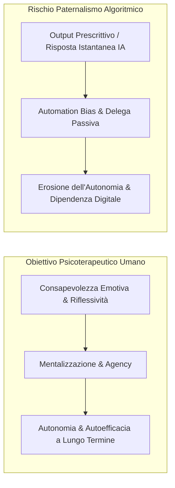
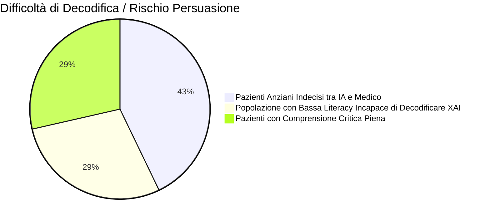

# Paternalismo Algoritmico e Autonomia del Paziente nell'IA Clinica

**Summary**: Inquadramento clinico, etico e cognitivo del fenomeno del paternalismo algoritmico e dell'automation bias nei sistemi di salute mentale digitale: la tendenza degli utenti e dei clinici a delegare passivamente scelte decisionali complesse agli algoritmi, l'impatto del divario di alfabetizzazione digitale e le strategie per ripristinare l'agency e la trasparenza.
**Sources**: Kandeel et al. (2026) - `ai-v5-e84305.pdf`, Topol (2019), Darcy et al. (2021), Dzangare & Gulu (2025)
**Last updated**: 2026-08-27
---

## Definizione del Fenomeno

Il **paternalismo algoritmico (*algorithmic paternalism*)** in salute mentale descrive la dinamica per cui sistemi di intelligenza artificiale (chatbot psicoterapeutici, strumenti di monitoraggio predittivo, algoritmi di classificazione diagnostica) assumono un ruolo direttivo o prescrittivo sulle decisioni del paziente, riducendone la capacità di autodeterminazione, l'autoefficacia introspettiva e l'autonomia decisionale.

A differenza dell'alleanza terapeutica umana, orientata a promuovere l'autonomia del paziente e l'elaborazione dei conflitti, l'interazione con agenti di calcolo automatizzati può indurre una delega passiva e acritica verso l'output della macchina (*automation bias*).

---

## Evidenze Empiriche e Manifestazioni Cliniche

Nella revisione sistematica di Kandeel et al. (2026) e nella letteratura empirica correlata emergono pattern comportamentali critici:

1. **Delega Inconsapevole delle Decisioni Chiave**:
   - Nei trial clinici condotti su chatbot per CBT come **Woebot**, circa il **25% dei partecipanti ha delegato decisioni personali e relazionali critiche all'agente conversazionale**, ignorando deliberatamente i disclaimer espliciti che ne delimitavano il ruolo a mero strumento di auto-aiuto non medico (Darcy et al., 2021).
2. **Erosione della Sicurezza Diagnostica dei Clinici**:
   - L'eccessivo affidamento sull'IA può condizionare negativamente anche i professionisti: studi su medici specializzandi in psichiatria documentano una riduzione della fiducia nel proprio giudizio clinico intuitivo (*reduced diagnostic confidence*) quando l'output dell'IA diverge dalla loro valutazione (Topol, 2019).
3. **Paternalismo Predittivo dai Wearable**:
   - Algoritmi di monitoraggio biometrico (es. variazioni di HRV o pattern di sonno) che inviano notifiche predittive d'ansia o allarmi su presunti episodi ipomaniacali possono innescare ansia anticipatoria o profezie che si auto-avverano, inducendo il paziente a conformare i propri stati soggettivi all'indicatore della macchina anziché esplorare la propria esperienza corporea cosciente.

---

## Il Divario di Alfabetizzazione Sanitaria Digitale (*Health Literacy Gap*)

Il rischio di paternalismo e manipolazione algoritmica non si distribuisce uniformemente tra la popolazione, ma amplifica le disuguaglianze socio-sanitarie preesistenti (Dzangare & Gulu, 2025):
- **Popolazione Anziana**: Circa il **60% dei pazienti anziani** incontra serie difficoltà nel distinguere un consiglio medico formulato da un essere umano da una raccomandazione generata da un modello linguistico, risultando altamente suscettibile a persuasione indebita.
- **Basso Livello di Scolarizzazione**: Fino al **40% degli utenti a bassa alfabetizzazione sanitaria** non è in grado di comprendere le metriche di spiegabilità fornite dagli strumenti XAI tecnici, accettando acriticamente le indicazioni del software.

---

## Strategie di Tutela e Ribilanciamento dell'Agency

Per contrastare il paternalismo algoritmico e preservare l'autonomia del paziente (in linea con i principi bioetici e con il GDPR), la ricerca individua quattro direttrici operative:

1. **Interfacce XAI Centrate sul Paziente (*Patient-Centered Explainability*)**:
   - Tradurre i pesi computazionali in narrazioni visive e causali semplici (es. grafici interattivi che illustrano come le interruzioni del sonno dopo la mezzanotte abbiano inciso per il 60% sul calo del tono dell'umore). Questo approccio incrementa l'adesione terapeutica del **+30%** e favorisce una comprensione attiva (Arya et al., 2020).
2. **Cruscotti per Clinici (*Clinician-Augmented Interpretation*)**:
   - Piattaforme come **AiCure** integrano dashboard dedicate in cui l'output algoritmico non comunica direttamente una diagnosi all'utente, ma funge da segnale di allerta che il terapeuta riesamina, contestualizza ed elabora insieme al paziente durante la seduta.
3. **Consenso Informato Continuativo e Dinamico**:
   - Il consenso deve esplicitare chiaramente non solo il funzionamento del modello, ma anche i suoi limiti probabilistici, i bias intrinseci e l'assenza di intenzionalità morale o clinica.
4. **Metodologie di Co-Design Partecipativo**:
   - Coinvolgere attivamente i pazienti e le associazioni di utenti nello sviluppo e nei test di usabilità delle interfacce per garantire che l'interazione promuova l'autoconsapevolezza anziché la sottomissione all'algoritmo (Torous et al., 2021).

---

## Related pages
- [[kandeel-et-al-2026]]
- [[gdpr-governance-mental-health-ai]]
- [[fast-food-psychotherapy]]
- [[sycophantic-mirroring]]
- [[calibrated-mismatches]]
- [[simulated-empathy-vs-authentic-presence]]
- [[human-in-the-reasoning]]
- [[cross-cultural-bias-and-fairness-audits-ai]]
- [[explainable-mental-disorder-diagnosis]]
