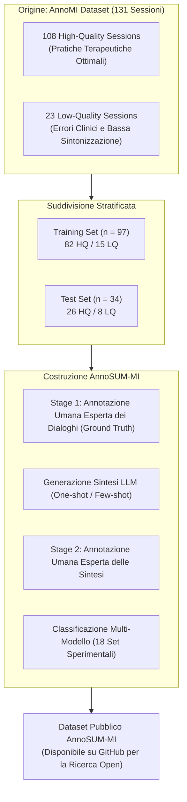

# Dataset AnnoSUM-MI e Benchmark di Trascrizioni Cliniche Annotate

## Definizione Operativa

**AnnoSUM-MI** è un dataset clinico multiscala, annotato da esperti e conforme al GDPR, sviluppato per il benchmarking, l'addestramento e la valutazione di modelli linguistici nella sintesi e nell'analisi di dialoghi di Colloquio Motivazionale (*Motivational Interviewing*, MI) (Kumar, Rajawat, & Ntoutsi, 2025).

Il dataset estende la risorsa **AnnoMI** (Wu et al., 2022, 2023) introducendo uno schema di annotazione globale a due stadi su **6 dimensioni MITI** (Evocation, Collaboration, Autonomy, Direction, Empathy, Non-Judgmental Attitude) e incorporando sintesi generate da differenti modelli di stato dell'arte (ChatGPT, Gemini, DeepSeek) sotto molteplici regimi di prompt.

---

## Struttura e Composizione del Dataset

### 1. Composizione delle Sessioni
- **Totale Sedute**: 131 trascrizioni di alta fedeltà di dialoghi paziente-terapeuta.
- **Distribuzione Qualitativa**:
  - *High-Quality ($n=108$)*: Sessioni che esemplificano elevata aderenza al modello Rogersiano/Miller-Rollnick, con ricorso a domande aperte, riformulazioni complesse e valorizzazione del *change talk*.
  - *Low-Quality ($n=23$)*: Sessioni che mostrano trappole comunicative (es. domande chiuse a raffica, confronto prematuro, minimizzazione emotiva o posture prescrittive).

### 2. Partizione Stratificata
- **Train ($n = 97$)**: 82 sessioni di alta qualità e 15 di bassa qualità.
- **Test ($n = 34$)**: 26 sessioni di alta qualità e 8 di bassa qualità (~25% del corpus), impiegate per il benchmark degli LLM.

---

## Affidabilità e Accordo Inter-Annotatore (*Inter-Rater Reliability*)

Per convalidare la qualità della ground truth, un panel di esperti di psicologia ha condotto doppie annotazioni indipendenti su un sottoinsieme bilanciato di 15 sessioni.
- **Metrica**: Coefficiente Kappa di Cohen ($\kappa$).
- **Valore Raggiunto**: $\kappa = 0.50 - 0.52$.
- **Interpretazione Metodologica**: Secondo i criteri di Landis & Koch (1977), un valore tra 0.41 e 0.60 indica un accordo *moderato*. Nel contesto dell'annotazione clinica multi-parametro e multi-classe su costrutti soggettivi complessi (empatia, autonomia, non-giudizio), tale punteggio è pienamente conforme agli standard accademici di riferimento (Tanana et al., 2016; Hallgren, 2012).

---

## Rilevanza per la Ricerca in Domini Low-Resource

L'applicazione dell'IA alla salute mentale soffre di una cronica scarsità di dati etichettati:
1. **Superamento dei Limiti dei Dataset Esistenti**: A differenza di dataset come *MI Dataset* (Welivita & Pu, 2022, che etichetta singoli enunciati senza contesto globale) o *BiMISC* (Sun et al., 2024, basato su diagnosi inferite), AnnoSUM-MI offre annotazioni di seduta complete e clinicamente verificate.
2. **Benchmark di Valutazione Oggettiva per LLM**: Fornisce una base empirica per quantificare la *semantic drift* e la distorsione valutativa dei modelli commerciali e open-weights.
3. **Conformità Privacy & Riuso Etico**: Il dataset è sviluppato nel pieno rispetto del GDPR, garantendo la riproducibilità scientifica senza violare la riservatezza dei pazienti.

---

## Relazioni
- [[miti-framework-llm-evaluation]]: Lo schema di codifica a 6 dimensioni impiegato in AnnoSUM-MI.
- [[motivational-interviewing-dialogue-summarization]]: Applicazione del dataset per compiti di NLP clinico.
- [[semantic-drift-in-therapy-llms]]: Quantificazione della deviazione semantica misurata sul test set di AnnoSUM-MI.
- [[synthetic-clinical-dialogues]]: Confronto tra dialoghi clinici reali trascritti e dialoghi clinici sintetici.
- [[specialized-nlp-models-mental-health]]: Utilizzo di dataset specialistici per il fine-tuning e la valutazione.
- [[kumar-et-al-2025]]: Paper fondativo che rilascia e descrive il dataset.
