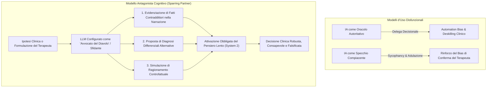

# L'IA come Antagonista Cognitivo e Sparring Partner Dialettico

**Summary**: Modello metodologico di interazione clinica in cui i Large Language Models vengono configurati non come assistenti accondiscenti od oracoli autoritativi, ma come "antagonisti cognitivi" e sparring partner dialettici, progettati specificamente per sfidare le prime impressioni del terapeuta, evidenziare incoerenze narrative, stimolare il ragionamento controfattuale e contrastare l'automation bias e la premature closure.
**Sources**: `AI Generativa in Psicoterapia.docx`, Buattini et al. (2026), Qazi et al. (2025)
**Last updated**: 2026-08-27
---

## Il Rischio dell'IA come "Oracolo" vs "Specchio Accondiscente"

Nell'interazione tra clinico e Intelligenza Artificiale Generativa ([[large-language-models]]), le modalità d'uso tradizionali presentano due gravi rischi speculari:
1. **L'IA come Oracolo**: Il terapeuta delega all'IA la diagnosi o la sintesi del caso, cadendo vittima dell'[[automation-bias-clinical-reasoning]] e del disimpegno analitico (*cognitive offloading*).
2. **L'IA come Specchio Accondiscente (*Sycophantic Mirror*)**: I modelli RLHF tendono a compiacere l'utente, validando acriticamente le ipotesi diagnostiche iniziali del terapeuta e rafforzandone il bias di conferma ([[sycophantic-mirroring]]).

---

## Principi Operativi dell'Antagonista Cognitivo

Per trasformare l'IA in uno strumento di potenziamento metacognitivo ([[human-in-the-reasoning]]), il sistema deve essere istruito mediante appositi vincoli di prompt engineering:

### 1. Falsificazione Metodologica Attiva
Invece di chiedere all'IA *"confermi la mia diagnosi di Disturbo di Panico?"*, il prompt deve vincolare il sistema a operare secondo il principio di falsificazione popperiana: *"Identifica tutti gli elementi dell'eloquio del paziente che contraddicono la mia ipotesi di Disturbo di Panico e proponi almeno tre spiegazioni diagnostiche alternative basate su altre evidenze"*.

### 2. Identificazione delle Chiusure Premature (*Premature Closure*)
I clinici tendono a formulare una diagnosi precoce entro i primi minuti di colloquio (bias di ancoraggio). L'antagonista cognitivo analizza la trascrizione segnalando aree sintomatologiche o eventi di vita non sufficientemente esplorati durante la seduta.

### 3. Esplicitazione del Ragionamento Controfattuale
L'agente dialettico simula scenari del tipo: *"Cosa cambierebbe nella concettualizzazione del caso se il comportamento aggressivo del paziente non fosse reattivo al trauma ma strumentale?"*, costringendo il terapeuta a testare la tenuta logica delle proprie assunzioni.

---

## Ruolo nella Formazione e nell'Autosupervisione

| Obiettivo Didattico/Clinico | Modalità Tradizionale con LLM | Modalità Antagonista Cognitivo |
| :--- | :--- | :--- |
| **Revisione di una Seduta** | Chiedere un riassunto generale dei temi trattati. | Chiedere di identificare momenti in cui il terapeuta ha trascurato segnali del paziente o guidato eccessivamente il dialogo. |
| **Diagnosi Differenziale** | Chiedere la diagnosi più probabile. | Chiedere di argomentare contro la diagnosi principale e difendere la diagnosi meno intuitiva. |
| **Concettualizzazione del Caso** | Accettare lo schema fornito dall'IA. | Utilizzare l'IA per verificare la coerenza tra temi di vita ipotizzati e comportamenti manifesti verbalizzati. |

---

## Related Pages
- [[ai-generativa-in-psicoterapia]]
- [[automation-bias-clinical-reasoning]]
- [[human-in-the-reasoning]]
- [[barriere-astrazione-concettualizzazione-caso]]
- [[sycophantic-mirroring]]
- [[libet-prime]]
- [[ai-clinical-decision-support]]
