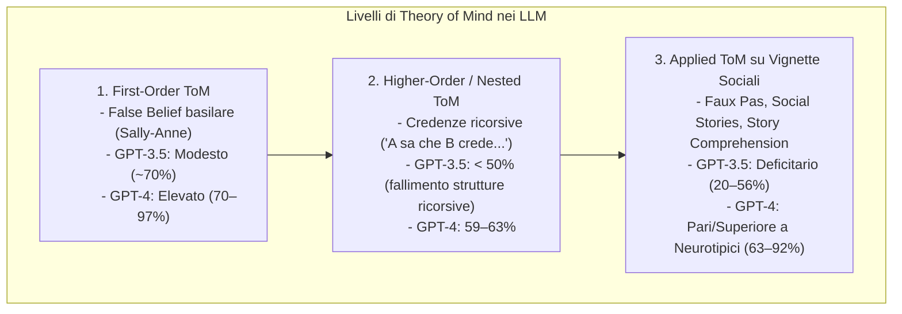

# Applied Theory of Mind nei Large Language Models

**Summary**: Studio e misurazione computazionale delle capacità di Theory of Mind (ToM) nei modelli di linguaggio di grandi dimensioni. Comprende l'attribuzione di stati mentali di primo e di secondo ordine (credenze, desideri, intenzioni ed emozioni) e la risoluzione di scenari sociali complessi (ironia, bugie bianche, gaffe/faux pas, doppi sensi).
**Sources**: `2601.06032v1.pdf`
**Last updated**: 2026-08-27
---

## Definizione e Inquadramento Teorico

La **Theory of Mind (ToM)** o *mentalizzazione* è l'abilità cognitiva fondamentale di inferire gli stati mentali interiori di se stessi e degli altri (credenze, intenzioni, desideri, prospettive affettive ed emotive) e di prevedere il comportamento sociale sulla base di tali inferenze (Baron-Cohen et al., 1985; Premack & Woodruff, 1978).

In ambito neuropsicologico e dello sviluppo umano, la ToM si articola su più livelli di complessità:
1. **ToM di Primo Ordine (*First-Order False Beliefs*)**: Comprensione che un'altra persona possa possedere credenze sul mondo diverse dalla realtà oggettiva o dalle proprie conoscenze (es. paradigma dell'Unexpected Transfer di Wimmer & Perner, 1983; compito di Sally-Anne). Si sviluppa tipicamente tra i 3 e i 5 anni.
2. **ToM di Secondo e Superiore Ordine (*Second-Order / Higher-Order ToM*)**: Capacità di elaborare credenze ricorsive e annidate (*"A pensa che B creda che C sappia..."*), essenziali per comprendere inganni, doppi giochi, scherzi e segreti. Si sviluppa tra i 6 e gli 8 anni.
3. **ToM Complessa e Applicata (*Applied Higher-Order ToM*)**: Comprensione di scenari comunicativi ecologici e sfumati, come la decodifica di gaffe sociali (*faux pas*), ironia, sarcasmo, bugie a fin di bene (*white lies*) e minacce velate. Si consolida durante l'adolescenza e l'età adulta.

---

## Prestazioni dei Modelli Linguistici (GPT-3.5 vs GPT-4)

Studi recenti (Holl-Etten et al., 2026; Strachan et al., 2024; Kosinski, 2023; Ullman, 2023) evidenziano un marcato salto prestazionale tra generazioni di modelli:

| Dominio di Valutazione | GPT-3.5 Turbo | GPT-4 | Riferimento Umano |
| :--- | :--- | :--- | :--- |
| **Faux Pas Recognition Test** | 80–84% (deficitario) | **92%** (robusto in EN e DE) | Adulti neurotipici: **95%**; Spettro Autistico / BAP: **89%** |
| **Social Stories Questionnaire (SSQ)** | 20–28% (inferiore a campioni clinici) | **63–67%** (eccellente sui blatant, moderato sui subtle) | Adulti neurotipici: **60–70%**; Asperger: **50%** |
| **Story Comprehension Test (SCT)** | 56% | **64% (EN) – 89% (DE)** | Adulti neurotipici: **64%**; Adolescenti: **50%** |

### Fattori Chiave per l'Emergenza di ToM negli LLM
1. **Scaling dei Parametri e Pre-training**: L'aumento di capacità del modello permette a GPT-4 di catturare correlazioni semantiche e narrative di secondo livello molto più stabili rispetto a GPT-3.5.
2. **Prompt Engineering e Perspective Taking**: Istruire esplicitamente il modello ad adottare la prospettiva del personaggio (*"put yourself in the shoes of the character"*) e a selezionare la singola risposta più probabile elimina la tendenza a divagare e aumenta drasticamente l'accuratezza.
3. **Generalizzazione Cross-Linguistica**: Le prestazioni coerenti tra inglese e tedesco dimostrano che il modello non memorizza risposte fisse, ma opera su strutture semantiche astratte.

---

## Dibattito: ToM Genuina vs Emulazione Pattern-Matching

Una questione filosofica e metodologica aperta è se gli LLM posseggano una reale comprensione degli stati mentali o se stiano unicamente replicando regolarità statistiche nei pattern linguistici (*stochastic parrot* / *Clever Hans effect*):
- **Fragilità al Rumore**: Piccole alterazioni sintattiche o contestuali possono far fallire compiti ToM apparentemente banali (Ullman, 2023).
- **Assenza di Embodiment e Non-Verbale**: La cognizione sociale umana è radicata nella percezione multimodale (sguardi, prosodia, microespressioni), elementi totalmente assenti nei modelli purely text-based.
- **Valore Funzionale**: Ai fini clinico-applicativi (es. sistemi assistivi per l'autismo), ciò che rileva non è l'ontologia interna del modello, bensì la fedeltà e l'accuratezza funzionale della spiegazione sociale generata.

---

## Related pages
- [[holl-etten-et-al-2026]]
- [[social-vignettes-benchmarking]]
- [[epistemic-markers-in-ai]]
- [[ai-assistive-autism-communication]]
- [[large-language-models]]
- [[ai-mental-health-vulnerable-populations]]
