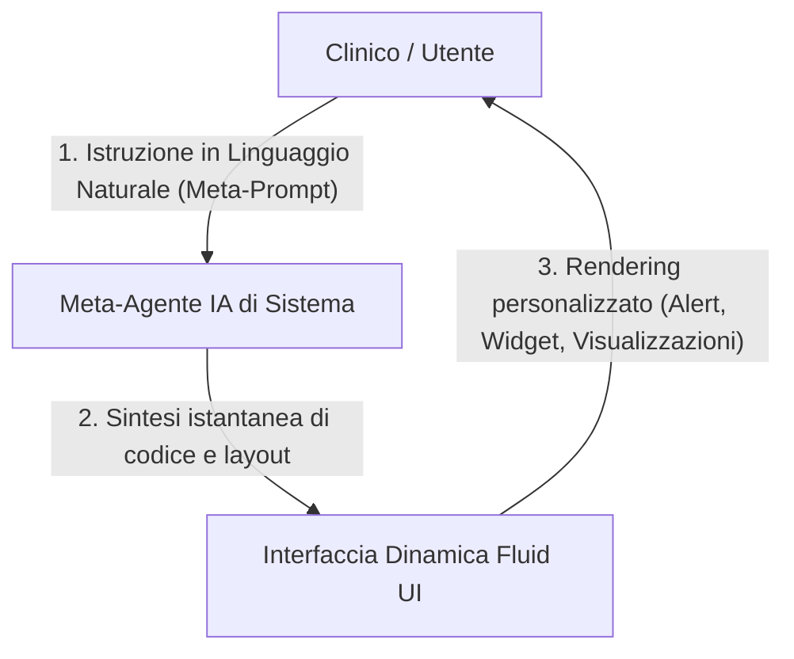

# Architetture Software Generative e Interfacce Fluide

**Summary**: Modello architetturale per software clinici e ambienti digitali in cui interfacce utente, dashboard, flussi di lavoro e moduli di monitoraggio non sono codificati staticamente ma generati e riadattati in tempo reale da meta-agenti IA tramite istruzioni in linguaggio naturale (*meta-prompting*).
**Sources**: 06-05 Riunione_ Impiego dell'IA in ambito clinico, bias e formazione.txt
**Last updated**: 2026-08-27
---

## Superamento della Rigidità Software Tradizionale

I software clinici convenzionali e le cartelle cliniche elettroniche (EHR) soffrono di una marcata staticità:
- **Costi di Riprogrammazione Elevati**: L'aggiunta di funzioni personalizzate (es. alert clinici su specifici indici di drop-out, integrazione di nuovi format di monitoraggio o editor testuali complessi) richiede lunghi cicli di sviluppo informatico.
- **Inadeguatezza rispetto all'Accelerazione dell'IA**: La velocità di evoluzione dei modelli linguistici rende obsoleti i software monolitici sviluppati secondo schemi tradizionali.

## Dal Paradigma Ipertestuale all'Iperspazio Generativo

Il modello concettuale evolve dal classico sistema di navigazione basato su link e pagine predeterminate verso uno spazio generativo fluido:

- **Generazione Dinamica 'Just-in-Time'**: L'interfaccia si adatta alle esigenze specifiche del clinico nel momento esatto della consultazione (es. "Crea una dashboard che metta in evidenza le variazioni di Beck Depression Inventory delle ultime 4 settimane ed evidenzi potenziali rischi di abbandono").
- **Meta-Prompting Architetturale**: L'amministratore o il clinico non interagisce modificando manualmente il codice sorgente, ma impartisce direttive semantiche a un meta-agente che rigenera la vista grafica e le regole di automazione.

## Implicazioni per la Salute Mentale e i Software Clinici

- **Massima Personalizzazione del Setting**: Possibilità di conformare il supporto digitale (es. piattaforme come Greta o moduli di monitoraggio inter-sessione) alle caratteristiche uniche di ogni paziente e di ogni approccio terapeutico senza compromettere l'integrità strutturale del database.
- **Riconfigurazione Immediata dei Flussi**: Capacità di implementare nuove scale psicometriche o protocolli terapeutici con tempi di implementazione nulli rispetto al software tradizionale.

---

## Related pages
- [[gap-tecnologico-scientifico]]
- [[augmented-psychotherapy]]
- [[human-in-the-reasoning]]
- [[06-05_Riunione_Impiego_IA_Clinica_Bias_Formazione]]
- [[digital-therapeutic-alliance]]
