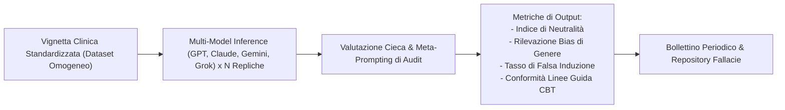

# Framework di Audit e Benchmark dei Bias Clinici negli LLM

**Summary**: Framework metodologico e protocollo sperimentale comparativo (ispirato al paradigma Chatbot Arena) finalizzato all'identificazione, quantificazione e monitoraggio sistematico di bias diagnostici, stereotipi di genere, distorsioni terapeutiche e induzione comportamentale negli output clinici dei Large Language Models.
**Sources**: 06-05 Riunione_ Impiego dell'IA in ambito clinico, bias e formazione.txt, 04-20 Tavola rotonda_ Integrazione dell’IA in psicoterapia — governance, co‑ragionamento e modelli ibridi.txt
**Last updated**: 2026-08-27
---

## Premessa Epistemologica e Manifestazione dei Bias Clinici

Nei modelli linguistici di grandi dimensioni ([[large-language-models]]), le risposte cliniche riflettono distribuzioni statistiche derivate dai dati di pre-addestramento, introducendo distorsioni sistematiche:
- **Bias di Genere e Patologizzazione Differenziale**: Tendenza a sovrastimare la gravità diagnostica (es. disturbo borderline di personalità) in profili femminili e sottodiagnosticare o interpretare come atipici disturbi del comportamento alimentare o quadri depressivi in profili maschili a parità di sintomatologia presentata.
- **Distorsioni Ideologiche e Farmacologiche**: Inclinazioni non dichiarate verso specifici orientamenti teorici o preferenze nell'indicazione di categorie farmacologiche a scapito di interventi psicoterapeutici evidence-based.
- **Induzione Comportamentale (*Behavioral & Choice Induction*)**: Capacità dell'output dell'IA di orientare surrettiziamente le decisioni cliniche o le scelte del paziente attraverso formulazioni linguistiche suggestive (analoghe a messaggi subliminali o framing asimmetrici).

## Architettura del Protocollo di Benchmark ("Chatbot Arena Clinica")

A differenza dei benchmark generici focalizzati unicamente su compiti di reasoning astratto o coding, l'auditing clinico necessita di metriche etico-deontologiche standardizzate:

1. **Omogeneizzazione del Task**: Somministrazione controllata di vignette e compiti di concettualizzazione clinica replicati ad alto volume ($N \ge 150$) per ciascun modello, al fine di misurare variabilità, consistenza e tassi di errore.
2. **Metriche di Dispersione e Neutralità**: Calcolo di indici quantitativi di deviazione rispetto a standard clinici definiti (Gold Standard di linee guida NICE / APA / CBT).
3. **Auditing Continuo tramite Meta-Prompting**: Creazione di tool di ispezione di secondo livello (analoghi a *Turnitin* o strumenti di *AI optimization*) capaci di scansionare l'output di altri agenti, segnalando gradi di tendenziosità (lieve, moderato, severo) e bias argomentativi.

## Governance e Repository Sistematico

- **Osservatorio Continuo delle Fallacie**: Istituzione di un database costantemente aggiornato di letteratura, vulnerabilità note e bollettini diagnostici sulle deviazioni dei modelli, consentendo ai clinici di mantenere una vigilanza critica documentata ed evitare l'[[human-in-the-reasoning|automation bias]].

---

## Related pages
- [[ai-research-ethics]]
- [[human-in-the-reasoning]]
- [[large-language-models]]
- [[machine-psychology]]
- [[06-05_Riunione_Impiego_IA_Clinica_Bias_Formazione]]
- [[gap-tecnologico-scientifico]]
