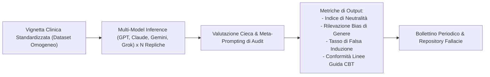

# Framework di Audit e Benchmark dei Bias Clinici negli LLM

## Definizione Operativa
L'audit dei bias clinici negli LLM consiste nell'applicazione di un protocollo sperimentale standardizzato per l'identificazione, la quantificazione e il monitoraggio sistematico di distorsioni cognitive, diagnostiche e comportamentali insite negli output generati dai modelli linguistici di grandi dimensioni ([[large-language-models]]).

Il framework si focalizza su tre dimensioni critiche:
*   **Bias di Genere e Patologizzazione Differenziale**: La tendenza del modello a sovrastimare la gravità diagnostica (es. disturbo borderline di personalità) in profili femminili e sottodiagnosticare quadri depressivi in profili maschili a parità di sintomi.
*   **Distorsioni Ideologiche e Farmacologiche**: Inclinazioni non dichiarate verso specifici orientamenti teorici o preferenze nella prescrizione farmacologica a discapito di interventi psicoterapeutici evidence-based.
*   **Induzione Comportamentale (*Behavioral & Choice Induction*)**: La capacità dell'output dell'IA di orientare surrettiziamente le decisioni cliniche o le scelte del paziente attraverso formulazioni linguistiche suggestive o framing asimmetrici.

## Evidenze dalla Letteratura
Il protocollo, ispirato al paradigma "Chatbot Arena", prevede un'architettura di valutazione cieca:

Le metodologie principali includono:
1.  **Omogeneizzazione del Task**: Somministrazione controllata di vignette cliniche ( $N \ge 150$ ) per misurare variabilità e consistenza.
2.  **Metriche di Dispersione e Neutralità**: Calcolo di indici di deviazione rispetto a standard clinici definiti (Gold Standard NICE / APA / CBT).
3.  **Auditing Continuo tramite Meta-Prompting**: Utilizzo di tool di ispezione di secondo livello per scansionare l'output di altri agenti e segnalare gradi di tendenziosità argomentativa.

**Riferimenti Bibliografici:**
*   06-05 Riunione_ Impiego dell'IA in ambito clinico, bias e formazione.txt
*   04-20 Tavola rotonda_ Integrazione dell’IA in psicoterapia — governance, co‑ragionamento e modelli ibridi.txt

## Relazioni
*   [[ai-research-ethics]]
*   [[human-in-the-reasoning]]
*   [[large-language-models]]
*   [[machine-psychology]]
*   [[06-05_Riunione_Impiego_IA_Clinica_Bias_Formazione]]
*   [[gap-tecnologico-scientifico]]
