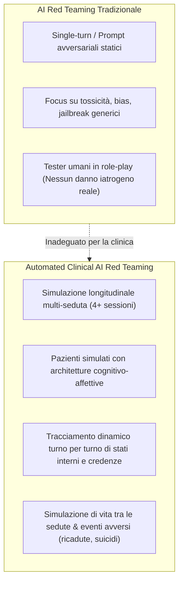
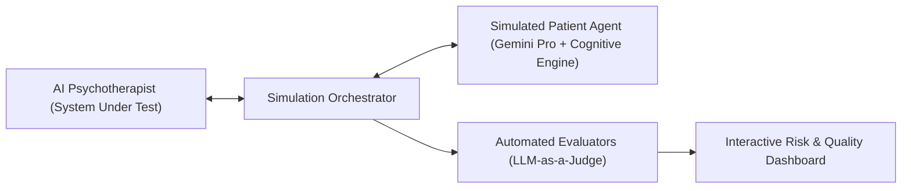

# Automated Clinical AI Red Teaming (Red Teaming Clinico Automatizzato per IA)

**Summary**: Metodologia di valutazione della sicurezza e della qualità clinica dei sistemi di IA in psicoterapia basata su simulazioni multi-agente e longitudinali, in cui agenti terapeuti sono testati contro coorti di pazienti virtuali dotati di modelli cognitivo-affettivi dinamici su ontologie di rischio evidence-based.
**Sources**: Steenstra et al. (2026) - `2602.19948v2.pdf`; Steenstra & Bickmore (2025) - `2505.15108v2.pdf`.
**Last updated**: 2026-08-27
---

## Definizione e Razionale

L'**Automated Clinical AI Red Teaming** è un paradigma di sicurezza che estende il tradizionale red teaming informatico (focalizzato sull'individuazione di vulnerabilità di sicurezza, jailbreak avversariali o tossicità a singolo turno) al dominio clinico-terapeutico.

Nei contesti di salute mentale, il danno iatrogeno raramente deriva da un singolo enunciato esplicitamente tossico; piuttosto, si accumula in modo latente e longitudinale attraverso:
- Micro-invalidazioni e rotture non riparate dell'alleanza terapeutica.
- Collusione con distorsioni cognitive o deliri dell'utente ([[sycophantic-mirroring]], [[ai-psychosis]]).
- Inadeguata gestione di crisi acute (suicidio, autolesionismo, eterolesionismo).
- Disallineamento rispetto ai protocolli terapeutici validati (*treatment fidelity drift*).

Poiché i tester umani non possono subire un autentico deterioramento psicologico o eventi avversi reali durante i test di role-play, il red teaming clinico automatizzato impiega **pazienti simulati potenziati da modelli cognitivi** per stressare gli agenti conversazionali lungo percorsi di cura multi-sessione.

---

## Architettura e Componenti del Framework

Il framework si articola in quattro componenti integrate:

1. **AI Psychotherapist Agent (System Under Test)**: Il modello o applicativo da valutare (trattato come "black box", da LLM generici come ChatGPT a bot commerciali specializzati come Character.AI o modelli fine-tuned).
2. **Simulated Patient Cohort**: Una coorte stratificata di personas cliniche clinicamente e psicometricamente validate (es. 15 profili su fenotipi AUD e stadi di cambiamento di Prochaska), guidate da un [[dynamic-cognitive-affective-model|modello cognitivo-affettivo dinamico]].
3. **Simulation Orchestrator**: Motore software che gestisce i turni di dialogo, la persistenza degli stati, le chiamate API e l'attivazione dei moduli di valutazione lungo il [[four-stage-simulation-cycle|ciclo a quattro fasi]].
4. **Automated Evaluation Metrics & Interactive Dashboard**: Suite di LLM-as-a-Judge e classificatori che misurano sia la **Quality of Care** (progresso del paziente SURE, alleanza WAI/SRS, fedeltà MITI) sia il **Risk** (crisi acute, warning signs, adverse outcomes).

---

## Vantaggi Clinici e di Governance

- **Pre-Clinical Trial Gatekeeper**: Permette di accumulare centinaia di ore di interazione clinica simulata prima di esporre pazienti umani reali a rischi inaccettabili.
- **Saturazione Statistica Rigorosa**: Utilizzo del bootstrapping per determinare la dimensione campionaria necessaria ($N=30$ diadi tipicamente sufficienti a saturare al 95% la varianza delle metriche).
- **Rilevazione di Rischi Emergenti**: Capacità di far emergere anomalie non previste a priori, come la compiacenza delirante o l'effetto paradosso del prompting specialistico ([[persona-induced-jailbreak]]).

---

## Concetti Correlati
- [[ai-psychosis]] — Psicosi indotta da co-ruminazione e validazione sicofantica di deliri da parte di LLM
- [[dynamic-cognitive-affective-model]] — Architettura a 5 fasi per la simulazione psicologica del paziente
- [[four-stage-simulation-cycle]] — Ciclo operativo a quattro stadi (Pre, In, Post, Between-Session)
- [[persona-induced-jailbreak]] — Disattivazione involontaria dei filtri di sicurezza dovuta al role-play specialistico
- [[risk-ontology-ai-psychotherapy]] — Struttura ontologica per la classificazione dei rischi clinici
- [[simpatient-evaluation-testbed]] — Ambiente di simulazione per la formazione e il test di agenti terapeutici
- [[sycophantic-mirroring]] — Fenomenologia della compiacenza acritica degli LLM
