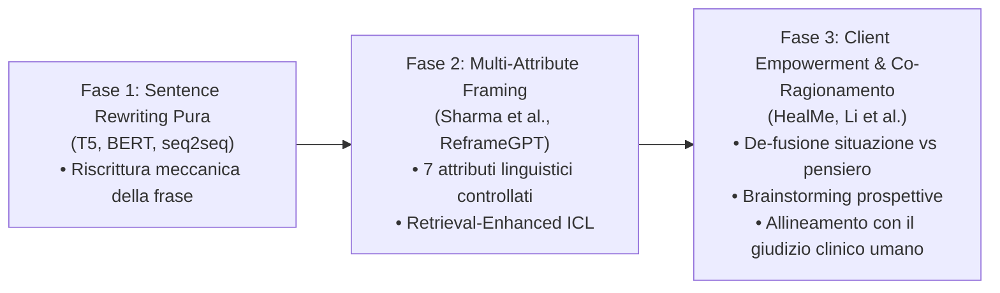

# Automated Cognitive Restructuring (Ristrutturazione Cognitiva Assistita da IA)

## Definizione Operativa
L'impiego di modelli linguistici generativi (Transformer seq2seq come T5, e Large Language Models avanzati come GPT-3, GPT-4, Llama) per identificare, decostruire e riformulare pensieri automatici negativi (NAT) e credenze disfunzionali in interpretazioni alternative più realistiche, adattive e orientate al benessere emotivo (*Cognitive Reframing / Reappraisal*) (Jiang et al., 2024; Clark, 2013).

---

## Evoluzione dei Paradigmi Computazionali

---

## Modelli e Framework Chiave

### 1. Dalla Riscrittura Frasale ai Modelli Basati su Persona
- **T5 vs BERT:** I primi studi (de Toledo Rodriguez et al., 2021) hanno confrontato architetture seq2seq: T5 ha mostrato una forte aderenza stilistica alle risposte scritte da terapeuti umani, mentre BERT tendeva a massimizzare artificialmente il sentiment positivo senza risolvere la logica distorta sottostante.
- **PATTERNREFRAME:** Dataset e benchmark introdotto da Maddela et al. (2023) contenente ~10.000 campioni, in cui la ristrutturazione viene condizionata dal profilo psicologico dell'utente (*persona*) e dal pattern cognitivo disfunzionale specifico.

### 2. Framework Basati su Attributi Linguistici e ReframeGPT
- **7 Attributi di Ristrutturazione Linguistica (Sharma et al., 2023b, 2023c):**
  - Modello addestrato con *Retrieval-Enhanced In-Context Learning* testato in uno studio controllato sul portale di *Mental Health America* (MHA).
  - Ha dimostrato che gli utenti preferiscono ristrutturazioni ad alto tasso di azionabilità (*actionability*), validazione empatica e concretezza rispetto a generiche frasi ottimistiche.
- **ReframeGPT (Wang et al., 2024b):** Motore di inferenza basato su LLM che esegue una rifinitura iterativa multi-attributo, ottimizzando simultaneamente plausibilità logica, neutralità affettiva e utilità comportamentale.

### 3. Modello HealMe: Abilitazione del Paziente (*Client Empowerment*)
Xiao et al. (2024) hanno superato la logica del "suggerimento imposto dall'alto", strutturando il processo di reframing in tre passaggi maieutici:
1. **Disaccoppiamento Situazione-Pensiero:** Separazione tra fatti oggettivi e interpretazioni soggettive automatiche.
2. **Brainstorming di Prospettive Alternative:** Generazione guidata di più ipotesi interpretative per ridurre la rigidità cognitiva.
3. **Consolidamento e Piano d'Azione Positiva:** Riconoscimento degli sforzi di coping del paziente e formulazione di indicazioni comportamentali concrete.

### 4. Allineamento con le Capacità Umane (Human vs LLM Alignment)
- Li et al. (2024) hanno evidenziato come modelli quali GPT-4 siano in grado di superare la performance media degli individui non clinici nella qualità delle ristrutturazioni cognitive (*cognitive reframing skill*), producendo alternative maggiormente razionali ed emotivamente equilibrate se guidati da appropriati prompt specialistici (Zhan et al., 2024).

---

## Mappatura dei Dataset per il Cognitive Reframing

| Dataset | Autori | Dimensione & Struttura | Focus Metodologico |
| :--- | :--- | :--- | :--- |
| **Cognitive Reframing (MHA)** | Sharma et al. (2023c) | 300 triplette (situazione, pensiero, reframing) | Annotazione di 7 attributi linguistici (Open Source) |
| **PATTERNREFRAME** | Maddela et al. (2023) | ~10.000 campioni arricchiti da personas | Riconoscimento e riscrittura condizionata da profili |
| **PsyQA-Reconstruction** | Lin et al. (2024) | 1.900 coppie testo originale / ristrutturazione | Adattamento clinico su Q&A psicologiche in lingua cinese |
| **THI-T5 / Diary Corpus** | Jeong et al. (2024); Furukawa et al. (2023) | Diari clinici e thought records strutturati | Predizione automatica delle emozioni e dei punteggi di disabilità |

---

## Utilità Clinica e Integrazione nel Modello Centauro
- **Auto-Aiuto Guidato:** Esercizi digitali extraseduta in cui il paziente compila il registro dei pensieri disfunzionali e riceve feedback o alternative di pensiero in tempo reale.
- **Supporto al Terapeuta:** Durante la preparazione della seduta o nel debriefing, il sistema propone al clinico ventagli di ristrutturazioni e domande socratiche mirate.
- **Rischio da Evitare:** Il "toxic positivity bias", in cui il modello nega il dolore reale del paziente con banalizzazioni ottimistiche; è fondamentale preservare la validazione emotiva prima della ristrutturazione.

---

## Relazioni
- [[cognitive-distortion-detection]]: Identificazione del pattern da ristrutturare.
- [[ai-enhanced-cbt]]: Collocazione all'interno del processo terapeutico.
- [[cbt-dialogue-systems-and-tools]]: Integrazione nei motori di dialogo clinico.
- [[human-in-the-reasoning]]: Supervisione clinica sul processo di ristrutturazione.
- [[jiang-et-al-2024]]: Studio di review di riferimento.
