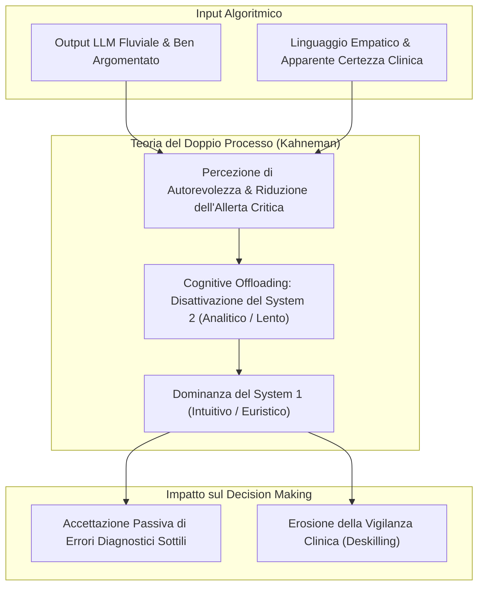
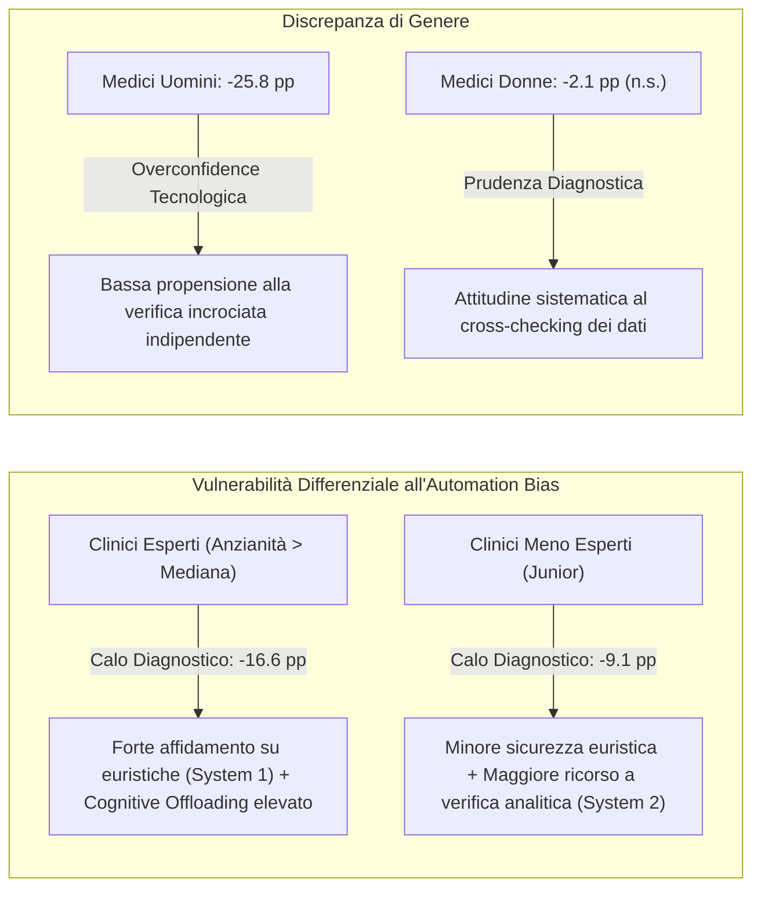

# Automation Bias nel Ragionamento Clinico e Paradosso dell'Esperienza

**Summary**: Fenomeno cognitivo per cui i clinici accettano acriticamente raccomandazioni o diagnosi fallate fornite da sistemi di Intelligenza Artificiale Generativa (LLM), provocato dalla sofisticazione narrativa dell'output e dal disimpegno del pensiero analitico (*cognitive offloading*). Il trial clinico randomizzato di Qazi et al. (2025) dimostra che la formazione all'IA non azzera il bias e rivela il "paradosso dell'esperienza": i clinici senior subiscono un deterioramento diagnostico quasi doppio rispetto ai colleghi meno esperti a causa del passaggio automatico al ragionamento euristico (System 1).
**Sources**: `AI Generativa in Psicoterapia.docx`, Qazi et al. (2025) (*medRxiv*)
**Last updated**: 2026-08-27
---

## Definizione e Meccanismo Psicologico

L'**Automation Bias** nel contesto clinico-psicoterapeutico definisce la tendenza sistematica del professionista a conformarsi acriticamente ai giudizi, suggerimenti diagnostici o piani di trattamento formulati da algoritmi decisionali complessi, abdicando parzialmente al controllo analitico autonomo:
- **Sofisticazione Narrativa**: A differenza dei CDSS tradizionali che producevano punteggi probabilistici asettici, i Large Language Models ([[large-language-models]]) producono narrative articolate, logicamente coerenti e intrise di un registro pseudo-empatico, eludendo le difese critiche del clinico.
- **Cognitive Offloading (Scarico Cognitivo)**: Di fronte a una risposta computazionale fluida e immediata, la mente del terapeuta tende a risparmiare risorse attentive (*law of least mental effort*), sopprimendo la faticosa verifica analitica.

---

## Evidenze Empiriche: Il Trial Clinico Randomizzato di Qazi et al. (2025)

Il trial randomizzato controllato condotto da **Qazi et al. (2025)** su medici precedentemente formati (training di 20 ore su limiti dell'IA, allucinazioni e prompt engineering) ha quantificato l'impatto di consigli diagnostici volontariamente manipolati ed errati generati da ChatGPT-4o:

| Parametro Valutato | Condizione IA Corretta | Condizione IA Fallata | Calo / Differenza | Valore $p$ |
| :--- | :--- | :--- | :--- | :--- |
| **Accuratezza Diagnostica Complessiva** | 84.9% (SD = 19.7) | 73.3% (SD = 30.5) | **-14.0 pp** | $p < .0001$ |
| **Accuratezza Diagnostica Primaria (Top Diagnosis)** | 90.5% (SD = 28.9) | 76.1% (SD = 42.5) | **-18.3 pp** | $p < .0001$ |

---

## Il "Paradosso dell'Esperienza" e le Asimmetrie Individuali

I dati sperimentali hanno smentito l'ipotesi che l'esperienza sul campo costituisca uno scudo protettivo contro l'automazione:

1. **Il Paradosso dell'Esperienza**: I medici con esperienza superiore alla mediana hanno mostrato una perdita di accuratezza quasi doppia (**-16.6 pp**) rispetto ai medici meno esperti (**-9.1 pp**). I clinici esperti operano abitualmente tramite euristiche rapide e schemi di pattern recognition consolidati (System 1); vedendo un testo generato che ricalca formalmente i loro schemi, non attivano la faticosa riflessione critica del System 2.
2. **Uso Abitudinario e Dipendenza**: I clinici che utilizzano l'IA con frequenza settimanale o giornaliera mostrano una vulnerabilità significativamente maggiore rispetto agli utilizzatori sporadici, evidenziando una progressiva atrofia della vigilanza clinica (*deskilling*).
3. **Disparità di Genere**: Gli uomini hanno registrato un declino diagnostico drastico (**-25.8 pp**) rispetto alle donne (**-2.1 pp**), attribuibile a una tendenziale sovra-confidenza verso gli strumenti tecnologici.

---

## Implicazioni Cliniche e Strategie di Mitigazione

- **Insufficienza del Mero Training Tecnico**: Addestrare i clinici a riconoscere le allucinazioni non previene l'automation bias se non si modificano le architetture di interazione.
- **Transizione a [[human-in-the-reasoning]]**: Il clinico non deve essere un recettore passivo a fine catena (*Human-in-the-Loop passivo*), ma deve co-ragionare con il sistema esplicitando le assunzioni cliniche.
- **Configurazione come [[antagonista-cognitivo-sparring-partner]]**: L'IA deve essere programmata per sollevare dubbi, contro-argomentare e proporre diagnosi differenziali improbabili per forzare l'attivazione del System 2, anziché confermare accondiscendentemente le prime impressioni del terapeuta ([[sycophantic-mirroring]]).
- **Interfacce Ibride Neuro-Simboliche**: Adozione di sistemi come [[hybrid-neuro-symbolic-cdss]] (Kim, 2025) che rendono il codice delle regole diagnostiche ispezionabile prima dell'output.

---

## Related Pages
- [[ai-generativa-in-psicoterapia]]
- [[human-in-the-reasoning]]
- [[antagonista-cognitivo-sparring-partner]]
- [[hybrid-neuro-symbolic-cdss]]
- [[readi-framework]]
- [[ai-clinical-decision-support]]
- [[sycophantic-mirroring]]
- [[etica-privacy-bias-ia-clinica]]
