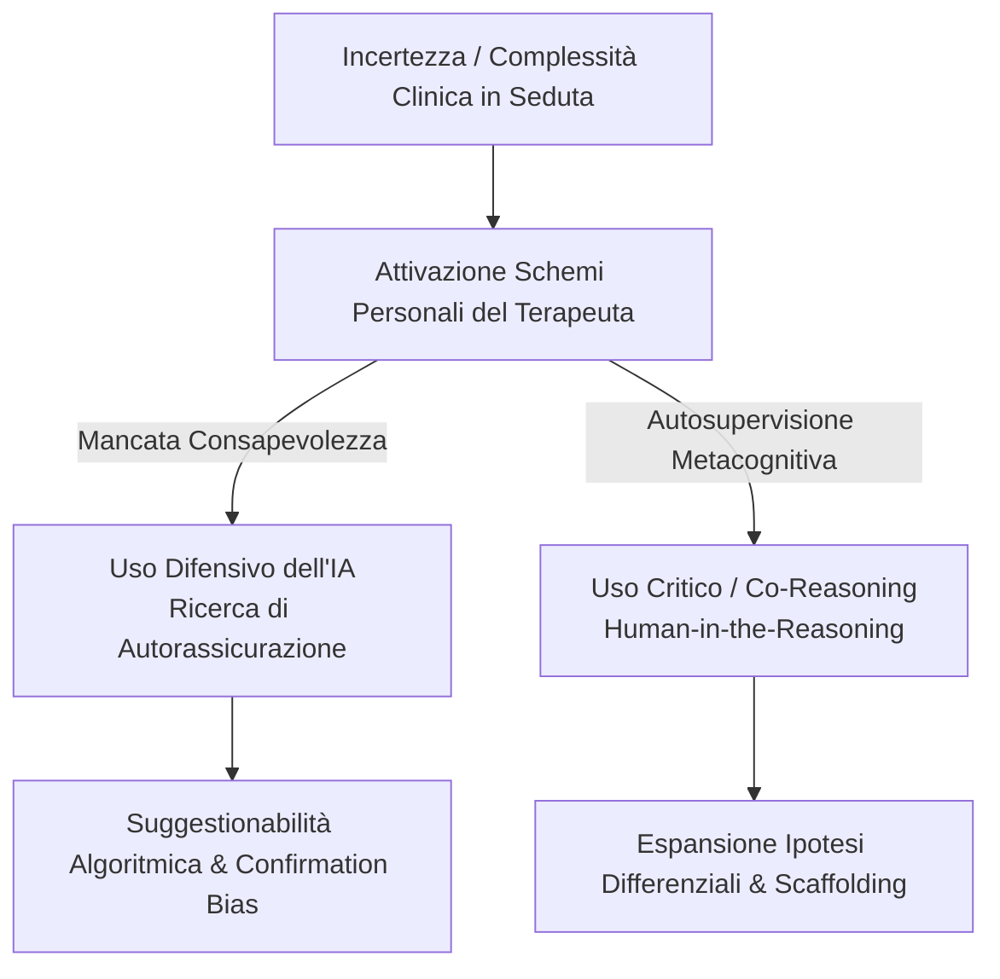

# Autosupervisione e Schemi del Terapeuta nell'Uso dell'IA

**Summary**: Modello di riflessione metacognitiva sull'interazione tra gli schemi di funzionamento personale del terapeuta e l'utilizzo clinico dell'Intelligenza Artificiale. Analizza le dinamiche in cui il ricorso ai modelli linguistici è guidato da bisogni di autorassicurazione di fronte all'incertezza diagnostica, prevenendo fenomeni di suggestionabilità algoritmica e bias di conferma.
**Sources**: 07-08 Riunione_ Pianificazione corso IA per psicoterapia — struttura, validazione interessi, microprogettazione e coordinamento.txt
**Last updated**: 2026-08-27
---

## 1. Il Funzionamento Personale del Terapeuta nell'Interazione con l'IA

Nella tradizione della psicoterapia cognitivo-comportamentale e dello sviluppo personale del terapeuta, il clinico impara a riconoscere i propri schemi interpersonali, le credenze di vulnerabilità e i piani che si attivano nella relazione con il paziente:

- **Estensione alla Relazione Uomo-Macchina**: Gli stessi schemi personali e credenze metacognitive che influenzano il setting clinico possono orientare le modalità con cui il professionista interroga i modelli linguistici (LLM).
- **Consapevolezza dello Scopo d'Uso**: L'interrogazione dell'IA non è mai un atto neutrale; essere consapevoli del *perché* e del *come* si consulta il modello è indispensabile per mantenere lucidità metodologica ed evitare la delega emotiva o cognitiva.

---

## 2. Piani Personali e Rischio di Distorsione nell'Uso Clinico

1. **Ricerca di Autorassicurazione ed Evitamento dell'Incertezza**:
   - Di fronte a un paziente complesso, non collaborativo o ad alto rischio (es. ideazione suicidaria, disturbo di personalità), un terapeuta con elevati standard perfezionistici o vulnerabilità al fallimento può ricorrere all'IA primariamente per placare la propria ansia da prestazione.
   - Il modello linguistico, strutturalmente portato a produrre risposte assertive e plausibili, offre una falsa sensazione di controllo e rassicurazione che rischia di bloccare l'esplorazione clinica genuina.

2. **Suggestionabilità Algoritmica (*Automation Complacency*)**:
   - Se il clinico si trova in una fase formativa acerba o in uno stato di affaticamento decisionale, tende ad accettare le interpretazioni dell'IA come "verità diagnostica" anziché come mere correlazioni statistiche da vagliare criticamente.

3. **Bias di Conferma Indotto dal Prompting**:
   - Formulazione di prompt tendenziosi che forzano l'IA a confermare le premesse del terapeuta ("*Dimmi perché questo paziente è chiaramente un profilo borderline*"), escludendo ipotesi alternative e rinforzando la chiusura prematura dell'assessment.

---

## 3. Linee Guida per l'Autosupervisione Metacognitiva

- **Interrogazione dell'Intento Prima del Prompt**: Prima di inviare una richiesta all'IA, il terapeuta deve porsi la domanda: "*Qual è il mio stato emotivo e quale scopo sto perseguendo con questa richiesta? Sto cercando una verifica logica o una rassicurazione emotiva?*".
- **Prompting Dialettico e Disconferma**: Istruire esplicitamente il modello ad assumere un ruolo di contraddittorio clinico ("*Analizza questo caso e proponi 3 spiegazioni cliniche alternative che contraddicono la mia ipotesi primaria*").
- **Preservazione dell'Autonomia Giudicante**: Utilizzare le risposte dell'IA come stimolo riflessivo da portare in supervisione umana, mantenendo ferma la responsabilità clinica e deontologica.

---

## Related pages
- [[07-08_Pianificazione_Corso_IA_Psicoterapia]]
- [[human-in-the-reasoning]]
- [[second-brain-clinico]]
- [[ai-research-ethics]]
- [[prompting-in-psychology]]
