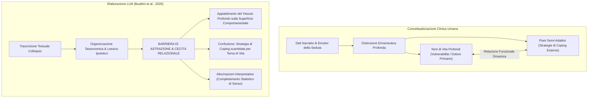

# Barriere di Astrazione e Allucinazioni Interpretative nella Concettualizzazione del Caso Clinico

**Summary**: Limiti epistemologici dei Large Language Models nella formulazione e concettualizzazione del caso clinico emersi dallo studio empirico di Buattini et al. (2026) sul modello LIBET. Pur mostrando eccellenti capacità organizzative e lessicali, l'IA incontra severe "barriere di astrazione", confondendo comportamenti manifesti (coping) con vulnerabilità emotive profonde (temi di vita) e generando allucinazioni interpretative prive di riscontro oggettivo.
**Sources**: `AI Generativa in Psicoterapia.docx`, Buattini, Barjami, Paponetti, et al. (2026) (*Cyberpsychology*)
**Last updated**: 2026-08-27
---

## Il Ruolo della Concettualizzazione del Caso

Nella psicoterapia cognitivo-comportamentale e nei modelli complessi (come il modello **LIBET** - *Life themes and plans Implicated in Biases: Elicitation and Treatment*), la concettualizzazione del caso rappresenta il momento ermeneutico culminante:
- Integra anamnesi remota, eventi scatenanti, credenze di base, stili di attaccamento e processi di mantenimento.
- Distingue nettamente tra **Temi di Vita** (vulnerabilità emotive primarie: senso di indegnità, terrore dell'abbandono, vulnerabilità al danno) e **Piani / Strategie di Coping** (comportamenti semi-adattivi o disfunzionali messi in atto per gestire la sofferenza: perfezionismo, ipercontrollo, compiacenza, evitamento).

---

## Le Evidenze dello Studio Qualitativo di Buattini et al. (2026)

Lo studio di **Buattini et al. (2026)** ha applicato ChatGPT-4 all'analisi qualitativa (analisi tematica riflessiva) di trascrizioni integrali di sedute cliniche reali (anonimizzate). I risultati isolano una netta demarcazione tra punti di forza e barriere strutturali:

### 1. Punti di Forza: Capacità Strutturale e Marcatori Epistemici
- **Organizzazione Tassonomica**: L'LLM ordina con eccezionale chiarezza il materiale discorsivo disordinato, inserendolo nelle categorie logiche previste dal modello e abbattendo i tempi burocratici del terapeuta.
- **Uso di Marcatori Epistemici (*Epistemic Markers*)**: Il modello impiega spontaneamente formule condizionali e costrutti ipotetici (*"i dati sembrerebbero suggerire che...", "potrebbe ipotizzarsi che..."*), perfettamente allineati con la natura della concettualizzazione come "mappa di lavoro provvisoria e falsificabile".

### 2. Punti di Debolezza: Barriere di Astrazione e Allucinazioni
- **La Barriera di Astrazione e Cecità Relazionale**: Il modello fallisce sistematicamente nell'inferire stati emotivi profondi e impliciti. Di fronte a un comportamento evidente (es. dedicarsi ossessivamente al lavoro), l'IA lo etichetta direttamente come "tema di vita", non riuscendo a cogliere che si tratta di un piano compensatorio difensivo per fuggire dal tema sottostante di inadeguatezza relazionale.
- **Allucinazioni Interpretative**: Sotto la spinta probabilistica a creare una narrazione coerente (*narrative closure*), l'algoritmo colma i vuoti informativi generando nessi causali affascinanti e apparentemente plausibili, ma privi di qualsiasi ancoraggio empirico nelle parole pronunciate dal paziente.

---

## Confronto Clinico

| Dimensione | Analisi del Terapeuta Umano | Output dell'LLM (GenAI) |
| :--- | :--- | :--- |
| **Piano Comportamentale vs Emotivo** | Distingue chiaramente il comportamento manifesto dalla sofferenza nucleare. | Tende a confondere il comportamento manifesto (coping) con il costrutto emotivo primario. |
| **Dinamica Relazionale Implicita** | Coglie micro-segnali, reticenze, silenzi e incongruenze prosodiche. | Cieco agli stati impliciti; vincolato alla superficie semantica letterale. |
| **Validità delle Inferenze** | Ancorata all'alleanza e alla costante verifica clinica in seduta. | Rischio elevato di allucinazioni interpretative formalmente impeccabili ma fattualmente inventate. |
| **Ruolo Operativo Ottimale** | **Monopolio Ermeneutico**: formulazione del senso e decisione terapeutica. | **Sparring Partner Dialettico**: riordino note, sintesi e rilevamento di macro-incongruenze. |

---

## Related Pages
- [[ai-generativa-in-psicoterapia]]
- [[libet-prime]]
- [[antagonista-cognitivo-sparring-partner]]
- [[human-in-the-reasoning]]
- [[automation-bias-clinical-reasoning]]
- [[llm-case-conceptualization-pipeline]]
