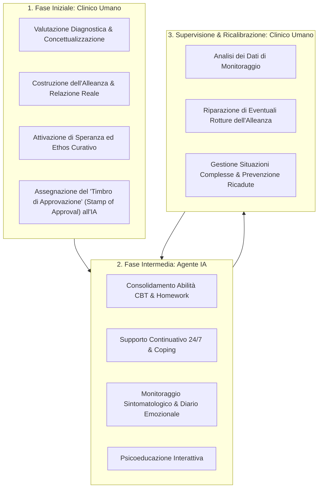

# Blended Care Framework per l'Integrazione di Agenti IA

**Summary**: Modello strategico e clinico di cura combinata (Blended Care) proposto da Herbener & Damholdt (2025) per superare i limiti strutturali degli agenti autonomi (Genuineness e Credibility Gap) capitalizzando al contempo sui loro punti di forza (scalabilità, disponibilità 24/7, basso costo).
**Sources**: Herbener & Damholdt (2025) - `2509.02144v1.pdf`
**Last updated**: 2026-08-27
---

## Definizione del Modello

Il **Blended Care Framework** (o assistenza ibrida tecnologia-supportata) definisce l'architettura clinica in cui gli interventi psicoterapeutici integrano sinergicamente sessioni in presenza o sincrone con un **terapeuta umano** e moduli interattivi continuativi gestiti da un **agente artificiale (LLM / chatbot clinico)** (Wentzel et al., 2016; Herbener & Damholdt, 2025).

Invece di concepire l'IA come un sostituto autonomo del clinico (scenario vulnerabile a gravi deficit di efficacia e problemi etici), il modello distribuisce i compiti clinici in base alla natura dei processi di cambiamento.

---

## Razionale Clinico: Perché il Blended Care Neutralizza i Gap

1. **Superamento del [[credibility-gap|Credibility Gap]] tramite lo "Stamp of Approval"**:
   - Quando l'agente IA è raccomandato e introdotto direttamente dal professionista curante con cui il paziente ha instaurato una relazione di fiducia, l'agente eredita la legittimazione istituzionale e l'autorevolezza del clinico. Ciò incrementa significativamente l'aderenza (*retention & adherence*) e le aspettative positive di miglioramento.

2. **Preservazione della Relazione Reale e del [[reflected-appraisal-in-ai-therapy|Reflected Appraisal]]**:
   - La relazione reale (Gelso, 2014) e le esperienze emotive correttive continuano a svilupparsi nello spazio interpersonale umano, evitando che il [[genuineness-gap|Genuineness Gap]] comprometta la ristrutturazione del concetto di Sé del paziente.

3. **Massimizzazione dell'Efficienza e Abbattimento dei Costi**:
   - L'agente IA assicura la disponibilità h24 per compiti ad alta ripetitività (consolidamento abitudini, journaling cognitivo, promemoria di esercizi), alleviando il carico di lavoro del terapeuta e riducendo i tempi di attesa e i costi per il paziente (Kazdin, 2018; Koelen et al., 2022).

---

## Parametri di Implementazione Clinica

Herbener & Damholdt (2025) evidenziano quattro domande chiave per la progettazione del blend terapeutico:

| Parametro | Descrizione | Raccomandazione Operativa |
| :--- | :--- | :--- |
| **Formato (*Format*)** | Modalità di interazione (faccia a faccia, videochiamata, testo asincrono, bot). | Faccia a faccia per le sessioni chiave; bot testuale per micro-interventi giornalieri. |
| **Proporzione (*Proportion*)** | Bilanciamento tra tempo umano e tempo digitale. | Maggior peso umano nelle fasi iniziali e finali; maggiore supporto IA nella fase centrale. |
| **Tempismo (*Timing*)** | Collocazione temporale dei blocchi di intervento. | Avvio obbligatorio con clinico umano per stabilire legame e accordo su compiti/obiettivi. |
| **Scopo (*Purpose*)** | Differenziazione dei ruoli operativi. | Umano: alleanza, profondità emotiva, etica, responsabilità. IA: pratica, ripetizione, dati. |

---

## Responsabilità Deontologica e Requisiti per i Professionisti

- **Responsabilità Finale Invariata**: La responsabilità legale e morale dell'intero percorso rimane in capo al terapeuta umano (Dennis et al., 2024).
- **Competenza Digitale (*AI Literacy*)**: I clinici devono acquisire competenze per valutare l'interazione del paziente con l'agente e prevenire dinamiche di attaccamento disfunzionale o fraintendimenti algoritmici.

---

## Relazioni
- [[herbener-damholdt-2025]]
- [[genuineness-gap]]
- [[credibility-gap]]
- [[ontological-and-sociocultural-status]]
- [[stepped-care-ai-integration]]
- [[three-layer-governance-framework]]
- [[human-in-the-reasoning]]
