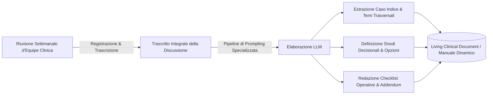

# Documentazione Clinica Bottom-Up e Living Documents

**Summary**: Metodologia per la generazione continua di manuali operativi, linee guida cliniche e alberi decisionali a partire dall'elaborazione computazionale (tramite LLM) dei trascritti di riunioni d'equipe e discussioni di casi reali. Introduce il concetto di *Living Clinical Document* ad aggiornamento incrementale e autorato diffuso.
**Sources**: 07-17 Riunione_ Corso di Formazione sull'IA in Psicologia e Utilizzo Clinico.txt
**Last updated**: 2026-08-27
---

## Il Divario tra Manualistica Tradizionale e Prassi Clinica
La letteratura scientifica e la formazione accademica si basano prevalentemente su manuali clinici "Top-Down", che descrivono protocolli standardizzati per patologie ideali. Nella pratica reale delle organizzazioni sanitarie e dei centri di psicoterapia complessa, i clinici affrontano quotidianamente sfide procedurali e relazionali che raramente trovano risposta nei testi canonici:
- Gestione dei passaggi di consegne (*transfer*) tra terapeuti (es. per maternità, interruzione temporanea, invio specialistico).
- Gestione del paziente passivo-richiestivo che rifiuta l'alleanza di lavoro e pretende soluzioni istantanee ("bacchetta magica").
- Interazioni complesse tra segreteria clinica, invianti e terapeuti d'equipe.

Queste soluzioni fanno parte della **conoscenza tacita (*tacit clinical knowledge*)** dell'equipe, che rischia di rimanere frammentata e perdersi nelle discussioni verbali senza mai strutturarsi in patrimonio formativo e operativo condiviso.

---

## Il Metodo Bottom-Up: Dalla Trascrizione al Manuale Operativo

Il modello sviluppato nell'ambito delle equipe cliniche specialistiche (progetto *inTherapy*) impiega gli LLM (es. Claude/Anthropic) come sintetizzatori ed estrattori strutturali del ragionamento d'equipe:

### Struttura Standard dell'Addendum Operativo
1. **Premesse e Scopo**: Inquadramento della lacuna procedurale nel manuale esistente.
2. **Caso Indice ed Episodio Critico**: Descrizione dell'evento clinico che ha motivato la discussione.
3. **Temi Clinici Trasversali**: Principi generali emergenti (es. distinguere il *tratto* dallo *stato*; leggere il *movente* del passaggio).
4. **Snodi Decisionali**: Mappatura esplicita delle opzioni terapeutiche a disposizione con relativi pro, contro e condizioni di applicabilità.
5. **Checklist Operativa**: Indicatori pratici per il clinico (es. domande da porsi prima del primo colloquio post-invio).

---

## Il Paradigma del "Living Clinical Document"
A differenza dei manuali cartacei statici, un **Living Document**:
- **Si aggiorna per aree tematiche**: Quando una successiva riunione d'equipe affronta nuovi aspetti dello stesso tema, l'agente AI integra le nuove evidenze nel capitolo preesistente.
- **Traccia il versioning**: Mantiene la storia delle revisioni (v1.0, v1.1, v2.0), documentando l'evoluzione delle prassi cliniche del centro.
- **Accessibilità digitale protetta**: Reso consultabile su portale privato HTML/Markdown con autenticazione riservata ai membri dell'equipe.

---

## Implicazioni per l'Autorato e la Ricerca Clinica
1. **Autorato Collettivo e Distribuito**: La redazione del testo nasce direttamente dai contributi dei partecipanti all'equipe, che diventano co-autori del manuale clinico operativo.
2. **Creazione di Manuali "Dal Basso"**: Possibilità di pubblicare linee guida terapeutiche derivate empiricamente dal lavoro clinico reale, colmando il divario tra ricerca di laboratorio e pratica quotidiana (*effectiveness vs efficacy*).
3. **Integrazione Didattica e Supervisione**: Materiale formativo di straordinario valore per allievi e giovani specializzandi, che possono apprendere la gestione dei micro-processi clinici reali.

---

## Related pages
- [[07-17_Riunione_Corso_Formazione_IA_Psicologia]]
- [[llm-wiki]]
- [[clinical-fidelity-assessment]]
- [[human-in-the-reasoning]]
- [[augmented-psychotherapy]]
- [[ai-assisted-psychotherapy]]
- [[hybrid-ai-research-workflows]]
