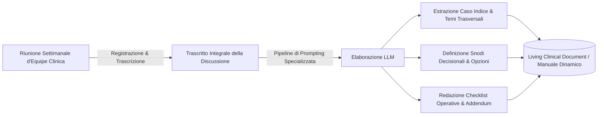

# Documentazione Clinica Bottom-Up e Living Documents

## Definizione Operativa
La Documentazione Clinica Bottom-Up è una metodologia per la generazione continua di manuali operativi, linee guida cliniche e alberi decisionali a partire dall'elaborazione computazionale (tramite LLM) dei trascritti di riunioni d'equipe e discussioni di casi reali. Introduce il concetto di *Living Clinical Document* ad aggiornamento incrementale e autorato diffuso, trasformando la conoscenza tacita dell'equipe in patrimonio operativo strutturato.

Il metodo impiega gli LLM come sintetizzatori ed estrattori strutturali del ragionamento d'equipe:

## Evidenze dalla Letteratura
La letteratura clinica tradizionale è spesso di tipo "Top-Down", focalizzata su protocolli per patologie ideali. La pratica reale presenta sfide quotidiane (es. passaggi di consegne, gestione pazienti difficili, dinamiche d'equipe) che costituiscono una "conoscenza tacita" (*tacit clinical knowledge*) spesso frammentata. L'approccio Bottom-Up mira a colmare questo divario, permettendo la creazione di linee guida derivate empiricamente dal lavoro clinico quotidiano (*effectiveness* vs *efficacy*). 

Il paradigma del *Living Clinical Document* offre vantaggi rispetto alla manualistica statica:
- **Aggiornamento tematico**: Integrazione continua di nuove evidenze.
- **Versioning**: Tracciabilità delle revisioni e dell'evoluzione delle prassi.
- **Autorato collettivo**: Partecipazione attiva dei membri dell'equipe alla creazione dei contenuti.
- **Valore didattico**: Supporto alla supervisione e formazione di giovani specializzandi sui micro-processi clinici.

**Riferimenti Bibliografici:**
- 07-17 Riunione_ Corso di Formazione sull'IA in Psicologia e Utilizzo Clinico.txt

## Relazioni
- [[07-17_Riunione_Corso_Formazione_IA_Psicologia]]
- [[llm-wiki]]
- [[clinical-fidelity-assessment]]
- [[human-in-the-reasoning]]
- [[augmented-psychotherapy]]
- [[ai-assisted-psychotherapy]]
- [[hybrid-ai-research-workflows]]
