# Boundary Objects in Psicoterapia Mediata da IA

**Summary**: Concettualizzazione dei Large Language Models e dei sistemi digitali di salute mentale come *oggetti di confine* (Boundary Objects, Star & Griesemer 1989), intesi come articolazioni operative dello "spazio potenziale" di Winnicott capaci di mediare significati, potere e fiducia tra mondi sociali eterogenei (paziente, clinico, istituzione).
**Sources**: Quan et al. (2025) - `2512.22462v1.pdf`, Star & Griesemer (1989), Winnicott (1971), BenEzer (2012)
**Last updated**: 2026-08-27
---

## Origine e Definizione Teorica

La nozione di **Boundary Object (Oggetto di Confine)**, introdotta originariamente dai sociologi Susan Leigh Star e James R. Griesemer (1989), descrive entità o artefatti che risiedono all'intersezione di molteplici comunità o mondi sociali disomogenei. Tali oggetti possiedono due proprietà cardinali:
1. **Plasticità Locale (*Plasticity*)**: Capacità di adattarsi alle esigenze specifiche e alle interpretazioni contingenti dei singoli attori locali.
2. **Coerenza Globale (*Robustness / Coherence*)**: Mantenimento di un'identità e di una struttura condivisa e riconoscibile tra i diversi gruppi.

```mermaid
flowchart LR
    subgraph WorldP ["Mondo del Paziente"]
        P1["Esperienza Vissuta"]
        P2["Linguaggio Soggettivo/Identitario"]
        P3["Vulnerabilità & Timore di Stigma"]
    end

    subgraph BO ["LLM come Boundary Object (Spazio Potenziale)"]
        B1["Plasticità Locale (Adattamento contestuale)"]
        B2["Coerenza di Significato (Struttura clinica condivisa)"]
        B3["Mediazione di Confine (Traduzione & Pacing)"]
    end

    subgraph WorldT ["Mondo del Terapeuta"]
        T1["Inquadramento Clinico"]
        T2["Deontologia & Responsabilità"]
        T3["Confini di Setting e Orario"]
    end

    WorldP <-->|Negoziazione Significati| BO
    BO <-->|Negoziazione Pratiche & Cura| WorldT
```

---

## Applicazione alla Psicoterapia: Lo Spazio Potenziale Winnicottiano

A differenza delle tradizionali applicazioni sanitarie in cui i boundary objects fungono da meri strumenti di scambio dati (es. cartelle cliniche elettroniche), nel contesto psicoterapeutico lo scambio diretto e oggettivante incontra resistenze affettive e relazionali.

Quan et al. (2025), richiamando la lettura transculturale di BenEzer (2012), posizionano il chatbot LLM come un'articolazione operativa dello **spazio potenziale di Donald Winnicott** (1971):
- Una *zona intermedia di esperienza* che non appartiene interamente né alla realtà interna del paziente né al mondo esterno del terapeuta.
- Uno spazio transizionale e protetto in cui il paziente può esplorare e verbalizzare vissuti ambivalenti o traumatizzanti, dosare il proprio autosvelamento (*pacing*) e rinegoziare i confini della relazione terapeutica prima dell'incontro formale.

---

## Confronto Teorico: Perché i Boundary Objects?

Quan et al. (2025) motivano la scelta della Boundary-Object Theory rispetto ad altri modelli teorici dell'HCI e della sociologia della tecnologia:

| Teoria | Assunti Principali | Limiti nel Contesto Psicoterapeutico | Vantaggio del Boundary Object |
| :--- | :--- | :--- | :--- |
| **Mediation Theory** (Gagnepain) | La tecnologia media la cognizione e la trasmissione di simboli e messaggi. | Considera la mediazione come passaggio di informazione statico; ignora la continua rinegoziazione fluida delle dinamiche di potere e dei confini relazionali. | Coglie la dimensione affettiva e la co-costruzione di significato. |
| **Actor-Network Theory (ANT)** (Callon, Latour) | Distribuzione simmetrica dell'agency tra attori umani e non-umani in reti eterogenee. | Rischia di deresponsabilizzare il clinico disperdendo l'intenzionalità etica e legale; tende a chiudere il discorso in *obbligatory passage points*, contrariamente all'ermeneutica aperta della psicoterapia. | Mantiene l'intenzionalità etica umana pur riconoscendo l'agency mediatrice dell'artefatto. |
| **Boundary-Object Theory** (Star & Griesemer) | Artefatti flessibili che permettono cooperazione senza richiedere consenso totale preventivo. | — | Perfettamente allineata alla coesistenza di prospettive cliniche istituzionali e vissuti identitari soggettivi. |

---

## Dimensioni Operative dei Boundary Objects nell'IA Clinica

1. **Oggetti di Confine Temporali**: Funzionalità come il tracking emotivo longitudinale e le sintesi narrative che creano continuità tra momenti discontinui (sedute settimanali).
2. **Oggetti di Confine Traduttivi**: Sistemi multimodali e glossari identitari che traducono emozioni indifferenziate o linguaggi subculturali in formulazioni condivisibili.
3. **Oggetti di Confine Plastici/Politici**: Moduli di consenso e privacy dinamica che consentono al paziente di decidere cosa oltrepassa il confine privato-professionale.

---
## Concetti Correlati
- [[dynamic-boundary-mediation-framework]]
- [[educator-burden-marginalized-clients]]
- [[negotiable-data-visibility-privacy]]
- [[contextualized-relational-memory]]
- [[interazione-triadica-terapeuta-paziente-ia]]
- [[weird-bias-cultural-adaptability-ai]]
