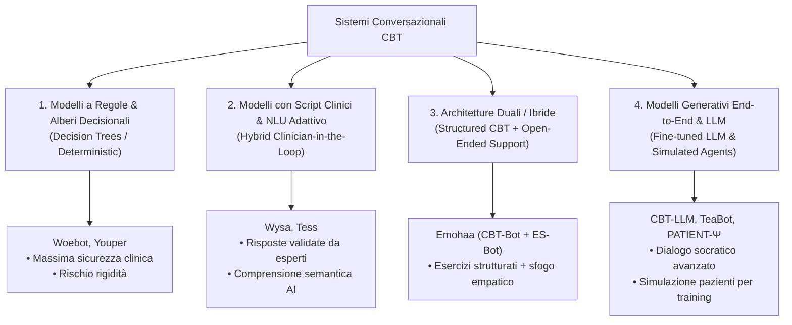

# CBT Dialogue Systems and Clinical Tools (Sistemi Conversazionali e Strumenti Digitali per la CBT)

## Definizione Operativa
Agenti conversazionali intelligenti (*Chatbots*, *Relational Agents* ed *Embodied Conversational Agents* - ECA) e piattaforme digitali basate su intelligenza artificiale progettati per implementare in modo strutturato, interattivo e continuativo principi e protocolli della Terapia Cognitivo-Comportamentale (CBT) (Jiang et al., 2024; Abd-Alrazaq et al., 2019).

---

## Tassonomia Architetturale dei Sistemi di Dialogo CBT

---

## Analisi Comparativa dei Principali Agenti CBT

| Agente / Sistema | Target Clinico | Architettura Tecnologica | Meccanismi CBT Implementati |
| :--- | :--- | :--- | :--- |
| **Woebot** | Depressione, ansia | Alberi decisionali, NLP, tracciamento dell'umore | Psicoeducazione, identificazione pensieri distorti, word games, safety routing |
| **Wysa** | Stress, ansia, depressione | Script clinici redatti da esperti + NLU neurale | Ristrutturazione cognitiva, mindfulness, protocolli di psicologia positiva |
| **Youper** | Disturbi affettivi | Assessment a 3 step + alberi di decisione | Valutazione emotiva real-time, micro-interventi CBT personalizzati |
| **Tess** | Supporto e promemoria | Clinician-prepared rules + feedback adattivo | Psicoeducazione rapida, reminder di abitudini sane, routing personalizzato |
| **Emohaa** | Distress psicologico | Architettura duale: *CBT-Bot* (strutturato) + *ES-Bot* (libero) | Esercizi CBT guidati uniti a supporto empatico non vincolato |
| **Rumi** | Ruminazione e ansia | Chatbot basato su RFCBT (*Rumination-focused CBT*) | Analisi dei pattern di rimuginio, de-focusing cognitivo |
| **Todaki** | ADHD nell'adulto | Chatbot mobile per abilità di auto-aiuto | Psicoeducazione mirata su funzioni esecutive e micro-sessioni CBT |
| **SchizoBot** | Schizofrenia | Reti neurali artificiali | Aderenza terapeutica, gestione dei sintomi, supporto standardizzato |
| **XIAO AN** | Ansia (trial clinici) | Robot assistivo multimodale (voce/video/testo) | Monitoraggio affettivo e supporto al terapeuta |
| **PATIENT-Ψ** | Formazione clinica | Multi-agent LLM con modelli cognitivi differenziati | Simulazione realistica di pazienti per l'addestramento al dialogo socratico |

---

## Componenti Funzionali di un Agente CBT Efficace

1. **Modulo di Valutazione e Triage:** Rilevazione dell'umore istantaneo e somministrazione periodica di scale standardizzate (BDI-II, BAI, GAD-7, PHQ-9).
2. **Modulo di Psicoeducazione Guidata:** Spiegazione interattiva del modello ABC (Antecedente - Belief - Conseguenza) e dei principi di ristrutturazione.
3. **Modulo di Intervento Strategico:** Erogazione di prompt socratici (*Socratic Questioning*), esercizi di de-catastrofizzazione e piani di attivazione comportamentale (*Behavioral Activation*).
4. **Modulo di Sicurezza (*Safety & Escalation Protocol*):** Riconoscimento immediato di ideazione suicidaria, abuso o emergenze psichiatriche con re-indirizzamento automatico a linee telefoniche di emergenza o a clinici umani.

---

## Sfide Cliniche e Limiti
- **Coinvolgimento nel Lungo Termine:** Rischio di elevato dropout spontaneo dopo le prime settimane di utilizzo.
- **Illusione di Empatia vs Presenza Autentica:** L'etichettatura esplicita dell'agente come "IA" può ridurre la risonanza emotiva percepita (Yin et al., 2024), rendendo necessario chiarire che il bot è uno strumento di supporto e non un sostituto affettivo.
- **Valutazione Clinica Rigorosa:** Necessità di standardizzare le metriche di usabilità e validità terapeutica tramite trial clinici controllati randomizzati (RCT).

---

## Relazioni
- [[ai-enhanced-cbt]]: Integrazione nel framework generale.
- [[cognitive-distortion-detection]]: Algoritmi di NLU integrati nelle interfacce.
- [[automated-cognitive-restructuring]]: Generazione di risposte di reframing.
- [[conversational-agents-mental-health]]: Panoramica meta-analitica generale.
- [[simulazione-pazienti-ai]]: Focus specifico su PATIENT-Ψ e simulatori per tirocinanti.
- [[jiang-et-al-2024]]: Studio di review di riferimento.
