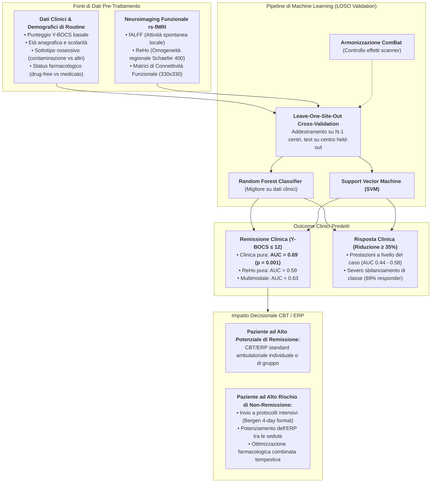

---
tags:
  - ocd
  - cbt
  - treatment-outcome-prediction
  - remission-prediction
  - machine-learning
  - neuroimaging-limits
  - rs-fmri
  - y-bocs
  - precision-psychiatry
  - van-de-mortel-2025
source_papers:
  - 1-s2.0-S0165032725011711-main.pdf
title: "Predizione dell'Esito della CBT nel Disturbo Ossessivo-Compulsivo (CBT Outcome Prediction in OCD)"
---

# Predizione dell'Esito della CBT nel Disturbo Ossessivo-Compulsivo (CBT Outcome Prediction in OCD)

## Definizione Operativa

La **Predizione dell'Esito della CBT nel Disturbo Ossessivo-Compulsivo** (*CBT Outcome Prediction in OCD*) è l'applicazione di metodologie di apprendimento automatico supervisionato (Random Forest, Support Vector Machines) e analisi multivariata a parametri clinico-anamnestici, psicometrici e neurobiologici per stimare a priori (prima dell'avvio della terapia) la probabilità che un paziente raggiunga una **Risposta Clinica** significativa ($\ge 35\%$ di riduzione dei sintomi alla scala Yale-Brown Obsessive Compulsive Scale [Y-BOCS]) o una completa **Remissione Sintomatica** ($\text{Y-BOCS} \le 12$) in seguito a un protocollo evidence-based di Terapia Cognitivo-Comportamentale focalizzata sull'Esposizione con Prevenzione della Risposta (ERP) (Van de Mortel et al., 2025).

*   **Utilità Clinica e Psichiatria di Precisione:** Permette di superare il paradigma per tentativi ed errori (*trial-and-error*), identificando tempestivamente i pazienti con bassa probabilità di remissione con la CBT ambulatoriale convenzionale e consentendo l'assegnazione mirata a trattamenti intensivi (es. *Bergen 4-day format*), protocolli combinati (CBT + SSRI ad alto dosaggio/antipsicotici atipici) o strategie di neuromodulazione precoce.

---

## Architettura Predittiva e Fonti di Dati

---

## Il Paradosso Empirico: Monocentrico vs Multicentrico

Un contributo cardine della letteratura recente (Van de Mortel et al., 2025, consorzio **ENIGMA-OCD**, $N = 159$ su 4 centri) risiede nella smentita del presunto valore predittivo superiore della neuroimaging funzionale a riposo (rs-fMRI):

1.  **L'Illusione dei Piccoli Campioni Monocentrici:** Precedenti studi pilota monocentrici su campioni limitati ($N < 40$) avevano riportato un'elevata accuratezza ($> 80\%$) dei biomarcatori di connettività striato-corticale e orbitofrontale nella previsione della risposta alla CBT.
2.  **Il Crollo di Performance nei Consorzi Multicentrici:** Quando testati con una rigorosa validazione esterna *leave-one-site-out* (in cui il modello è validato su un ospedale mai visto durante il training):
    *   I parametri di rs-fMRI (**fALFF, ReHo e Connettività Funzionale globale**) non hanno superato il livello del caso casuale per la risposta ($\text{AUC} = 0.44 - 0.56$);
    *   Nella remissione, solo l'omogeneità regionale (ReHo) ha mostrato un segnale debole ($\text{AUC} = 0.59$), mentre connettività funzionale ($\text{AUC} \le 0.50$) e ampiezza delle fluttuazioni ($\text{AUC} \le 0.50$) sono risultate del tutto inefficaci;
    *   L'integrazione multimodale (Clinica + fMRI) non ha fornito alcun vantaggio rispetto ai soli dati clinici ($\text{AUC} = 0.63$ vs $0.69$);
    *   L'armonizzazione statistica mediante algoritmi ComBat non ha colmato il divario, suggerendo un'assenza di biomarcatori fisiologici macroscopici rilevabili a riposo associati alla responsività all'ERP.
3.  **Estensione alla fMRI Task-Based (Inibizione ed Error Processing):** La successiva mega-analisi multicentrica ENIGMA-OCD su 5 coorti ($N=130$) condotta da Džinalija et al. (2026) ha testato l'ipotesi che la fMRI evocata da compiti cognitivi (*task-based*, Stop-Signal e Flanker) potesse superare i limiti della rs-fMRI. Nonostante la rilevazione di chiare associazioni univariate e bayesiane a livello di gruppo (deattivazione del DMN e della corteccia motoria), i modelli di Machine Learning (SVM, Random Forest con validazione LOSO e nested 5-fold CV) hanno replicato prestazioni a livello del caso ($\text{AUC} = 0.40 - 0.59, p > 0.05$), consolidando l'esistenza del **Prediction vs. Association Gap** (vedi [[task-based-fmri-cbt-prediction]] e [[dzinalija-et-al-2026]]).
4.  **Il Primato della Frugalità Clinica:** I parametri anamnestici e psicometrici ordinari, raccolti a costo zero in pochi minuti durante la visita di inquadramento, offrono una capacità predittiva significativamente più solida, affidabile e generalizzabile tra diversi ospedali rispetto a costose scansioni RM.

---

## Dicotomia Clinica: Risposta vs Remissione

La ricerca evidenzia una divergenza prognostica e psicometrica cruciale tra i due target terapeutici:

| Dimensione | Risposta Clinica (*Response*, $\Delta\text{Y-BOCS} \ge 35\%$) | Remissione Clinica (*Remission*, $\text{Y-BOCS} \le 12$) |
| :--- | :--- | :--- |
| **Distribuzione nel Campione** | Forte sbilanciamento ($69\%$ responder) | Equilibrata ($42\%$ remitter, $58\%$ non-remitter) |
| **Prevedibilità da ML** | Inefficace / Livello del caso ($\text{AUC} \approx 0.50 - 0.58$) | Significativa con Random Forest ($\text{AUC} = 0.69$, $p = 0.001$) |
| **Rilevanza Prognostica** | Può sottendere una cronicità parziale residua | **Massima:** riduce drasticamente le ricadute a lungo termine (Elsner et al., 2020) |
| **Impatto Decisionale** | Bassa utilità discriminativa pre-trattamento | Guida la scelta dell'intensità e del setting terapeutico |

Come stabilito da Elsner et al. (2020), la stabilità dei benefici della CBT per l'OCD a 1-2 anni dal termine della terapia dipende dal raggiungimento della **remissione dei sintomi** durante il trattamento, e non dalla semplice riduzione percentuale del punteggio.

---

## Profilo Predittivo del Paziente Remitter (Feature Importance SHAP)

L'analisi dei valori Shapley (SHAP) nei modelli ad albero decisionale (*Random Forest*) identifica un cluster coerente di predittori per la remissione post-ERP:

1.  **Minore Gravità Y-BOCS Basale:** Pazienti con sintomatologia pre-trattamento moderata mostrano probabilità marcatamente superiori di scendere sotto la soglia di remissione ($\le 12$). L'uso del modello multivariato previene l'elevato tasso di falsi positivi generato dall'uso isolato della Y-BOCS (che presenta specificità insoddisfacente del $46\%$).
2.  **Età Più Giovane:** L'età precoce è associata a una maggiore flessibilità cognitiva e a una superiore capacità di estinzione dell'apprendimento ansiogeno durante le esposizioni.
3.  **Assenza di Ossessioni di Contaminazione e Pulizia (*Cleaning/Contamination*):** I pazienti con ossessioni di contaminazione ottengono spesso risposte cliniche parziali, ma faticano a raggiungere la remissione completa rispetto a soggetti con ossessioni aggressive, religiose o di simmetria, verosimilmente a causa della pervasività dei trigger ambientali e delle condotte di evitamento radicate.
4.  **Status Non Medicato (*Drug-Free*):** I pazienti che intraprendono la CBT senza terapia farmacologica concomitante (SSRI o antipsicotici) presentano probabilità di remissione più elevate. Clinicamente, l'assunzione di psicofarmaci al baseline è spesso indice di una patologia più refrattaria o cronica che ha già fallito precedenti linee di intervento.
5.  **Livello di Istruzione Superiore:** Un maggior livello di scolarità correla positivamente con la comprensione concettuale del razionale dell'ERP e l'aderenza ai compiti a casa inter-seduta (*homework*).

---

## Implicazioni per la Pratica Clinica della CBT

*   **Stratificazione dell'Intensità Terapeutica:** I pazienti che presentano un profilo a basso potenziale di remissione standard (alta severità basale, età avanzata, presenza di ossessioni di pulizia, già in terapia farmacologica) non dovrebbero essere avviati a percorsi ambulatoriali a bassa frequenza senza supporto intensivo. Per questi profili sono indicati:
    *   Formati intensivi ad alta concentrazione (es. il protocollo norvegese Bergen 4-day, che ha dimostrato efficacia indipendente dalla gravità basale; Hansen et al., 2018, 2019);
    *   Sessioni di esposizione assistite in vivo dal terapeuta nell'ambiente naturale del paziente;
    *   Integrazione di strumenti digitali per il monitoraggio e il supporto all'ERP extraseduta ([[automated-erp-training]]).
*   **Abbandono del Neuroimaging di Routine:** In conformità ai criteri di appropriatezza clinica ed economica, l'esecuzione di risonanze magnetiche a riposo non trova alcuna giustificazione come biomarcatore decisionale pre-CBT nell'OCD.

---

## Relazioni

*   [[task-based-fmri-cbt-prediction]]: Predizione tramite fMRI task-based (controllo inibitorio ed error processing) e Prediction vs. Association Gap.
*   [[dzinalija-et-al-2026]]: Mega-analisi ENIGMA-OCD su 5 coorti e test di modelli ML (SVM, RF) su fMRI task-based.
*   [[van-de-mortel-et-al-2025]]: Studio multicentrico empirico ENIGMA-OCD su Journal of Affective Disorders.
*   [[treatment-outcome-and-relapse-prediction]]: Panoramica generale sui modelli di predizione esito e ricaduta in psicoterapia.
*   [[clinical-prediction-model-evaluation]]: Metodologia di valutazione continua, discriminazione, calibrazione e beneficio netto.
*   [[automated-erp-training]]: Piattaforme digitali e agenti IA per l'allenamento dell'esposizione con prevenzione della risposta.
*   [[cbt]]: Principi teorico-metodologici della Terapia Cognitivo-Comportamentale evidence-based.
*   [[tripod-ai2024]]: Standard internazionali di reporting per modelli predittivi clinici basati su AI e Machine Learning.
