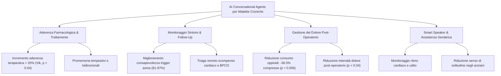

# Chronic Disease Self-Management, Remote Monitoring, and Medication Adherence

## Definizione Operativa
L'utilizzo di agenti conversazionali basati su intelligenza artificiale e assistenti vocali per facilitare l'automonitoraggio continuativo dei sintomi, la gestione domiciliare delle patologie croniche complesse (es. diabete, scompenso cardiaco, asma, BPCO, patologie oncologiche) e l'ottimizzazione dell'aderenza ai regimi farmacologici e riabilitativi prescritti (Huynh et al., 2026; Schachner et al., 2020).
- **Utilità CBT e Clinica:** Potenziamento dell'autoefficacia del paziente (*self-efficacy*), riduzione del distress associato alla gestione della malattia cronica, riconoscimento precoce dei trigger sintomatologici e automatizzazione dei promemoria posologici personalizzati.

---

## Evidenze Cliniche e Applicazioni Pratiche

### 1. Ottimizzazione dell'Aderenza Terapeutica
- **Incremento della Compliance**: L'utilizzo di chatbot dedicati (es. *Vik*) ha dimostrato un aumento dell'aderenza ai trattamenti superiore al 20% ($p = 0.04$; Xu, 2021). Nelle review sistematiche analizzate (Aggarwal et al., 2023; Casu, 2024), i gruppi che hanno utilizzato agenti conversazionali hanno registrato tassi di aderenza significativamente più elevati rispetto alle cure abituali.
- **Promemoria Dinamici e Interattivi**: A differenza dei semplici allarmi passivi, i chatbot AI instaurano un dialogo bidirezionale, verificando l'effettiva assunzione, raccogliendo segnalazioni su effetti collaterali e fornendo risposte immediate a dubbi posologici.

### 2. Monitoraggio Remoto e Follow-up Post-Chirurgico
- **Riduzione del Consumo di Oppioidi**: Nella revisione di Geoghegan et al. (2021), i pazienti seguiti nel post-operatorio da chatbot per il follow-up hanno evidenziato una riduzione del 36.5% nel numero di compresse di oppiacei assunte e un calo del 35% nei milliequivalenti di morfina consumati ($p = 0.006$), accompagnati da punteggi significativamente inferiori di intensità del dolore (PROMIS score, $p = 0.04$).
- **Gestione dell'Asma e della BPCO**: Applicazioni dedicate (es. *mASMAA*) hanno raggiunto tassi di risposta giornaliera tra l'81% e il 97%, migliorando sensibilmente la consapevolezza dei trigger ambientali e la tempestività nell'uso degli inalatori al bisogno (Schachner et al., 2020).

### 3. Assistenti Vocali (*Smart Speakers*) e Popolazione Anziana
- **Piattaforme**: Ampio utilizzo di dispositivi vocali domestici come Amazon Alexa (85%) e Google Assistant (19%) (Merkel & Schorr, 2025).
- **Outcome Clinico-Assistenziali**: Elevata accuratezza nel monitoraggio remoto (es. rilevazione di aritmie cardiache, test uditivi domiciliari, monitoraggio della gravidanza) e significativo impatto positivo nella riduzione dell'isolamento sociale e del senso di solitudine negli anziani fragili.

---

## Vantaggi Sistemici e Integrazione nel Servizio Sanitario
1. **Sgravio del Carico Ospedaliero**: L'automazione della raccolta dati pre-visita e del monitoraggio post-dimissione decongestiona i reparti e riduce i tassi di riammissione non pianificata.
2. **Personalizzazione Contestuale**: Gli agenti possono adattare il registro comunicativo e la frequenza delle interazioni allo stato emotivo e alla risposta clinica del paziente.
3. **Interoperabilità con Cartelle Cliniche Elettroniche (EHR)**: L'integrazione con standard sanitari (es. FHIR/HL7) consente di trasferire i parametri registrati direttamente al team medico curante.

---

## Riferimenti Bibliografici
- Huynh, A. L., Roy, T. J., Jackson, K. N., Lee, A. G., Liaw, W., & Hossain, M. M. (2026). Applications of artificial intelligence-based conversational agents in healthcare: A systematic umbrella review. *International Journal of Medical Informatics*, 207, 106204.
- Geoghegan, L., Scarborough, A., Wormald, J. C. R., et al. (2021). Automated conversational agents for post-intervention follow-up: A systematic review. *BJS Open*, 5(4), zrab070.
- Merkel, S., & Schorr, S. (2025). Identification of Use Cases, Target Groups, and Motivations Around Adopting Smart Speakers for Health Care and Social Care Settings: Scoping Review. *JMIR AI*, 4, e55673.
- Schachner, T., Keller, R., & von Wangenheim, F. (2020). Artificial intelligence-based conversational agents for chronic conditions: Systematic literature review. *Journal of Medical Internet Research*, 22(9), e20701.

---

## Relazioni
- [[huynh-et-al-2026]]
- [[healthcare-conversational-agents]]
- [[addiction-lifestyle-behavior-change]]
- [[ai-clinical-decision-support]]
- [[digital-therapeutic-alliance]]
