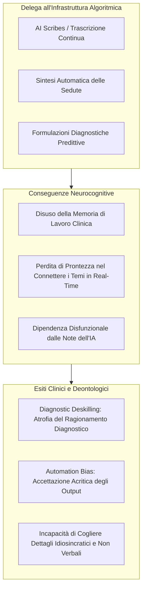

# Cognitive Offloading e Diagnostic Deskilling in Psicoterapia

**Summary**: Processo di decadimento neurocognitivo e professionale in cui la delega sistematica all'IA dei processi di memorizzazione anamnestica, sintesi tematica e formulazione diagnostica produce "debito cognitivo", atrofia della memoria di lavoro in seduta e vulnerabilità all'automation bias.
**Sources**: Signorini & Paganin (2026, *Frontiers in Psychology*, DOI: 10.3389/fpsyg.2026.1690291); Parasuraman & Manzey (2010); `AI in Psicoterapia 2023-2026.docx`.
**Last updated**: 2026-08-27
---

## Il Meccanismo del "Cognitive Offloading" (Scaricamento Cognitivo)

Il **Cognitive Offloading** clinico si verifica quando il terapeuta affida all'infrastruttura algoritmica (come trascrittori intelligenti, AI scribes e sintetizzatori automatici di seduta) compiti cognitivi complessi:
- La memorizzazione e l'aggiornamento dei dettagli anamnestici;
- L'estrazione tematica dei nuclei emotivi ricorrenti;
- La strutturazione delle note di avanzamento della terapia.

Se a breve termine questo meccanismo riduce il carico percepito, a lungo termine genera un severo **"debito cognitivo"**:

---

## Diagnostic Deskilling e Automation Bias

### 1. Diagnostic Deskilling (De-professionalizzazione Diagnostica)
L'apprendimento e il mantenimento dell'expertise clinica richiedono un faticoso e continuo esercizio di:
- Formulazione di ipotesi multiple;
- Confronto con segnali deboli e contraddittori;
- Test e scarto attivo di piste diagnostiche.

Quando il clinico viene costantemente anticipato o sollevato da ipotesi pre-confezionate dall'IA, questo circuito neurofunzionale si atrofizza, rendendo il terapeuta progressivamente dipendente e insicuro nell'elaborazione autonoma.

### 2. Automation Bias
L'**Automation Bias** è la tendenza euristica a sovrastimare l'affidabilità, la correttezza e l'esaustività di un sistema automatizzato.
- Dinanzi a un testo redatto dall'LLM con un linguaggio tecnico assertivo, impeccabile grammatica e ricchi rimandi concettuali, il clinico tende ad abbassare la soglia di vigilanza critica.
- Si rischia di ignorare o svalutare evidenze relazionali, corporee o idiosincratiche manifeste che contraddicono la categorizzazione dell'algoritmo.

---

## Tabella Comparativa degli Impatti Cognitivi

| Funzione Clinica | Esercizio Tradizionale | Delega all'IA (Offloading) | Presidio Protocollato ([[sadar-framework\|SADAR]]) |
| :--- | :--- | :--- | :--- |
| **Memoria di Lavoro** | Allenamento continuo in seduta per associare temi | Atrofia da disuso; consultazione continua di note | Stimolata nel richiamo differito post-seduta |
| **Generazione Ipotesi** | Faticosa esplorazione intuitivo-analitica | Accettazione passiva di pattern suggeriti | **L'IA è costretta a produrre 3 ipotesi divergenti** |
| **Vigilanza Critica** | Revisione e dubbio sistematico | Illusione di accuratezza (Automation Bias) | Rigetto attivo delle allucinazioni e integrazione umana |
| **Focus in Seduta** | Attenzione fluttuante e sintonizzazione corporea | Distrazione da dashboard / registrazione | **Nessuna tecnologia durante la seduta** |

---

## Contromisure e Standard Operativi

- **Intenzionale Attrito Cognitivo**: Rifiutare l'automazione totale dei processi decisionali; impiegare prompt che costringano al ragionamento divergente (come previsto dal metodo 3-2-1 del [[sadar-framework|SADAR]]).
- **Mantenimento di Compiti Mentali Non Delegabili**: La stesura della concettualizzazione del caso e la formulazione diagnostica devono rimanere atti intellettuali prioritariamente umani.
- **Formazione Continua sui Bias Tecnologici**: Inserimento dell'automation bias nei curricula ECM e di specializzazione per psicoterapeuti.

---

## Pagine Correlate
- [[moral-buffering-e-deskilling-etico]]
- [[sadar-framework]]
- [[digital-analytic-third]]
- [[sindrome-impostore-ia-specifica]]
- [[artificial-intelligence-replacement-dysfunction]]
- [[tecnostress-e-paradosso-sovradocumentazione]]
- [[ai-in-psicoterapia-2023-2026]]
