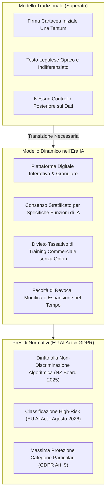

# Consenso Dinamico e Governance dei Dati in Psicoterapia Digitale

**Summary**: Modello evolutivo di consenso informato e governance etico-giuridica per la salute mentale digitale che supera il consenso statico cartaceo, garantendo al paziente granularità modulare sui propri dati, diritto alla non-discriminazione algoritmica e conformità vincolante a EU AI Act 2024/1689 (sistemi ad alto rischio - agosto 2026) e GDPR Articolo 9.
**Sources**: Regolamento (UE) 2024/1689 (EU AI Act); New Zealand Psychologists Board (2025); APA (2025); Tandem Health (2025); `AI in Psicoterapia 2023-2026.docx`.
**Last updated**: 2026-08-27
---

## Il Superamento del Consenso Informato Statico

Nell'era dei [[large-language-models]] e della digital health, il consenso informato cartaceo, una tantum e generico risulta clinicamente e giuridicamente inefficace. 

Il **Consenso Dinamico (*Dynamic Informed Consent*)** è una piattaforma relazionale e tecnologica in cui il paziente esercita un controllo continuativo e granulare sull'utilizzo, l'archiviazione e l'eventuale processamento algoritmico dei propri dati clinici, narrativi e biometrici.

---

## Quadro Normativo e Standard Istituzionali (2023-2026)

### 1. Regolamento (UE) 2024/1689 (EU AI Act)
- **Classificazione ad Alto Rischio (*High-Risk*)**: I sistemi di IA impiegati per diagnosi, supporto terapeutico, monitoraggio psicologico o triage psichiatrico sono classificati nella fascia di massimo controllo normativo.
- **Termine di Conformità (Agosto 2026)**: Scadenza entro cui clinici e organizzazioni sanitarie (in qualità di *deployers*) devono documentare la supervisione umana continuativa (*human oversight*), l'assenza di bias sistemici e la tracciabilità tecnica degli algoritmi.

### 2. GDPR Articolo 9 e Protezione dei Dati Sensibili
- I dati psichiatrici, le registrazioni vocali, le trascrizioni di seduta e i dati psicometrici appartengono a "categorie particolari di dati personali".
- La semplice pseudonimizzazione o de-identificazione standard spesso non tutela l'anonimato in narrazioni biografiche dense e ricche di sfumature personali. L'uso di tali dati per il riaddestramento dei modelli proprietari di Big Tech senza un consenso informato specifico e separato costituisce una violazione grave.

### 3. Diritto alla Non-Discriminazione Algoritmica (New Zealand Board, 2025)
- Principio deontologico fondamentale: qualora un paziente scelga espressamente di **non autorizzare l'uso di trascrittori IA o software di supporto decisionale**, il professionista ha l'obbligo di garantire il medesimo standard di cura, dedizione, riservatezza e tempestività, senza penalizzazioni o aggravi tariffari.

---

## Matrice Operativa del Consenso Dinamico

| Ambito di Utilizzo | Consenso Necessario | Condizioni Operative |
| :--- | :--- | :--- |
| **Completamento Testuale Predittivo / Email** | Non richiesto (uso standard) | Nessun dato del paziente inserito |
| **AI Scribe / Trascrizione Seduta** | **Obbligatorio e Specifico** | Crittografia end-to-end, server UE/GDPR compliant |
| **Supporto Decisionale / RAG Clinico** | **Obbligatorio ed Esplicito** | Trasparenza sui limiti del modello e su *Human-in-the-Loop* |
| **Addestramento Modelli di Terze Parti** | **Opt-in Esplicito Separato** | Fortemente sconsigliato in contesti terapeutici |
| **Rifiuto dell'Uso dell'IA** | Registrazione a cartella | Nessuna discriminazione o pregiudizio nella cura |

---

## Pagine Correlate
- [[ai-in-psicoterapia-2023-2026]]
- [[moral-buffering-e-deskilling-etico]]
- [[sadar-framework]]
- [[specializzazioni-ia-resistenti]]
- [[tecnostress-e-paradosso-sovradocumentazione]]
