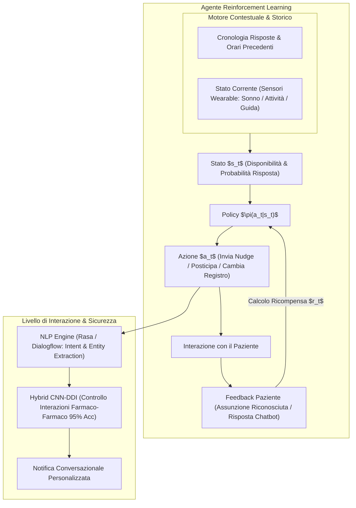
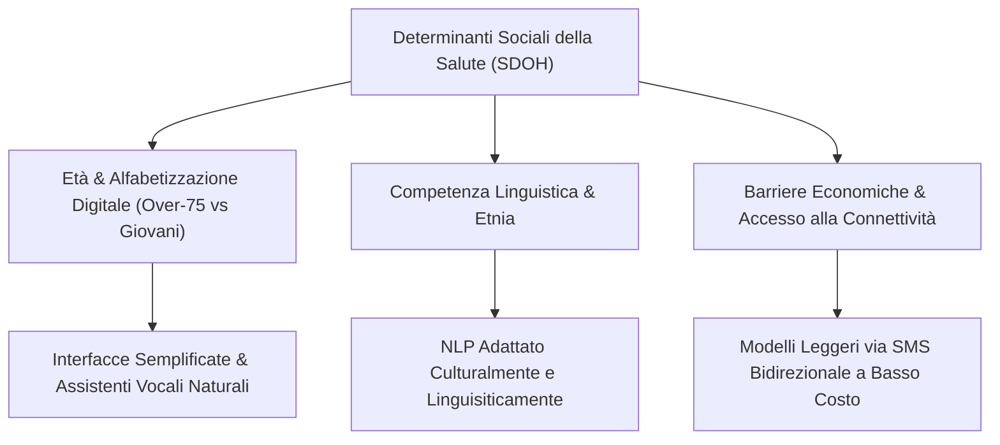

# Context-Aware Adaptive Nudging and Reinforcement Learning in Adherence

## Definizione Operativa
L'integrazione di agenti conversazionali intelligenti (chatbot testuali e vocali) e algoritmi di apprendimento per rinforzo (*Reinforcement Learning* - RL) per modulare dinamicamente il momento, la frequenza, il tono e il canale di invio dei promemoria posologici (*behavioral nudges*), ottimizzando la responsività individuale del paziente sulla base dei suoi schemi comportamentali storici e del contesto situazionale (Joshua & Peterson, 2025; Milne-Ives et al., 2020).

- **Utilità Clinica e Psicologica:** Superamento dell'assuefazione agli allarmi statici e rigidi, incremento dell'autoefficacia e dell'aderenza continuativa ($\ge 92\%$), prevenzione delle interazioni farmacologiche pericolose mediante controlli incrociati di sicurezza automatizzati.

---

## Architettura del Sistema di Nudging Adattivo

### 1. Schedulazione Basata su Reinforcement Learning (RL)
A differenza dei promemoria tradizionali che scattano a orari fissi (spesso ignorati se il paziente è occupato, alla guida o addormentato), l'agente RL modella l'invio del promemoria come un processo decisionale di Markov (MDP):
- **Stato ($s_t$)**: Contesto orario, livello di mobilità rilevato dallo smartwatch, risposte positive o mancate nelle ultime settimane.
- **Azione ($a_t$)**: Invio immediato del nudge, differimento di 15-30 minuti, variazione del canale comunicativo (notifica push vs messaggio vocale vs chat interattiva) o modulazione del tono persuasivo.
- **Ricompensa ($r_t$)**: Positiva quando l'assunzione viene confermata entro una finestra temporale congrua (tramite VDOT o wearable sensor fusion); neutra o negativa in caso di ignoramento o rifiuto.

### 2. Strato di Natural Language Processing (NLP)
- Moduli NLP basati su framework open ed enterprise (es. **Rasa**, **Dialogflow**) gestiscono la comprensione del linguaggio naturale:
  - *Intent Recognition*: Riconoscimento delle intenzioni del paziente (es. richiesta di posticipare, segnalazione di effetti collaterali, dubbi sul dosaggio);
  - *Entity Extraction*: Rilevamento di nomi di farmaci, sintomi lamentati e tempistiche.

### 3. Sicurezza Farmacologica e Rilevamento Interazioni (DDI)
- Prima dell'erogazione di qualsiasi indicazione o reminder combinato, un modello ibrido **Hybrid CNN-DDI** verifica il profilo prescrittivo del paziente, identificando potenziali interazioni farmaco-farmaco avverse con un'accuratezza del **79%–95%** (Joshua & Peterson, 2025).

---

## Determinanti Sociali della Salute (SDOH) ed Equità Digitale

L'efficacia del nudging adattivo è strettamente vincolata alla capacità di abbattere il *digital divide* e le barriere socio-demografiche:

1. **Digital Divide Geriatrico**: Gli studi evidenziano che i pazienti over-75 richiedono ricariche farmacologiche e interagiscono con chatbot a tassi inferiori rispetto ai pazienti più giovani. È prioritario l'uso di interfacce vocali ergonomiche e senza frizione.
2. **Adattamento Culturale e Linguistico**: Modelli addestrati unicamente su popolazioni anglosassoni mostrano scarsa aderenza in contesti socioculturali differenti. L'implementazione di modelli NLP culturalmente calibrati (es. studi con popolazioni oncologiche mediorientali) aumenta significativamente il coinvolgimento e l'accettazione fiduciaria.

---

## Riferimenti Bibliografici
- Joshua, C., & Peterson, W. (2025). AI-Powered Real-Time Adherence Monitoring for Remote Patient Care in Telemedicine. *Research Article*, June 2025.
- Milne-Ives, M., et al. (2020). The Effectiveness of AI Conversational Agents in Healthcare. *Journal of Medical Internet Research*, 22(10), e20346.
- Brar Prayaga, R., et al. (2019). Improving Refill Adherence in Medicare Patients With Tailored Mobile Text Messaging. *JMIR mHealth and uHealth*, 7(11), e15771.

---

## Relazioni
- [[joshua-peterson-2025]]
- [[video-observed-therapy-ai]]
- [[wearable-sensor-fusion-adherence]]
- [[proactive-surveillance-alert-fatigue]]
- [[chronic-disease-monitoring-adherence]]
- [[conversational-agents-mental-health]]
- [[algorithmic-bias-and-digital-inequalities]]
