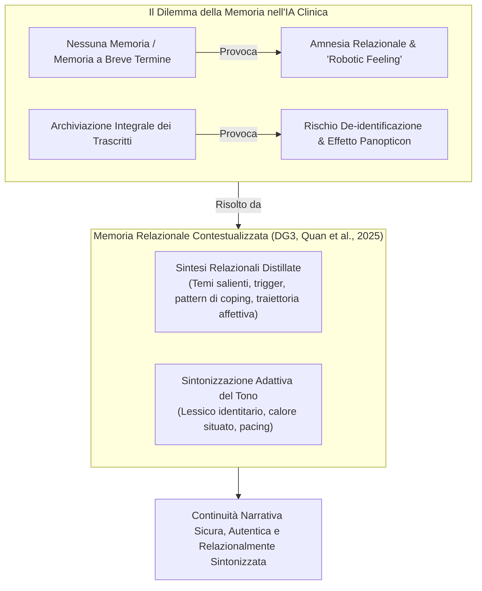

# Memoria Relazionale Contestualizzata e Superamento del "Robotic Feeling"

**Summary**: Architettura di memoria conversazionale per agenti terapeutici LLM (DG3 & DG5, Quan et al., 2025) basata su "sintesi relazionali distillate" (temi, trigger, traiettorie emotive) anziché trascritti integrali, finalizzata a mantenere continuità narrativa e sintonizzazione affettiva profonda senza innescare ansie da sorveglianza.
**Sources**: Quan et al. (2025) - `2512.22462v1.pdf`, Fu et al. (2025), Song et al. (2024)
**Last updated**: 2026-08-27
---

## Il Paradosso della Memoria nei Chatbot di Salute Mentale

Nell'interazione con agenti conversazionali per la salute mentale, si manifesta un doppio fallimento relazionale:

1. **Il "Robotic Feeling" (Empatia Algoritmica Superficiale)**:
   - Risposte generiche, fredde e stereotipate (es. *"Comprendiamo la tua sofferenza..."* o *"È difficile quello che provi"*), percepite dal paziente come un mero calcolo statistico privo di autentica sintonizzazione affettiva (C5: *"Parlare con un chatbot che risponde così non ha alcun valore"*).
2. **L'Amnesia Relazionale vs. Sorveglianza Integrale**:
   - Se l'IA dimentica i dialoghi precedenti, ogni sessione riparte da zero, costringendo il paziente a un continuo lavoro di ri-narrazione.
   - Se l'IA archivia tutti i trascritti integrali parola per parola, si innescano timori di violazione della privacy e l'effetto Panopticon (*panopticon effect*).

---

## Architettura delle "Sintesi Relazionali Distillate" (*Distilled Relational Summaries*)

La Design Guideline 3 (DG3) di Quan et al. (2025) teorizza una struttura di memoria che non memorizza il testo grezzo ma estrae una rappresentazione semantica ed emotiva compatta:

| Componente della Memoria | Contenuto Distillato | Funzione Clinica |
| :--- | :--- | :--- |
| **Trame Tematiche (*Themes*)** | Nodi narrativi centrali (es. coming out in famiglia, mobbing lavorativo, gestione del lutto). | Evita che il paziente debba rispiegare il contesto di base. |
| **Inneschi Emotivi (*Triggers*)** | Situazioni o parole chiave che attivano stati di disregolazione o ritiro. | Permette al modello di modulare la delicatezza e il tono. |
| **Progressi e Risorse (*Progress & Coping*)** | Strategie di fronteggiamento riuscite nelle sessioni o settimane precedenti. | Supporta il rinforzo positivo e la motivazione all'autoefficacia. |
| **Registro Relazionale (*Tenor & Style*)** | Preferenze lessicali, uso di pronomi, livello di formalità o dialetto desiderato. | Elimina la sensazione di impersonalità e stereotipia. |

---

## Superamento del "Robotic Feeling" (DG5: Context-Adaptive Empathy)

Per superare l'artificiosità percepita e consentire all'utente di "sentirsi autenticamente visto nel dolore e nella speranza" (P4), l'agente deve implementare una **sintonizzazione affettiva pervasiva e flessibile**:

- **Variazione Dinamica del Registro**: Modulazione della lunghezza delle risposte, del tempo di attesa percepito, dell'uso di onorifici e del grado di vicinanza emotiva in base allo stato affettivo in tempo reale dell'utente.
- **Accoglienza Culturale e Identitaria**: Riconoscimento non giudicante dei modi di dire subculturali o regionali, integrando la conoscenza della comunità marginalizzata senza stereotipi paternalistici.

---
## Concetti Correlati
- [[dynamic-boundary-mediation-framework]]
- [[boundary-objects-in-psychotherapy]]
- [[negotiable-data-visibility-privacy]]
- [[educator-burden-marginalized-clients]]
- [[simulated-empathy-vs-authentic-presence]]
- [[genuineness-gap]]
- [[language-style-matching-human-ai]]
