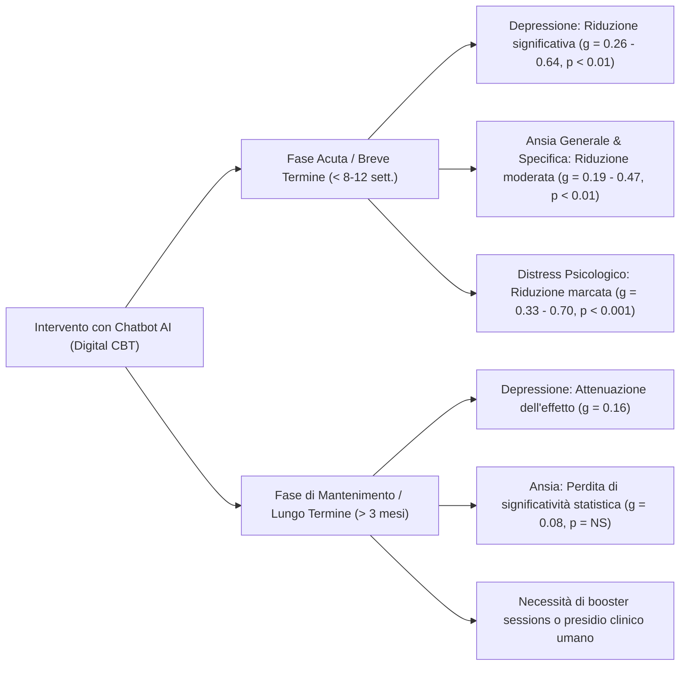

# Conversational Agents in Mental Health (Agenti Conversazionali per la Salute Mentale)

## Definizione Operativa
Interventi terapeutici o di supporto psicoeducativo digitali erogati mediante agenti conversazionali dotati di intelligenza artificiale, finalizzati alla prevenzione, al monitoraggio e alla mitigazione di disturbi psicologici ed emotivi, in primis depressione, disturbi d'ansia, stress e disagio psicologico generale (Huynh et al., 2026; Li et al., 2023).
- **Utilità CBT:** Automatizzazione di moduli standardizzati di Terapia Cognitivo-Comportamentale (CBT) e Problem-Solving Therapy (PST), quali l'identificazione di pensieri automatici negativi (NAT), la ristrutturazione cognitiva guidata, il diario dell'umore (mood tracking), le tecniche di grounding/mindfulness e l'attivazione comportamentale.

---

## Evidenze Meta-Analitiche di Efficacia Clinica

### 1. Efficacia a Breve Termine
- **Sintomi Depressivi**: Le meta-analisi evidenziano una solida efficacia post-intervento a breve termine (entro le 8-12 settimane):
  - He et al. (2023): *g* = 0.29 (95% CI 0.20–0.38).
  - Li et al. (2023): *Hedge's g* = 0.64 (95% CI 0.17–1.12).
  - Zhong et al. (2024): *g* = −0.26 (95% CI −0.34, −0.17; p < 0.01).
- **Sintomi d'Ansia**: Riduzione significativa dell'ansia generalizzata e specifica a breve termine (*g* = 0.19–0.47; Zhong et al., 2024; He et al., 2023).
- **Distress ed Emozioni Negative**: Riduzione marcata del distress globale (*g* = 0.33–0.70) e del burnout in popolazioni sanitarie e universitarie (Baek et al., 2025; Farzan et al., 2025).

### 2. Il Fenomeno dell'Attenuazione a Lungo Termine
Un dato cruciale emerso dall'umbrella review di Huynh et al. (2026) riguarda la discrepanza temporale degli outcome:
- Ai follow-up a **3 e 6 mesi**, l'effetto sui sintomi ansiosi si riduce a *g* = 0.08 (non statisticamente significativo) e per i sintomi depressivi a *g* = 0.16.
- **Interpretazione Clinica:** I chatbot operano primariamente come strumenti di sollievo acuto e stabilizzazione sintomatica transitoria; non sostituiscono il lavoro profondo di rielaborazione cognitiva ed emotiva svolto nella psicoterapia interpersonale o in presenza di un'alleanza terapeutica solida.

### 3. Moderatori dell'Efficacia
- **Incarnazione Virtuale (*Embodiment*)**: Gli agenti con avatar visivo (*Embodied CAs*) ottengono effect size significativamente superiori (*g* = 0.88) rispetto ai bot puramente testuali (Lim et al., 2022).
- **Tipo di Modello Psicoterapeutico**: Gli interventi basati su Problem-Solving Therapy (PST) e CBT strutturata mostrano dimensioni d'effetto più elevate (*g* = 1.05) rispetto ad approcci supportivi aspecifici.
- **Durata e Dosaggio**: Programmi brevi (< 10 sessioni) e altamente focalizzati evidenziano una migliore aderenza rispetto a percorsi digitali a lungo termine privi di supervisione.

---

## Principali Agenti Conversazionali Validati

| Agente / Sistema | Modello Teorico / Funzione | Evidenze Documentate |
| :--- | :--- | :--- |
| **Woebot** | CBT, tracciamento dell'umore, reframing | Riduzione depressione, ansia, craving e uso di sostanze (Li, 2023; Farzan, 2025) |
| **Wysa** | CBT, mindfulness, supporto empatico | Riduzione distress e ansia subclinica in popolazioni cliniche e lavorative |
| **Tess** | Micro-interventi CBT, counseling breve | Riduzione sintomi depressivi e ansiosi, gestione del peso e immagine corporea |
| **XiaoE** | CBT strutturata in ambiente universitario | Riduzione rapida sintomi depressivi entro 1 settimana (Casu, 2024) |
| **Vivibot** | Psicoeducazione e supporto per giovani sopravvissuti a tumori | Aumento emozioni positive e riduzione distress post-trattamento (Kim, 2024) |
| **Deprexis / Velibra** | Moduli CBT interattivi online | Miglioramento sintomi depressivi e d'ansia con effect size medi (Lim, 2022) |

---

## Implicazioni Cliniche ed Etiche
- **Ruolo di Triage e Step-Care**: I chatbot per la salute mentale risultano ideali nel modello *stepped care*, come primo livello di intervento a bassa intensità per la gestione di sintomatologie subcliniche o nelle liste d'attesa.
- **Presidio del Rischio Clinico**: I chatbot non sono idonei alla gestione autonoma delle crisi acute o del rischio suicidario; è indispensabile l'integrazione di protocolli automatici di routing verso operatori umani o linee di emergenza.
- **Alleanza Terapeutica Ibrida**: Il massimo valore clinico si ottiene quando l'agente è prescritto e monitorato dal terapeuta all'interno di un'alleanza terapeutica digitale integrata.

---

## Riferimenti Bibliografici
- Huynh, A. L., Roy, T. J., Jackson, K. N., Lee, A. G., Liaw, W., & Hossain, M. M. (2026). Applications of artificial intelligence-based conversational agents in healthcare: A systematic umbrella review. *International Journal of Medical Informatics*, 207, 106204.
- He, Y., Yang, L., Qian, C., et al. (2023). Conversational Agent Interventions for Mental Health Problems: Systematic Review and Meta-analysis of Randomized Controlled Trials. *Journal of Medical Internet Research*, 25, e43862.
- Li, H., Zhang, R., Lee, Y. C., Kraut, R. E., & Mohr, D. C. (2023). Systematic review and meta-analysis of AI-based conversational agents for promoting mental health and well-being. *NPJ Digital Medicine*, 6, 236.
- Lim, S. M., Shiau, C. W. C., Cheng, L. J., & Lau, Y. (2022). Chatbot-Delivered Psychotherapy for Adults With Depressive and Anxiety Symptoms: A Systematic Review and Meta-Regression. *Behavior Therapy*, 53(2), 334–347.
- Zhong, W., Luo, J., & Zhang, H. (2024). The therapeutic effectiveness of artificial intelligence-based chatbots in alleviation of depressive and anxiety symptoms in short-course treatments: A systematic review and meta-analysis. *Journal of Affective Disorders*, 356, 459–469.

---

## Relazioni
- [[huynh-et-al-2026]]
- [[healthcare-conversational-agents]]
- [[ai-assisted-psychotherapy]]
- [[augmented-psychotherapy]]
- [[digital-therapeutic-alliance]]
- [[human-in-the-reasoning]]
