# Conversione Questionari-Linguaggio Naturale per Agenti Clinici

**Summary**: Metodologia di ingegneria del prompt e preprocessing clinico che trasforma scale psicometriche tabulari (es. BDI, HAM-D, HAM-A) e metadati anamnestici in descrizioni fenomenologiche in linguaggio naturale. Questo approccio risolve i problemi di allucinazione e interpretazione rigida dei Large Language Models durante la simulazione di pazienti, traducendo punteggi numerici discreti in vissuti soggettivi realistici e clinicamente coerenti.
**Sources**: `2510.25384v1.pdf` (Vu et al., 2025: *Roleplaying with Structure: Synthetic Therapist-Client Conversation Generation from Questionnaires*), `2508.11398v2.pdf` (Ozgun et al., 2025)
**Last updated**: 2026-08-27
---

## Il Problema della Rappresentazione Tabulare nei LLM Clinici

Nei dataset clinici ed epidemiologici (es. consorzio *FOR2107*, Kircher et al., 2019), le informazioni sul paziente sono archiviate in formato tabulare relazionale, composto da:
1. **Valori Demografici e Anamnestici Continui/Discreti**: Età, età di esordio (*age of onset*), durata dell'episodio attuale, numero di ricoveri.
2. **Punteggi di Rating Scale Psicometriche**: Voci codificate su scale Likert (es. `BDI1=2`, `HAMD2=3`, `HAMA4=1`).

Quando un LLM riceve direttamente dati tabulari grezzi come prompt per il role-playing di un paziente:
- **Interpretazione Rigida e Robotica**: Il modello tende a recitare meccanicamente gli item (*"Il mio punteggio BDI per il sonno è 2..."*), violando l'ecologia della comunicazione umana.
- **Perdita di Fenomenologia Affettiva**: I numeri non trasmettono la qualità soggettiva della sofferenza, portando il modello a generare risposte piatte o incoerenti con la gravità del quadro.
- **Rischio di Leakage Diagnostico**: Il modello può rivelare prematuramente etichette diagnostiche complesse che un paziente reale non formulerebbe in quei termini.

```mermaid
flowchart LR
    subgraph Raw_Data ["1. Dati Tabulari Grezzi"]
        R1["Age: 22, Onset: 19"]
        R2["BDI1: 1 (Sadness)"]
        R3["BDI8: 2 (Self-Critical)"]
        R4["HAMD2: 2 (Guilt)"]
    end

    subgraph Hash_Mapping ["2. Decodifica Semantica via Hash Map"]
        M1["Mappatura Ontologica dei Criteri Clinici"]
        M2["Articolazione Fenomenologica in 1a Persona"]
    end

    subgraph Natural_Language ["3. Profilo Descrittivo Naturale"]
        N1["'The client is 22 years old, with onset at 19.'"]
        N2["'The client feels persistent sadness and discouragement.'"]
        N3["'The client severely criticizes themselves for weaknesses.'"]
        N4["'Feelings of guilt and burdensome responsibility are reported.'"]
    end

    Raw_Data --> Hash_Mapping
    Hash_Mapping --> Natural_Language
    Natural_Language --> LLM_Client["Client LLM Conditioning"]
```

---

## Metodologia di Mappatura Semantica (Hash Mapping)

Nel framework **SQPsych** (Vu et al., 2025), la conversione si basa su una tabella di consultazione (*hash map*) biunivoca co-progettata con psicologi clinici, che traduce ciascun livello di gravità degli item psicometrici in una proposizione clinica standardizzata in terza persona (poi interiorizzata dall'agente paziente in prima persona).

### Esempi di Conversione per Scale di Depressione e Ansia

| Strumento | Item Numerico | Valore | Descrizione Semantica Generata |
| :--- | :--- | :--- | :--- |
| **BDI** (Beck Depression Inventory) | `BDI1` (Sadness) | `1` | *"The client feels sad much of the time and finds it difficult to lift their spirits."* |
| **BDI** | `BDI2` (Pessimism) | `2` | *"The client feels that the future is hopeless and that things cannot improve."* |
| **BDI** | `BDI7` (Self-Dislike) | `2` | *"The client expresses deep disappointment in themselves."* |
| **BDI** | `BDI8` (Self-Criticalness) | `2` | *"The client criticizes themselves constantly for their faults and perceived failures."* |
| **HAM-D** (Hamilton Depression) | `HAMD1` (Depressed Mood) | `2` | *"The client verbalizes spontaneous feelings of sadness, helplessness, and weeping."* |
| **HAM-D** | `HAMD2` (Guilt) | `2` | *"The client reports recurring ideas of guilt and ruminates over past errors."* |
| **HAM-D** | `HAMD7` (Work & Activities) | `3` | *"The client reports severe loss of interest and has to force themselves to engage in basic daily activities."* |
| **HAM-A** (Hamilton Anxiety) | `HAMA1` (Anxious Mood) | `2` | *"The client experiences constant apprehension, irritability, and fears the worst."* |

---

## Vantaggi Clinici ed Euristici nella Simulazione

1. **Aderenza Empirica Controllata**: L'agente paziente non inventa sintomi arbitrari, ma riflette fedelmente il profilo sintomatologico rilevato nella coorte clinica reale.
2. **Differenziazione tra Casi Clinici e Controlli**: Nei test su 2.090 profili, i pazienti del gruppo MDD manifestavano spontaneamente credenze centrali di colpa e indegnità (derivate da BDI item 7 e 8), mentre i soggetti del gruppo di controllo circoscrivevano il disagio a stanchezza e stress lavorativo contingente.
3. **Stimolazione di Competenze CBT Mirate**: Fornendo una descrizione fenomenologica coerente, il terapeuta virtuale (*Therapist LLM*) è messo nelle condizioni ideali per applicare tecniche cognitive mirate: individuazione di distorsioni cognitive (pensiero dicotomico, catastrofizzazione), scoperta guidata socratica e compiti di ristrutturazione comportamentale.

---

## Pagine Correlate
- [[sqpsych-framework]]: Architettura generale di generazione dual-agent e dataset SQPsychConv.
- [[vu-et-al-2025]]: Sintesi del paper di riferimento.
- [[cognitive-distortion-detection]]: Individuazione di credenze disfunzionali nel discorso clinico.
- [[simulazione-pazienti-ai]]: Metodologie e vincoli per la creazione di pazienti virtuali.
- [[specialized-nlp-models-mental-health]]: Adattamento di modelli NLP al lessico e alla psicopatologia clinica.
