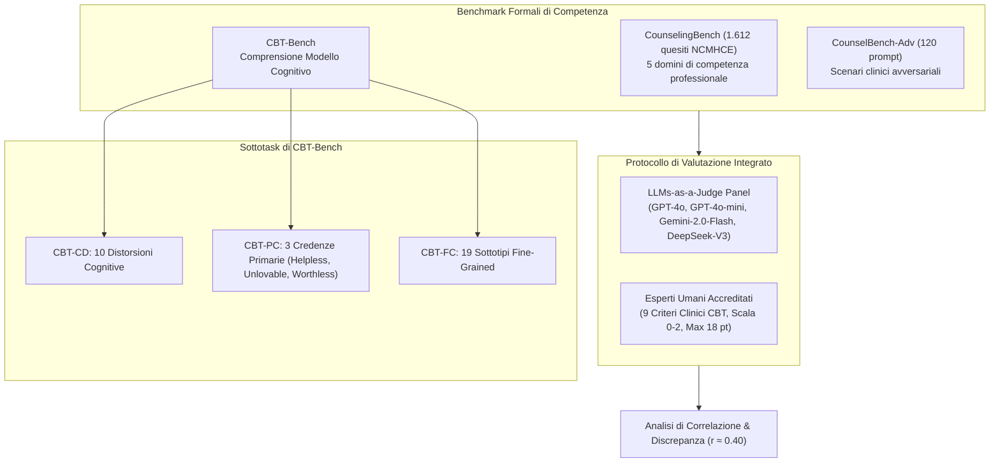
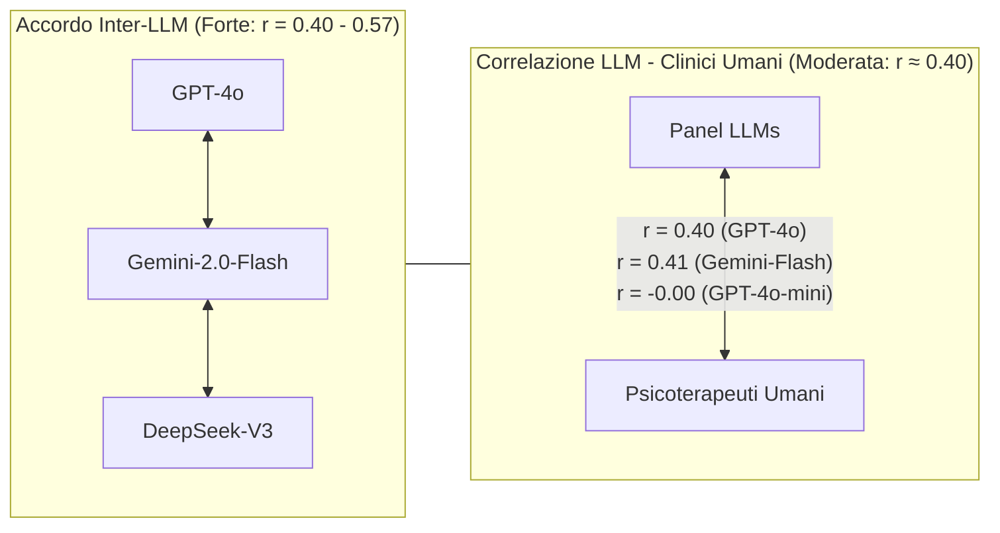

# Benchmarking e Valutazione di Competenze di Counseling per LLM

**Summary**: Quadro metodologico per la valutazione quantitativa e qualitativa delle competenze psicoterapeutiche e di counseling nei Large Language Models. Comprende benchmark standardizzati di esame clinico (*CounselingBench*), compiti di comprensione del modello cognitivo CBT (*CBT-Bench*), scenari avversariali (*CounselBench-Adv*) e protocolli di valutazione comparata tra panel di LLM-as-a-Judge e psicoterapeuti esperti accreditati, evidenziando le discrepanze sistematiche tra metriche automatiche e giudizio clinico umano.
**Sources**: `2510.25384v1.pdf` (Vu et al., 2025), `Nguyen et al., 2025` (*CounselingBench*), `Zhang et al., 2025` (*CBT-Bench*), `Li et al., 2025` (*CounselBench-Adv*)
**Last updated**: 2026-08-27
---

## Il Panorama dei Benchmark Clinici per LLM

La valutazione degli LLM applicati al supporto psicologico non può basarsi su metriche lessicali tradizionali (BLEU, ROUGE) o su generici indici di gradevolezza conversazionale. Richiede invece l'allineamento con le **competenze cliniche formali** definite dagli organismi professionali di psicoterapia e counseling.

---

## Benchmark di Riferimento

### 1. CounselingBench (Nguyen et al., 2025)
Comprende **1.612 quesiti clinici applicati** tratti dalle simulazioni d'esame per l'abilitazione professionale statunitense (*National Clinical Mental Health Counseling Examination - NCMHCE*). Valuta 5 competenze fondamentali:
1. *Intake, Assessment e Diagnosi*
2. *Competenze e Interventi di Counseling*
3. *Pianificazione del Trattamento (Treatment Planning)*
4. *Pratica Professionale ed Etica*
5. *Attributi Fondamentali di Counseling*

- **Modalità di Prompting**: Valutazione sia in formato *Zero-Shot* diretto che con *Zero-Shot Chain-of-Thought (CoT)*. Nei test di Vu et al. (2025), i modelli specializzati SQPsychLLM raggiungono il picco in Zero-Shot diretto (Recall 0.492, F1 0.484), mentre modelli generali come CAMEL beneficiano maggiormente del ragionamento CoT.

### 2. CBT-Bench (Zhang et al., 2025)
Raccolta di quesiti specialistici tratti dagli esami per il Master of Social Work, mirata a testare la comprensione della Terapia Cognitivo-Comportamentale:
- **CBT-CD (Cognitive Distortions)**: 146 esempi per classificare le distorsioni cognitive in 10 categorie (es. pensiero tutto-o-nulla, personalizzazione, catastrofizzazione).
- **CBT-PC (Primary Core Beliefs)**: 184 esempi per identificare le credenze nucleari disfunzionali primarie (*Helpless* - impotente, *Unlovable* - non amabile, *Worthless* - privo di valore).
- **CBT-FC (Fine-Grained Core Beliefs)**: 112 esempi per la classificazione granulare su 19 sottotipi specifici.

### 3. CounselBench-Adv (Li et al., 2025)
Benchmark avversariale di 120 scenari ideato per smascherare i limiti degli LLM in situazioni delicate (es. dinamiche familiari tossiche, dipendenze, confini terapeutici). Valutato tramite confronti *pairwise* (A vs. B o pareggio) da esperti e giudici LLM.

---

## Rubrica di Valutazione per Esperti Umani (9 Criteri CBT)

Nel protocollo co-progettato con psicoterapeuti professionisti (Vu et al., 2025), la qualità delle risposte del terapeuta viene valutata su una scala Likert a 3 punti (0 = *No*, 1 = *Parzialmente*, 2 = *Completamente*, totale massimo **18 punti**):

| Criterio Clinico | Definizione Operativa | Segnale di Eccellenza (2 pt) |
| :--- | :--- | :--- |
| **1. Identificazione Credenze/Pensieri** | Capacità di evidenziare le credenze nucleari sottostanti. | Isola con precisione schemi di colpa o inadeguatezza. |
| **2. Parafrasi per Comprensione Reciproca** | Riformulazione accurata delle affermazioni del paziente. | Riformula senza distorsioni o aggiunte indebite. |
| **3. Scoperta Guidata (Guided Discovery)** | Esplorazione socratica della validità delle credenze. | Pone domande aperte che favoriscono l'auto-riflessione. |
| **4. Validazione Emotiva** | Riconoscimento e normalizzazione del vissuto emotivo. | Valida la sofferenza senza minimizzarla né amplificarla. |
| **5. Ascolto Riflessivo** | Rispecchiamento delle emozioni e dei significati impliciti. | Sintonizzazione empatica autentica e tempestiva. |
| **6. Accuratezza nella Comprensione** | Comprensione esatta delle espressioni del cliente. | Assenza totale di fraintendimenti concettuali. |
| **7. Chiusura della Sessione** | Conclusione strutturata e pianificazione dell'incontro successivo. | Riepiloga gli insight e concorda data e compiti a casa. |
| **8. Semplicità del Linguaggio** | Uso di un registro chiaro, accessibile e non accademico. | Evita tecnicismi disorientanti per il paziente. |
| **9. Evitamento di Formule Ripetitive** | Varietà lessicale e naturalezza espositiva. | Nessuna ripetizione pedissequa di formule fisse. |

---

## La Discrepanza tra Giudici LLM ed Esperti Clinici

L'impiego di panel automatici di LLM (*LLM-as-a-judge*, es. GPT-4o, Gemini-2.0-Flash, DeepSeek-V3) mostra un fenomeno critico:

- **Bias di Giudizio degli LLM**: I giudici automatici tendono a premiare risposte lunghe, complesse ed esplicitamente psicoeducative.
- **Priorità dei Clinici Umani**: I terapeuti professionisti premiano la **riservatezza maieutica**, la gradualità degli interventi, la brevità e la capacità di non anticipare soluzioni, evitando di soverchiare il paziente (*"pacing & boundary control"*).

---

## Pagine Correlate
- [[vu-et-al-2025]]: Sintesi del paper di riferimento e risultati comparativi.
- [[sqpsych-framework]]: Architettura di generazione e modelli SQPsychLLM valutati nei benchmark.
- [[clinical-fidelity-assessment]]: Metodologie per la misura della fedeltà e aderenza ai modelli terapeutici.
- [[ctrs-automated-evaluation]]: Valutazione automatizzata della scala CTRS per la CBT.
- [[cognitive-distortion-detection]]: Sistemi computazionali per il rilevamento di distorsioni cognitive.
- [[human-in-the-reasoning]]: Centralità del giudizio clinico umano rispetto all'automazione algoritmica.
