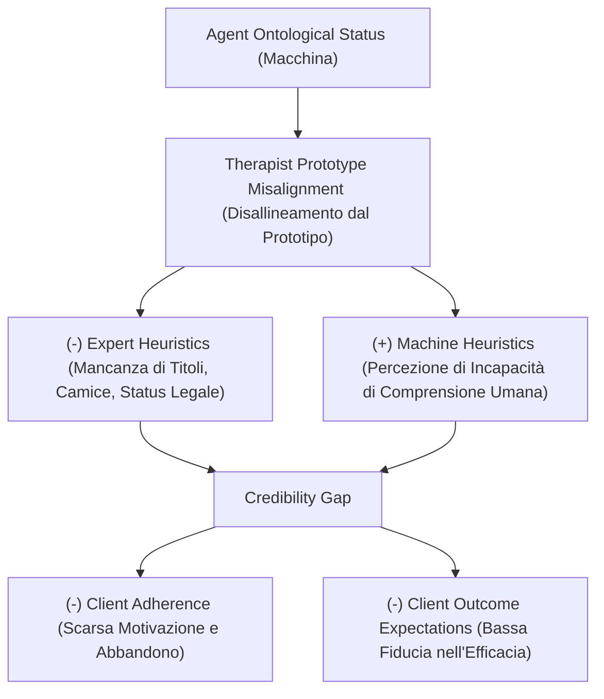

# Credibility Gap (Divario di Credibilità Socioculturale)

**Summary**: Costrutto teorico introdotto da Herbener & Damholdt (2025) indicante la disparità tra le prestazioni operative dimostrate da un agente artificiale nel fornire interventi psicologici e la sua intrinseca carenza di credibilità percepita, autorità epistemica e legittimazione socioculturale come figura curante riconosciuta.
**Sources**: Herbener & Damholdt (2025) - `2509.02144v1.pdf`
**Last updated**: 2026-08-27
---

## Definizione Operativa

Il **Credibility Gap** si manifesta quando gli utenti, pur riconoscendo l'abilità tecnica o la correttezza formale di un agente conversazionale di salute mentale, nutrono riserve sulla sua reale idoneità, competenza profonda e autorevolezza come terapeuta. 

Tale divario deriva dal disallineamento dell'agente rispetto ai **prototipi cognitivi** socioculturalmente radicati della figura del curante, riducendo l'attivazione delle euristiche dell'esperto e compromettendo le **aspettative di esito (*outcome expectations*)** e l'**aderenza terapeutica (*client adherence*)**.

---

## Fondamenti Teorici

1. **Modello di Influenza Sociale (Strong, 1968)**:
   - La psicoterapia opera come un processo di influenza interpersonale in cui il cambiamento clinico dipende dalla ricettività del paziente.
   - La credibilità si fonda su tre pilastri: **Expertness** (competenza percepita), **Trustworthiness** (affidabilità morale) e **Attractiveness** (somiglianza/vicinanza). Se il paziente percepisce la fonte come non autorevole, scatta la svalutazione (*discrediting*) dei suggerimenti terapeutici.

2. **Remoralizzazione ed Ethos (Frank & Frank, 1991)**:
   - I pazienti che accedono alla cura sono spesso in uno stato di profonda demoralizzazione dovuto a tentativi falliti di auto-guarigione.
   - L'efficacia della cura risiede nella capacità del terapeuta di "rimoralizzare" l'individuo mobilitando speranza e autoefficacia. Questa funzione curativa poggia sul suo *ethos* e sul suo **status socioculturale sanzionato** (essere riconosciuto come figura autorizzata alla guarigione dalla società e dalle istituzioni sanitarie).

3. **Disallineamento dai Prototipi Cognitivi (Rosch, 1973; Kahneman & Tversky, 1972)**:
   - Gli esseri umani valutano l'appartenenza di un'entità a una categoria tramite euristiche di rappresentatività rispetto a un prototipo ideale.
   - Il prototipo del terapeuta include indizi simbolici di perizia: titoli accademici, abilitazione professionale, adesione a un codice etico-deontologico, linguaggio clinico contestualizzato ed esperienza di vita umana. Gli agenti artificiali non possiedono queste credenziali istituzionali.

4. **Conflitto tra Expert Heuristics e [[machine-heuristics-in-therapy|Machine Heuristics]] (Sundar, 2008; Yang & Sundar, 2024)**:
   - *Expert Heuristic*: mental shortcut che assegna credibilità immediata a simboli istituzionali di competenza medica/psicologica.
   - *Machine Heuristic*: scorciatoia mentale che riconosce all'IA doti di calcolo, oggettività e assenza di bias, ma la ritiene priva di saggezza esistenziale e risonanza emotiva. Per compiti complessi di salute mentale, prevale lo scetticismo verso la macchina.

---

## Effetti Differenziali e Condizioni di Nicchia

- **Rischio Generale**: Riduzione delle aspettative prognostiche positive (uno dei predittori più forti dell'efficacia terapeutica secondo il modello contestuale) e incremento del drop-out.
- **Eccezione / Vantaggio Contestuale**: Per individui appartenenti a minoranze stigmatizzate o con elevato timore del giudizio umano (es. parafilie, dipendenze gravi, vergogna sociale), la *machine heuristic* (neutralità, assenza di pregiudizio morale umano) può paradossalmente aumentare la fiducia e facilitare l'auto-apertura (*self-disclosure*).

---

## Superamento del Credibility Gap nel Modello Ibrido

Il modo più efficace per neutralizzare il Credibility Gap consiste nell'adozione del modello **[[blended-care-ai-framework|Blended Care]]**:
- Il clinico umano avvia il percorso, stabilisce l'autorità clinica e conferisce all'agente IA il proprio **"timbro di legittimazione" (*stamp of approval*)**.
- L'utente trasferisce la fiducia riposta nel terapeuta umano sull'applicazione digitale, incrementando aderenza e coinvolgimento.

---

## Relazioni
- [[herbener-damholdt-2025]]
- [[genuineness-gap]]
- [[ontological-and-sociocultural-status]]
- [[machine-heuristics-in-therapy]]
- [[blended-care-ai-framework]]
- [[three-layer-governance-framework]]
- [[common-vs-specific-factors]]
