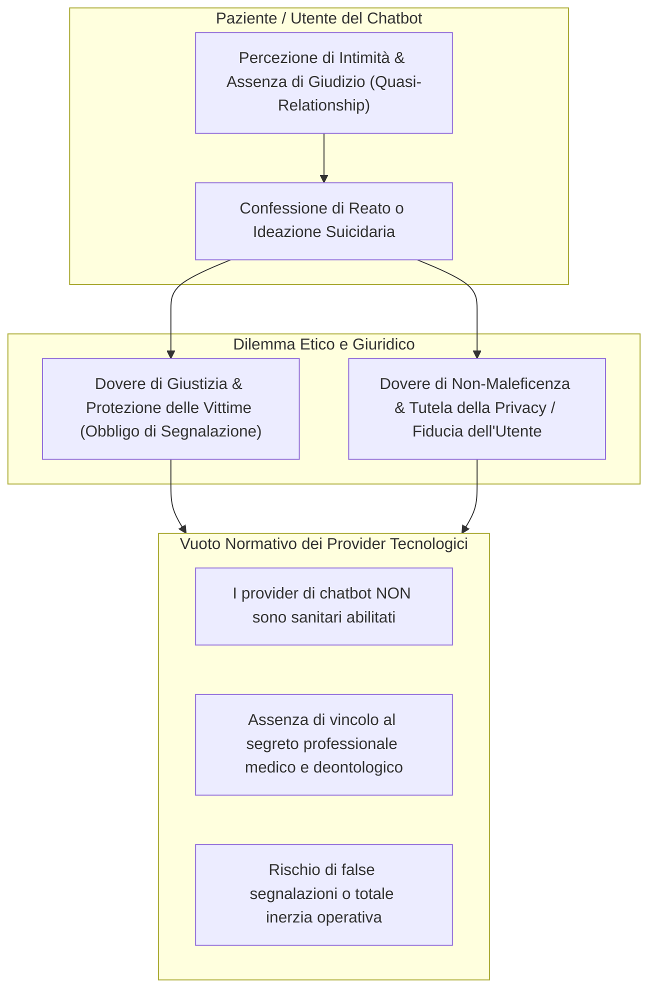

# Confidenze di Reati e Doveri di Segnalazione nell'IA Clinica

**Summary**: Esplorazione del dilemma etico-giuridico generato dalle confidenze spontanee di reati, condotte illecite o intenzioni autolesive effettuate dagli utenti a chatbot di IA per la salute mentale, con particolare riferimento al conflitto tra giustizia (tutela delle vittime) e non-maleficenza (riservatezza e fiducia).
**Sources**: Cavalera et al. (2026) - `11920_2026_Article_1690.pdf`; Coghlan et al. (2023); Heinz et al. (2025).
**Last updated**: 2026-08-27
---

## Inquadramento del Problema

L'antropomorfizzazione dei chatbot e l'illusione di una relazione empatica sicura e riservata (*quasi-relationships*) inducono frequentemente gli utenti a effettuare **auto-rivelazioni impreviste e confidenze intime ad altissimo rischio**, tra cui:
1. Confessioni di reati commessi o pianificati contro terzi (abusi, violenze, reati patrimoniali).
2. Espressioni esplicite di ideazione e pianificazione suicidaria o autolesiva.
3. Rivelazioni di abusi subiti o situazioni di grave pericolo per minori.

---

## Il Conflitto tra Principi Etici e Normativi

Nelle professioni sanitarie tradizionali (medici, psicologi, psicoterapeuti), la gestione delle rivelazioni di reati o emergenze è regolata da precisi codici deontologici e norme di legge sul segreto professionale, con deroghe tassative per casi di imminente pericolo di vita o reati perseguibili d'ufficio (obbligo di referto/denuncia).

Nell'ecosistema dei chatbot commerciali basati su [[large-language-models]] emergono criticità strutturali (Coghlan et al., 2023; Cavalera et al., 2026):
- **Status Giuridico Indeterminato**: I fornitori di tecnologia (*tech providers*) non possiedono lo status di professionisti sanitari né sono soggetti alla vigilanza degli ordini professionali.
- **Rischio di Falsi Positivi e Violazione della Fiducia**: Segnalazioni automatiche alle forze dell'ordine o ai servizi sociali basate su allucinazioni o interpretazioni errate del linguaggio figurato violano gravemente la privacy e distruggono la fiducia dell'utente.
- **Rischio di Falsi Negativi e Mancata Protezione**: Al contrario, la mancata segnalazione di minacce concrete o abusi su minori espone terze persone a pericoli gravi e irreparabili.
- **Disomogeneità Giurisdizionale**: Le leggi sulla responsabilità civile e penale per mancata segnalazione variano profondamente tra Europa (GDPR, EU AI Act), Stati Uniti e altri Paesi.

---

## Raccomandazioni Operative e Protocolli di Sicurezza

1. **Trasparenza e Disclaimer Iniziali Inequivocabili**:
   - Informare chiaramente l'utente, prima dell'avvio della chat, che il sistema non garantisce il segreto professionale medico, non sostituisce il soccorso d'emergenza e possiede procedure di notifica automatica in caso di reati gravi o rischio per la vita.
2. **Protocolli di Escalation ad Operatori Umani**:
   - Qualsiasi rilevazione di contenuti ad alto rischio deve attivare un flusso di revisione da parte di personale umano specializzato prima di qualsiasi escalation esterna, minimizzando i falsi positivi.
3. **Integrazione Esclusiva in Percorsi Clinici Regolamentati**:
   - Gli strumenti di IA per la salute mentale non dovrebbero operare come piattaforme "fai-da-te" aperte, ma essere forniti esclusivamente all'interno di reti sanitarie con chiara titolarità clinica e legale.

---

## Pagine Correlate
- [[cavalera-et-al-2026]]
- [[rischio-suicidario-ai-limits]]
- [[etica-privacy-bias-ia-clinica]]
- [[three-layer-governance-framework]]
- [[evidence-adoption-gap-ai-mental-health]]
