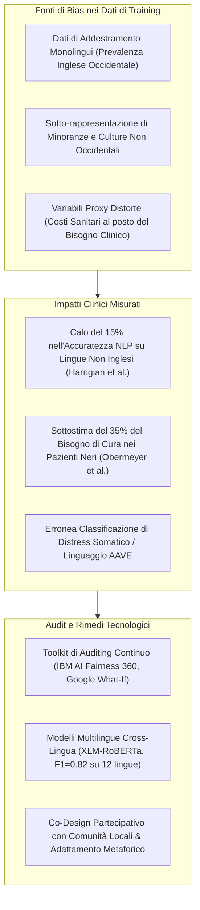

# Bias Transculturali, Disparità Algoritmiche e Audit di Equità nell'IA Clinica

**Summary**: Analisi delle disparità sistematiche e dei bias etno-culturali, linguistici e demografici nei modelli di intelligenza artificiale applicati alla salute mentale, con disamina degli strumenti di audit algoritmico (IBM AI Fairness 360, Google What-If Tool) e delle metodologie di co-design partecipativo per un'IA inclusiva ed equa.
**Sources**: Kandeel et al. (2026) - `ai-v5-e84305.pdf`, Obermeyer et al. (2019), Harrigian et al. (2021), Liu et al. (2023)
**Last updated**: 2026-08-27
---

## Definizione del Problema: Il Bias WEIRD e le Disparità Algoritmiche

La quasi totalità dei modelli di elaborazione del linguaggio naturale (NLP) e degli algoritmi di machine learning utilizzati nella salute mentale è stata sviluppata e addestrata su popolazioni **WEIRD** (*Western, Educated, Industrialized, Rich, Democratic*), prevalentemente di lingua inglese.

Quando questi modelli vengono applicati in contesti sanitari reali o su popolazioni appartenenti a minoranze etnico-linguistiche, generano **distorsioni diagnostiche sistematiche (*algorithmic disparities*)** che rischiano di esacerbare le disuguaglianze nell'accesso e nella qualità delle cure.

---

## Evidenze Empiriche delle Disparità Algoritmiche

La revisione sistematica di Kandeel et al. (2026) documenta evidenze quantitative sul danno da bias:

1. **Bias Razziale nella Stima del Rischio e del Dolore (Obermeyer et al., 2019)**:
   - Uno studio fondamentale su algoritmi sanitari utilizzati su milioni di pazienti negli Stati Uniti ha rivelato che il sistema sottostimava sistematicamente del **35% il bisogno di assistenza sanitaria e salute mentale per i pazienti neri** rispetto ai bianchi a parità di gravità clinica. La causa risiedeva nell'uso della spesa sanitaria passata come proxy del bisogno (poiché le minoranze spendono meno per motivi di disparità economica e di accesso).
2. **Decadimento delle Prestazioni NLP Cross-Linguistiche (Harrigian et al., 2021)**:
   - Modelli basati su architetture BERT addestrati su testi in lingua inglese hanno mostrato un **crollo dell'accuratezza fino al 15%** quando testati su post in mandarino o spagnolo, evidenziando l'inapplicabilità globale diretta di modelli non adattati.
3. **Misinterpretazione Culturale del Distress e Dialetti**:
   - In molte culture asiatiche e africane, la sofferenza psicologica si manifesta primariamente attraverso **idiomi somatici di distress** (es. senso di oppressione gastrica, calore corporeo, stanchezza fisica) piuttosto che attraverso il lessico affettivo esplicito tipico della depressione occidentale.
   - Audit condotti su chatbot terapeutici come **Woebot** hanno rilevato che gli algoritmi classificavano espressioni di distress in *African American Vernacular English* (AAVE) come a "basso rischio", richiedendo successivi cicli di riaddestramento con dataset eterogenei.

---

## Strumenti Metodologici per l'Audit di Equità

La conformità alle linee guida dell'OMS (2021), al GDPR e all'EU AI Act impone verifiche periodiche di non discriminazione:

- **IBM AI Fairness 360**: Toolkit open-source contenente metriche quantitative di equità (es. *Disparate Impact*, *Equal Opportunity Difference*, *Statistical Parity Difference*) e algoritmi di mitigazione applicabili in fase di pre-processing (riponderazione dei pesi), in-processing (funzioni di perdita con vincoli di fairness) e post-processing.
- **Google What-If Tool**: Interfaccia interattiva che permette ai ricercatori e ai clinici di analizzare controtendenze (*counterfactual analysis*), verificando come cambia l'output diagnostico modificando unicamente l'etnia, l'età o la lingua dell'utente.
- **Audit Federati Multi-Istituzionali**: Piattaforme di Federated Learning (Sheller et al., 2020) che permettono a diversi ospedali internazionali di eseguire audit di equità incrociati senza condividere né esportare i dati sensibili dei pazienti.

---

## Strategie di Progettazione Inclusiva e Multilingue

1. **Modelli di Linguaggio Cross-Lingua Robustificati**:
   - Liu et al. (2023) hanno dimostrato che l'impiego di modelli multilingue pre-addestrati come **XLM-RoBERTa** consente di estendere la diagnosi precoce di depressione e ansia a **12 lingue differenti**, raggiungendo performance uniformi ($F_1 = 0.82$) comparabili a modelli monolingue nativi.
2. **Adattamento Culturale dei Chatbot (Native Metaphors)**:
   - L'applicazione **Wysa**, adattando i propri interventi CBT agli idiomi e alle metafore tradizionali indiane per lo stress, ha conseguito un miglioramento dei sintomi d'ansia (GAD-7) del **~30%**.
   - Piattaforme come **X2AI**, introducendo dialoghi terapeutici in arabo e swahili, hanno incrementato l'engagement dei pazienti del **+40%** rispetto a interfacce generiche anglosassoni.
3. **Co-Design Partecipativo**:
   - Coinvolgere attivamente pazienti, clinici e mediatori culturali locali nelle fasi di ideazione e addestramento (Torous et al., 2021) per evitare il tecnocolonialismo e assicurare l'adattabilità ecologica degli strumenti.

---

## Related pages
- [[kandeel-et-al-2026]]
- [[weird-bias-cultural-adaptability-ai]]
- [[audit-bias-llm-clinici]]
- [[misurazione-bias-razziale-llm]]
- [[gdpr-governance-mental-health-ai]]
- [[algorithmic-paternalism-in-ai-mental-health]]
- [[federated-learning-and-differential-privacy-mental-health]]
- [[three-layer-governance-framework]]
- [[etica-privacy-bias-ia-clinica]]
