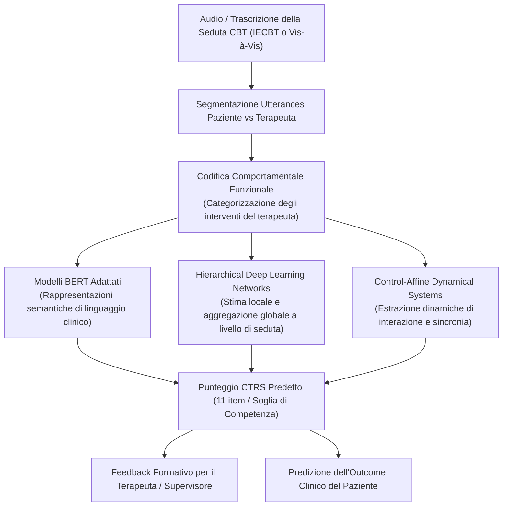

# Automated CTRS and Fidelity Evaluation (Valutazione Automatizzata della Fidelity e Qualità CBT)

## Definizione Operativa
L'impiego di modelli di Elaborazione del Linguaggio Naturale (NLP), rappresentazioni contestualizzate (BERT adattato) e architetture gerarchiche di Deep Learning per valutare in modo scalabile e oggettivo la competenza del terapeuta e la fedeltà al protocollo terapeutico (*treatment fidelity*) nelle sedute di Terapia Cognitivo-Comportamentale, quantificando i punteggi sulla scala standardizzata **Cognitive Therapy Rating Scale (CTRS)** (Jiang et al., 2024; Flemotomos et al., 2021; Chen et al., 2022b).

La scala CTRS definisce **11 dimensioni di competenza clinica** a livello di seduta (es. definizione dell'agenda, identificazione dei pensieri automatici, uso del dialogo socratico, compiti a casa, collaborazione e alleanza terapeutica).

---

## Architettura di Valutazione Automatizzata della Seduta

---

## Evidenze Empiriche e Validazione

### 1. Correlazione tra Fedeltà al Protocollo ed Esito Clinico
- In uno studio su vasta scala su oltre **14.000 pazienti** trattati con Internet-enabled CBT (IECBT), Ewbank et al. (2020) hanno addestrato modelli di deep learning per categorizzare ogni singolo enunciato del terapeuta.
- **Risultato Fondamentale:** Una maggiore percentuale di interventi coerenti con il protocollo CBT correlava positivamente e significativamente con il miglioramento sintomatico del paziente; al contrario, il tempo speso in conversazioni non focalizzate sulla terapia mostrava una correlazione negativa con l'esito.

### 2. Modelli Linguistici Adattati per la CTRS (Flemotomos et al., 2021, 2022)
- Impiego di modelli linguistici BERT pre-addestrati e fine-tunati su trascrizioni psicoterapeutiche reali per classificare il superamento della soglia di competenza CTRS (score binario e punteggi continui).
- L'analisi automatica del linguaggio verbale e prosodico ha permesso di quantificare competenze specifiche come l'empatia, il timing delle interpretazioni e la guida socratica con alta coerenza rispetto ai valutatori umani esperti.

### 3. Architetture Gerarchiche e Dinamiche Conversazionali (Chen et al., 2022; Ardulov et al., 2022)
- Modelli gerarchici che combinano stime di qualità a livello di singolo scambio (*turn-level*) con metriche globali di seduta (*session-level*), preservando la struttura narrativa della conversazione.
- Analisi mediante sistemi dinamici affini al controllo (*control-affine models*) per tracciare i pattern di reciprocità e sintonizzazione verbale tra clinico e paziente.

---

## Applicazioni nella Formazione e nella Supervisione Clinica
- **Supervisione Continua e Scalabile:** Superamento del collo di bottiglia della supervisione manuale (che richiede l'ascolto integrale di ore di registrazione da parte di supervisori esperti).
- **Cruscotto di Autovalutazione:** Restituzione al terapeuta di metriche quantitative sulle aree di eccellenza e sui punti deboli (es. insufficiente revisione dei compiti a casa, eccessiva direttività, dispersione dell'agenda).
- **Integrazione con Ambienti di Simulazione (PATIENT-Ψ):** Valutazione automatica istantanea delle competenze degli studenti durante simulazioni con pazienti virtuali LLM (Wang et al., 2024a).

---

## Relazioni
- [[clinical-fidelity-assessment]]: Concetto generale di fidelity e behavioral coding.
- [[ai-enhanced-cbt]]: Ruolo dell'IA nella valutazione del processo terapeutico.
- [[treatment-outcome-and-relapse-prediction]]: Impatto della qualità erogata sugli esiti a lungo termine.
- [[simulazione-pazienti-ai]]: Training e debriefing con pazienti virtuali.
- [[jiang-et-al-2024]]: Studio di review di riferimento.
