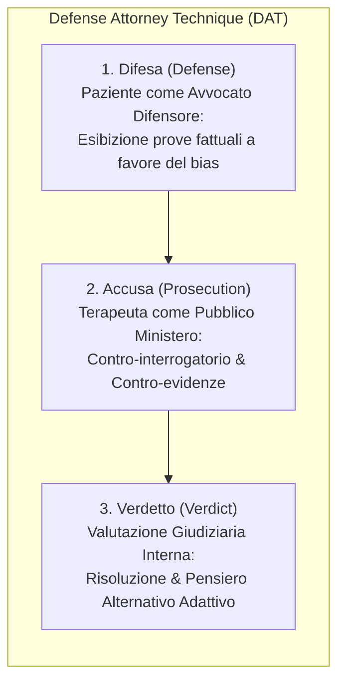

# Defense Attorney Technique (DAT)

## Definizione Operativa
- Tecnica strutturata di psicoterapia cognitivo-comportamentale ideata da Irismar Reis de Oliveira (2011) basata sulla **metafora dell'aula di tribunale**, in cui il paziente e il terapeuta esplorano e mettono alla prova i pensieri automatici e le distorsioni cognitive attraverso ruoli legali definiti.
- **Utilità CBT:** Consente di separare nettamente le reazioni emotive soggettive dalle *evidenze fattuali oggettive e verificabili*, superando l'impasse della ruminazione e facilitando una ristrutturazione cognitiva profonda attraverso tre stadi sequenziali: Difesa (*Defense*), Accusa (*Prosecution*) e Verdetto (*Verdict*).

## Evidenze dalla Letteratura
- **Articolazione dei Tre Meccanismi Operativi:**
  1. **Difesa (Defense):** Il paziente veste i panni dell'avvocato difensore del proprio pensiero negativo disfunzionale. Guidato dal terapeuta, è vincolato a produrre solo fatti empirici e verificabili (escludendo deduzioni o sensazioni viscerali). Il modello non confuta anticipatamente questa fase ma la approfondisce per far emergere i presunti presupposti di verità del bias (Zhou et al., 2025; de Oliveira, 2011).
  2. **Accusa (Prosecution):** Il terapeuta assume il ruolo dell'accusa/pubblico ministero, evidenziando le fallacie argomentative, le generalizzazioni indebite e stimolando il paziente a rintracciare contro-fatti ed eccezioni storiche che smentiscono la tesi difensiva (Zhou et al., 2025).
  3. **Verdetto (Verdict):** Al termine del contraddittorio, il sistema valuta se si è verificato un effettivo disancoraggio cognitivo (*cognitive shift*). Se la risoluzione ha successo, il paziente formula un verdetto sintetico positivo, realistico e costruttivo (Zhou et al., 2025).
- **Applicazione nei Modelli Linguistici (LLM):** Nel framework CRDIAL e nei modelli CRISPERS, l'implementazione del DAT evita il tono predicatorio tipico delle parafrasi dirette, delegando al paziente il ruolo attivo di esaminatore delle proprie convinzioni e generando un cambiamento cognitivo duraturo (incremento del +48.77% nell'affetto positivo misurato su scala PANAS) (Zhou et al., 2025).

**Riferimenti Bibliografici:**
- de Oliveira, I. R. (2011). Kafka’s trial dilemma: proposal of a practical solution to Joseph K.’s unknown accusation. *Medical Hypotheses*, 77(1), 5–6.
- Zhou, J., Chen, Y., Yin, J., Huang, Y., Shi, Y., Zhang, X., Peng, L., Zhang, R., Lv, T., Hu, Z., Wang, H., & Huang, M. (2025). CRISP: Cognitive Restructuring of Negative Thoughts through Multi-turn Supportive Dialogues. *arXiv preprint arXiv:2504.17238*. https://arxiv.org/abs/2504.17238

## Relazioni
- Vedi anche: [[zhou-et-al-2025]], [[crdial-framework]], [[sentence-level-supportive-strategies]], [[multi-channel-loop-mechanism]], [[crispers-models-and-dataset]], [[ia-maieutica-e-co-ragionamento]], [[active-ai-therapeutic-agent]]
