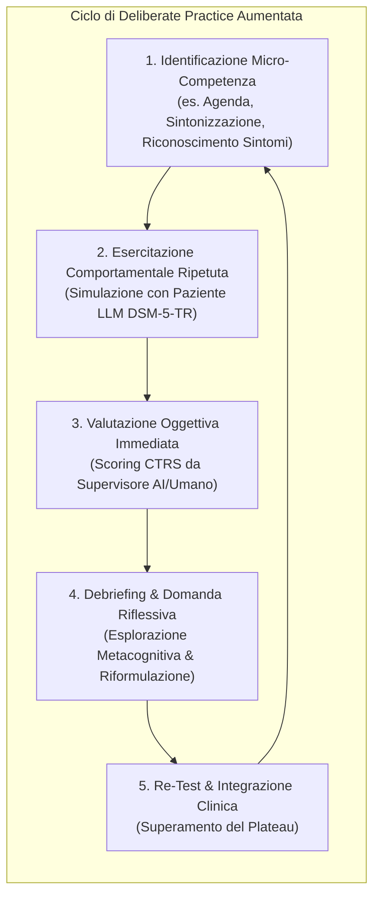

# Deliberate Practice in Psicoterapia mediata da IA (Pratica Deliberata Aumentata da Modelli Generativi)

**Summary**: Applicazione dei principi della *deliberate practice* (Ericsson, Rousmaniere) alla formazione clinica in psicoterapia mediante ambienti di simulazione generativa e supervisione aumentata da LLM, basata sulla ripetizione comportamentale mirata, feedback esperto tempestivo e superamento dei plateau prestazionali.
**Sources**: `2607.25667v1.pdf` (*arXiv:2607.25667v1*, 2026), Rousmaniere (2024), Ericsson & Pool (2016).
**Last updated**: 2026-08-27
---

## Il Modello della Deliberate Practice in Psicoterapia

Nella formazione clinica tradizionale, si assume spesso che l'accumulo di esperienza clinica diretta (il numero di ore di seduta svolte) conduca automaticamente a una maggiore efficacia terapeutica. Tuttavia, la letteratura empirica evidenzia che l'esperienza routinaria produce rapidamente **plateau di prestazione**, e che i terapeuti esperti non ottengono necessariamente outcome superiori ai novizi se non sottoposti a formazione specifica (Goldberg et al., 2016).

La **Deliberate Practice (DP)** (Rousmaniere, 2024) introduce un paradigma alternativo mutuato dalla psicologia dell'expertise (Ericsson & Pool, 2016):
1. **Ripetizione Comportamentale Fuori Seduta**: Esercitazione sistematica su micro-competenze isolate (es. formulazione di domande socratiche, gestione di rotture dell'alleanza, validazione di affetti intensi);
2. **Obiettivi Progressivi e Sfide Calibrate**: Compiti situati nella *zona di sviluppo prossimale* del clinico;
3. **Feedback Continuo ed Esperto**: Correzione immediata basata su standard oggettivi e scale di competenza (come la CTRS);
4. **Riflessione Metacognitiva**: Analisi critica delle decisioni cliniche e delle ipotesi diagnostiche.

---

## Il Collo di Bottiglia della Formazione e il Ruolo dell'IA

La piena implementazione della deliberate practice in psicoterapia è storicamente ostacolata da vincoli strutturali:
- **Tutela del Paziente Reale**: Non è etico né sicuro per i pazienti fungere da "palestra di prova" per i tentativi ed errori dei tirocinanti;
- **Limiti degli Attori Standardizzati**: Gli attori umani sono costosi, difficilmente scalabili e presentano limiti nella riproduzione di quadri clinici complessi o reazioni emotive dinamiche;
- **Scarsità dei Supervisori Esperti**: La revisione analitica di registrazioni o trascritti richiede decine di ore settimanali di specialisti senior.

L'integrazione di ambienti generativi come **MyMentorLLM** (Rizzi et al., 2026) risolve questo collo di bottiglia fornendo una **palestra clinica virtuale a ciclo chiuso**, dove l'allievo può condurre centinaia di colloqui simulati, sperimentare interventi alternativi e ricevere feedback standardizzato e riflessivo a costo computazionale marginale.

---

## Dimensioni Didattiche Allenabili con Simulazioni Generative

| Dimensione di Competenza | Modalità di Esercitazione con GenAI | Metrica di Valutazione |
| :--- | :--- | :--- |
| **Sintonizzazione e Risonanza Affettiva** | Risposta a pazienti virtuali con carichi emotivi intensi (rabbia BPD, tristezza MDD, paura GAD). | Analisi lessicale/affettiva ([[risonanza-affettiva-simulazione-clinica]], EmoAtlas). |
| **Intervista e Raccolta Anamnestica** | Svelamento graduale di informazioni sensibili di fronte a domande ben formulate. | Numero di turni per la disclosure clinica. |
| **Fedeltà al Modello CBT** | Mantenimento della struttura di seduta, esplorazione di pensieri automatici e compiti a casa. | Item CTRS 1–11 ([[ctrs-automated-evaluation]]). |
| **Diagnosi Differenziale e Riconoscimento Sintomi** | Formulazione diagnostica e clustering di sintomi DSM-5-TR. | Accuratezza diagnostica ($A_I, A_F$) e coerenza sintomatica ($A_S$). |
| **Flessibilità Metacognitiva** | Risposta a feedback didattici senza cadere nella deferenza cieca. | Indice di guadagno diagnostico ($g$) vs *over-deference*. |

---

## Sfide e Prescrizioni Metodologiche

1. **Evitare l'Illusione di Competenza da Testo**:
   Come dimostrato da Rizzi et al. (2026), la deliberate practice basata esclusivamente su testo o audio trascritto genera punteggi di competenza artificialmente gonfiati. L'addestramento efficace richiede **interazioni audio native (*speech-to-speech*)**, che preservano il carico cognitivo della prosodia, del silenzio e dell'esitazione reale.
2. **Accoppiamento con Supervisori Umani**:
   L'IA funge da strumento preparatorio e integrativo. La supervisione finale di casi reali complessi e la validazione delle competenze abilitanti rimangono di esclusiva pertinenza di formatori clinici umani qualificati.

---

## Relazioni
- [[mymentorllm-framework]]: L'ambiente di simulazione triadico per la deliberate practice CBT.
- [[native-speech-vs-text-in-clinical-simulation]]: Impatto della modalità vocale nativa nella simulazione della pratica.
- [[over-deference-in-llm-supervision]]: Gestione del feedback supervisivo ed evitamento della compiacenza acritica.
- [[ctrs-automated-evaluation]]: Metriche di rating della competenza clinica nella CBT.
- [[feedback-informed-practice-ai]]: Integrazione di feedback continui nei sistemi di salute mentale.
- [[simulazione-pazienti-ai]]: Architettura di base per la creazione di pazienti virtuali.
- [[rizzi-et-al-2026]]: Studio sperimentale su larga scala sulla deliberate practice simulata.
