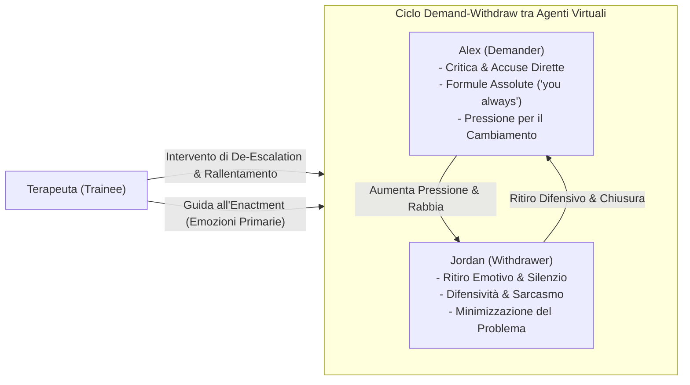

# Dinamiche Demand-Withdraw nella Simulazione Multi-Agente

## Definizione Operativa
- Modellizzazione computazionale del pattern relazionale disfunzionale noto come **Demand–Withdraw** (o *Pursue–Withdraw cycle*), prevalente nelle coppie in stato di sofferenza relazionale e centrale negli interventi di Terapia di Coppia Focalizzata sulle Emozioni (EFT) e nei modelli sistemico-relazionali (Gottman, Christensen & Heavey).
- **Meccanismo Sistemico-Computazionale:** Il ciclo viene istanziato tramite due agenti LLM dotati di profili psicologici e stili comunicativi complementari e polarizzati:
  1. **Alex (Demander / Inseguitore):** Assume un ruolo attivo, pressante ed esigente; verbalizza lamentele e richieste esplicite di cambiamento, ricorre a critiche e accuse dirette (*"you always"*, *"you never"*), manifestando rabbia ed esasperazione.
  2. **Jordan (Withdrawer / Ritirato):** Assume un ruolo difensivo ed evitante; risponde con disingaggio emotivo, sarcasmo, minimizzazione delle problematiche, contro-accuse (*counter-complaining*) o silenzio ostinato (*stonewalling*).
- L'interazione tra i due agenti crea un **circuito di retroazione positiva (feedback loop)**: la pressione e la critica del Demander innescano il ritiro del Withdrawer, la cui chiusura alimenta ulteriormente la frustrazione e le pretese del Demander, finché un intervento terapeutico esterno efficace non interrompe la spirale.

## Evidenze dalla Letteratura
- **Riconoscimento Clinico del Pattern:** Negli esperimenti con psicoterapeuti esperti ($N=21$), il pattern demand-withdraw modellato computazionalmente è stato chiaramente identificato e valutato con un punteggio significativamente più elevato rispetto a una baseline priva di istruzioni relazionali ($M=3.301$ vs $M=1.460, z=35.46, p < 0.001$) (Wang, Chen et al., 2026).
- **Fedeltà di Ruolo (*Role Fidelity*):** L'utilizzo di profili espliciti e vincoli di stadio ha consentito di raggiungere una fedeltà di ruolo del 70.7% (74.4% per Alex, 66.8% per Jordan) contro il 4.9% della baseline ($\chi^2 = 352.39, p < 0.001$), dimostrando che i modelli generativi non vincolati non sono in grado di mantenere spontaneamente pattern conflittuali polarizzati e interdipendenti (Wang, Chen et al., 2026).
- **Innesco di Scambi Agent-to-Agent:** L'emergere di frasi trigger accusatorie attiva automaticamente sotto-dialoghi diretti tra i due agenti (fino a 5 turni consecutivi nello stadio di *Escalation*), riproducendo l'autentica dinamica di scontro che i terapeuti in formazione devono imparare a contenere e disinnescare (Wang, Chen et al., 2026; Crenshaw et al., 2017).

**Riferimenti Bibliografici:**
- Wang, C., Chen, A., Bao, C., Jin, S., Swartz, H., Wu, T., Kraut, R. E., & Zhu, H. (2026). Simulating Couple Conflict: Designing A Multi-Agent System for Therapy Training and Practice. *arXiv preprint arXiv:2601.10970v2*. https://arxiv.org/abs/2601.10970
- Christensen, A., & Heavey, C. L. (1990). Gender and social structure in the demand/withdraw pattern of marital conflict. *Journal of Personality and Social Psychology*, 59(1), 73–81.
- Eldridge, K. A., & Christensen, A. (2002). Demand-withdraw communication during couple conflict: A review and analysis. *Understanding Marriage: Developments in the Study of Couple Interaction*, 289–322.
- Crenshaw, A. O., Christensen, A., Baucom, D. H., et al. (2017). Revised scoring and improved reliability for the Communication Patterns Questionnaire. *Psychological Assessment*, 29(7), 913–925.

## Relazioni
- Vedi anche: [[wang-chen-et-al-2026]], [[sense-plan-act-therapy-simulation]], [[therapeutic-enactment-simulation]], [[multi-party-interaction-simulation]], [[clinical-fidelity-assessment]], [[simulazione-pazienti-ai]]
