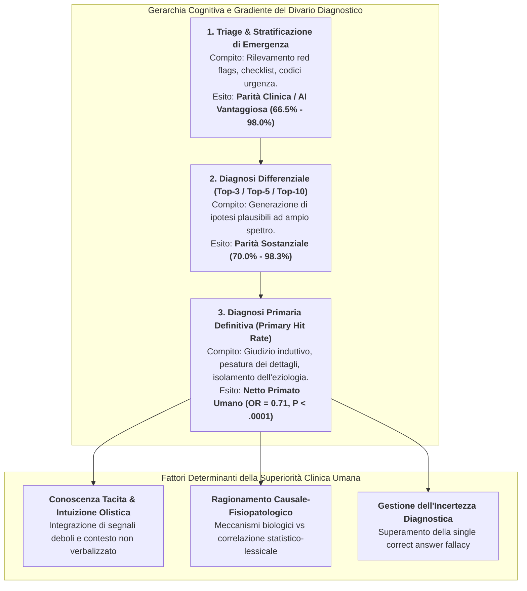
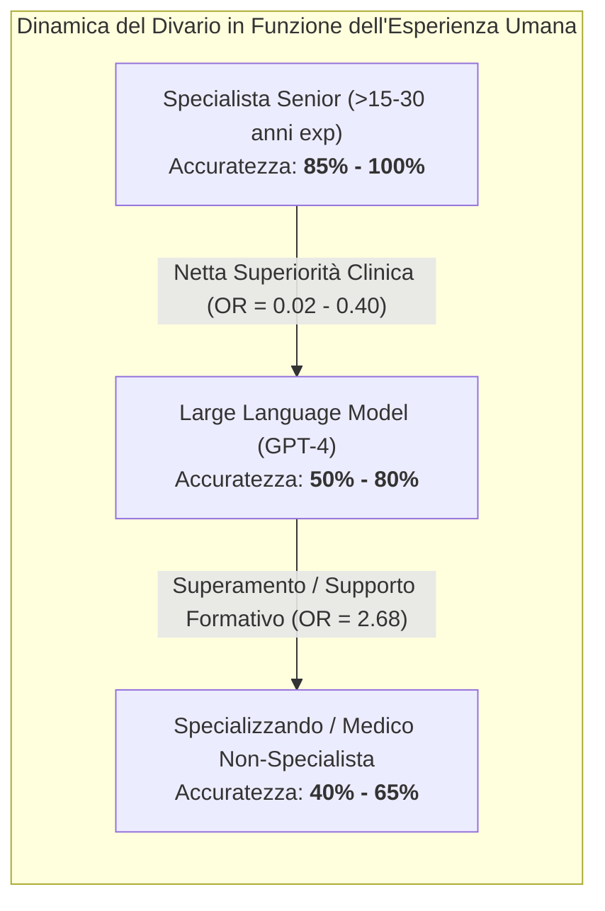

# Diagnostic Accuracy Gap: Large Language Models vs Clinical Professionals (Il Divario di Accuratezza Diagnostica tra LLM e Medici)

## Definizione Operativa
- Il **Diagnostic Accuracy Gap** (Divario di Accuratezza Diagnostica) definisce la discrepanza quantitativa e qualitativa di prestazione riscontrata tra i modelli linguistici di grandi dimensioni ([[large-language-models|LLM]]) e i professionisti sanitari qualificati nella formulazione di diagnosi cliniche accurate, stratificazione del rischio e diagnosi differenziale.
- **Evidenza Meta-Analitica Globale (Shan et al., 2025):** Sintetizzando 30 studi clinici primari ($N = 4.762$ casi) e conducendo una meta-analisi su 18 studi mirati sulla diagnosi primaria ($N = 1.472$ casi), la ricerca ha stabilito che i medici superano in modo statisticamente significativo gli LLM:
  $$\text{Pooled Odds Ratio: } \text{OR} = 0.71 \quad (95\%\text{ CI } [0.60, 0.84], Z = 4.06, P < .0001)$$
  con una percentuale di successo globale del **$71.8\%$ per i clinici umani** contro il **$65.1\%$ per i modelli LLM ottimali**.
- **La Tripartizione Funzionale delle Competenze:** Il divario di accuratezza non è omogeneo ma si distribuisce su tre livelli gerarchici di complessità cognitiva:
  1. **Triage e Urgenza (Parità/Vantaggio IA):** Accuratezza $66.5\% - 98.0\%$;
  2. **Diagnosi Differenziale Top-N (Parità/Recall Elevato):** Inclusione del target patologico nel $70\% - 98.3\%$ dei casi;
  3. **Diagnosi Primaria Singola (Netto Vantaggio Umano):** Accuratezza $25.0\% - 97.8\%$, con superiorità umana nel $66.7\%$ degli studi comparativi.

---

## Meccanismi Epistemologici e Cognitivi del Divario

### 1. Conoscenza Tacita e Integrazione Gestaltica (*Polanyi's Paradox in Medicine*)
- La pratica medica esperta si fonda largamente su **conoscenza tacita** (*tacit knowledge*): la capacità del medico di percepire pattern patologici complessi tramite un colpo d'occhio olistico (*clinical gestalt*), integrando impercettibili indizi non strutturati (aspetto del paziente, tono di voce, tempistica evolutiva dei sintomi).
- Gli LLM operano esclusivamente su rappresentazioni simbolico-testuali esplicite; se un indizio clinico sottile non viene formalizzato nel prompt testuale, il modello non ha modo di inferirlo, portando a fallimenti diagnostici su casi atipici.

### 2. Correlazione Statistico-Lessicale vs Ragionamento Fisiopatologico Causale
- Gli LLM sono predittori probabilistici del token successivo addestrati a minimizzare la cross-entropy su vasti corpus testuali. Generano ipotesi diagnostiche basate sulla frequenza di co-occorrenza lessicale tra sintomi e patologie nella letteratura medica.
- Il medico ragiona invece secondo **modelli causali e fisiopatologici**: valuta la plausibilità biologica, la sequenza temporale di comparsa dei sintomi e le interazioni sistemiche (es. farmacocinetica, cascate infiammatorie, comorbilità metaboliche), discriminando tra correlazioni spurie e nessi eziologici reali.

### 3. La [[single-correct-answer-fallacy-in-clinical-ai|Fallacia della Risposta Corretta Singola]] e la Gestione dell'Incertezza
- Nel benchmarking accademico, l'accuratezza viene spesso misurata assegnando un punto binario (1 o 0) alla coincidenza con la diagnosi registrata in cartella.
- Nella medicina reale, la diagnosi è un processo iterativo ad alta incertezza, caratterizzato da diagnosi di lavoro, monitoraggio temporale e test terapeutici. I medici sono addestrati a tollerare e calibrare l'incertezza, mentre gli LLM tendono all'iper-sicurezza (*overconfidence*) o a confabulazioni plausibili ma errate.

### 4. Vulnerabilità ai Bias Demografici e di Framing
- Studi inclusi nella meta-analisi (es. Ito et al., 2023) dimostrano che la modifica di minime variabili anagrafiche (etnia, genere, status socioeconomico) all'interno del prompt clinico può alterare significativamente la diagnosi primaria proposta dall'LLM, rivelando bias sistematici ereditati dai dati di pretraining.

---

## Analisi Comparativa per Setting Specialistico

Il gap diagnostico varia marcatamente in funzione della struttura del dominio clinico:

| Setting Clinico | Comportamento dell'LLM | Comportamento del Medico | Entità del Divario | Razionale Metodologico |
| :--- | :--- | :--- | :--- | :--- |
| **Triage di Emergenza (ED)** | Mappatura rapida di checklist e punteggi di allarme (es. triage Arslan $66.5\%$, Paslı $95.6\%$) | Valutazione combinata parametri vitali + colpo d'occhio | **Nullo o Favorevole all'AI** | I protocolli di triage sono altamente strutturati e algoritmici, terreno ideale per gli LLM. |
| **Oftalmologia** | Accuratezza primaria $59.6\% - 85\%$, differenziale fino a $98\%$ (77.8% parità) | Accuratezza primaria $60.6\% - 96.7\%$ | **Minimo / Sovrapponibile** | Le descrizioni testuali delle lesioni oculari sono precise e standardizzate nella letteratura. |
| **Medicina Interna Generale** | Diagnosi primaria $40.2\% - 60\%$; Top-10 differenziale $83.3\% - 96\%$ | Diagnosi primaria $64.6\% - 93.3\%$; Top-10 fino a $100\%$ | **Marcato (Vantaggio Umano)** | La complessità polisindromica richiede ragionamento differenziale profondo e pesatura di sintomi aspecifici. |
| **Malattie Rare e Autoimmuni** | Diagnosi primaria $25\%$; Top-5 differenziale $45\%$ (Pillai et al., 2023) | Diagnosi primaria $47.5\%$; Top-5 differenziale $60\%$ | **Severo (Vantaggio Umano)** | I quadri clinici atipici e la scarsità di dati nel pretraining penalizzano drasticamente il modello. |
| **Dermatologia Morfologica** | Diagnosi primaria $56\%$ su report testuali (Stoneham et al., 2023) | Diagnosi primaria $83\%$ | **Severo (Distacco di 27%)** | La semiotica visiva cutanea perde potere discriminante se tradotta in mero testo. |

---

## Il Gradiente di Competenza dell'Interlocutore Umano

Un risultato metodologico fondamentale della meta-analisi di Shan et al. (2025) riguarda l'impatto del livello di seniority del gruppo di controllo:
- **LLM vs Specializzandi / Non-Specialisti:** Quando gli LLM sono stati testati contro medici residenti o generalisti che affrontavano casi specialistici fuori dal proprio dominio (es. Gunes et al., 2024 su casi toracici complessi), l'LLM ha mostrato un'accuratezza superiore ($\text{OR} = 2.68$).
- **LLM vs Specialisti Senior ed Esperti Accademici:** Quando il confronto è avvenuto con clinici con decenni di esperienza specialistica (es. Nakaura et al., Hirosawa et al., Kaya et al.), il divario a favore dell'umano è divenuto schiacciante ($\text{OR} = 0.02 - 0.40$).
- **Implicazione:** Gli LLM possono fungere da eccellente "livellatore di competenze" (*skill equalizer*) per medici in formazione o contesti rurali a scarse risorse, ma non possono eguagliare il giudizio clinico di vertice.

---

## Linee Guida per l'Integrazione Clinica e Safe Deployment

Alla luce dell'evidenza quantitativa, l'adozione clinica degli LLM deve aderire ai seguenti principi di sicurezza:

1. **Divieto di Diagnosi Autonoma:** Nessun LLM generalista deve essere impiegato come decisore diagnostico autonomo (*autonomous diagnostic agent*), data la probabilità di errore non trascurabile ($34.9\%$ di fallimenti sulla diagnosi primaria).
2. **Posizionamento come "Generatore di Ipotesi Differenziali":** L'LLM deve essere configurato per produrre liste differenziali allargate (Top-5/Top-10), agendo da rete di sicurezza contro i bias di chiusura prematura (*premature closure bias*) del medico.
3. **Integrazione Obbligatoria Human-in-the-Loop:** La decisione diagnostica finale e la prescrizione terapeutica devono rimanere sotto la supervisione e responsabilità legale esclusiva del clinico umano ([[human-in-the-reasoning|Human-in-the-Reasoning]]).
4. **Potenziamento tramite [[rag-in-psicoterapia|RAG]] e Linee Guida Certificate:** Passare dall'uso di interfacce web generiche all'integrazione di motori RAG collegati a database clinici istituzionali (UpToDate, PubMed, linee guida ministeriali).

---

## Collegamenti Concettuali

- [[medinform-v13-e64963]] — Sintesi sistematica e meta-analisi PRISMA-DTA di Shan et al. (2025).
- [[multimodal-diagnostic-paradox-in-llms]] — Il paradosso del degrado diagnostico nei modelli visione-linguaggio.
- [[single-correct-answer-fallacy-in-clinical-ai]] — Limiti epistemologici della valutazione diagnostica a risposta univoca.
- [[modello-centauro-clinico]] — Framework operativo di simbiosi diagnostica tra clinico e IA.
- [[human-in-the-reasoning]] — Preservazione del giudizio clinico critico e dell'intuito umano nei sistemi decisionali.
- [[cognitive-offloading-e-diagnostic-deskilling]] — Rischi di atrofia delle competenze cliniche derivanti dalla delega diagnostica all'AI.
- [[traffic-light-quality-appraisal-clinical-ai]] — Criteri metodologici per valutare il rischio di bias negli studi clinici su LLM.

