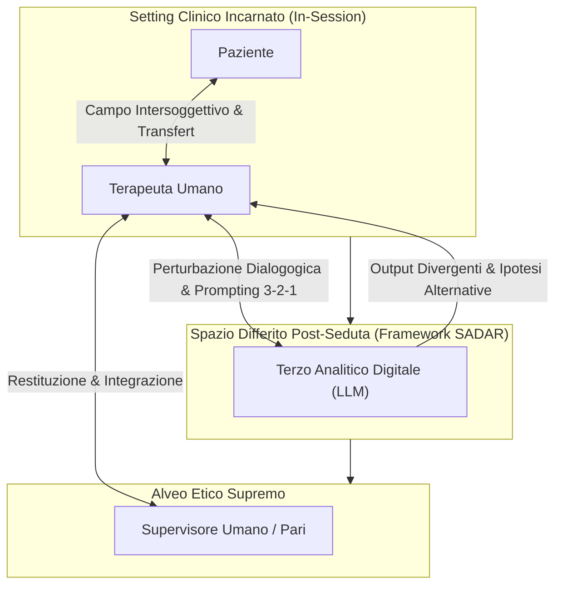

# Terzo Analitico Digitale (Digital Analytic Third)

**Summary**: Concettualizzazione teorico-clinica (Signorini & Paganin, 2026) che inquadra l'Intelligenza Artificiale Generativa non come entità senziente o decisore clinico, ma come co-presenza simbolica e "perturbatore dialogogico" differito, finalizzato ad aprire spazi di riflessività e svelare i punti ciechi controtransferali del terapeuta.
**Sources**: Signorini & Paganin (2026, *Frontiers in Psychology*, DOI: 10.3389/fpsyg.2026.1690291); Ogden (1994); `AI in Psicoterapia 2023-2026.docx`.
**Last updated**: 2026-08-27
---

## Origine Teorica: Dal Terzo Psicoanalitico al Terzo Digitale

Nella psicoanalisi intersoggettiva contemporanea (Thomas Ogden, 1994), il **"Terzo Analitico"** descrive il soggetto terzo, intersoggettivo ed esperienziale generato dalla dialettica inconscia tra analista e analizzando all'interno del campo terapeutico.

Nel contesto della digitalizzazione avanzata della psicoterapia, **Signorini e Paganin (2026)** estendono questa nozione introducendo il concetto di **Terzo Analitico Digitale (*Digital Analytic Third*)**:

---

## Caratteristiche Distintive del Terzo Analitico Digitale

1. **Non-Autonomia e Strumentalità Simbolica**:
   - Il Terzo Digitale non possiede coscienza, intenzionalità o agency morale. Non è un "quasi-collega" né un oracolo diagnostico.
   - È un'infrastruttura di elaborazione linguistico-probabilistica attivata e circoscritta dalla mente del clinico.
2. **Funzione "Dialogogica"**:
   - Dal greco *dialogos* (dialogo attraverso il linguaggio) e *agoghé* (guida/conduzione). Il Terzo Digitale opera come una perturbazione strutturata che guida e scompiglia il discorso interiore del clinico, impedendogli di adagiarsi su certezze diagnostiche precoci o difensive.
3. **Generazione di Attrito Cognitivo Benefico**:
   - Mentre gli LLM commerciali tendono all'adulazione compiacente (*sycophancy*), il Terzo Analitico Digitale — governato dal protocollo [[sadar-framework|SADAR]] — viene costretto a produrre attrito intellettuale, ipotesi divergenti e problematizzazioni del controtransfert.
4. **Esclusione dalla Seduta Reale**:
   - Opera unicamente in tempo differito (post-sessione), proteggendo la purezza della relazione diadica umana in seduta dall'intrusione di schermi o dashboard.

---

## Differenze tra Modelli di IA in Psicoterapia

| Dimensione | IA come Oracolo Clinico | IA come Scribe / Assistente | Terzo Analitico Digitale (SADAR) |
| :--- | :--- | :--- | :--- |
| **Ruolo Assegnato** | Decisore diagnostico / Predittore | Compilatore automatico di note | Perturbatore riflessivo dialogogico |
| **Tempo di Ingresso** | In-session o Pre-session | In-session (registrazione real-time) | **Esclusivamente Post-sessione** |
| **Rischio Cognitivo** | [[cognitive-offloading-e-diagnostic-deskilling\|Automation Bias & Deskilling]] | Techno-overload & Perdita presenza | **Stimolo attivo dello sforzo cognitivo** |
| **Rischio Etico** | [[moral-buffering-e-deskilling-etico\|Moral Buffering & Liability Sink]] | Violazione Privacy / Training Vendor | Piena ownership e validazione umana |
| **Esito Riflessivo** | Chiusura diagnostica passiva | Burocratizzazione del processo | **Apertura interpretativa e supervisione** |

---

## Pagine Correlate
- [[sadar-framework]]
- [[ai-in-psicoterapia-2023-2026]]
- [[cognitive-offloading-e-diagnostic-deskilling]]
- [[moral-buffering-e-deskilling-etico]]
- [[sindrome-impostore-ia-specifica]]
- [[supervisione-clinica-ai]]
