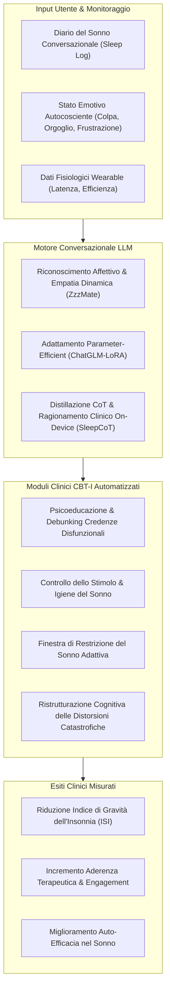

# Agenti Conversazionali e LLM per la Digital CBT-I (Cognitive Behavioral Therapy for Insomnia)

## Definizione Operativa
- Implementazione di agenti conversazionali intelligenti, modelli fine-tunnati e sistemi di distillazione del ragionamento basati su Large Language Models ([[large-language-models|LLM]]) per l'erogazione interattiva ed ecologica dei protocolli di Terapia Cognitivo-Comportamentale per l'Insonnia (CBT-I) (Mansoor, 2025; Chan et al., 2024).
- **Utilità CBT:** Automatizza e personalizza i moduli cardine della CBT-I (restrizione del sonno, controllo dello stimolo, igiene del sonno, ristrutturazione dei pensieri disfunzionali e delle credenze catastrofiche sul mancato riposo), integrando il monitoraggio dinamico delle emozioni autocoscienti (colpa, ansia, frustrazione) e sostenendo l'aderenza tra le sedute in modelli di cura stepped-care o a ridotta disponibilità di psicoterapeuti umani.

---

## Evidenze dalla Letteratura

- **Efficacia Clinica e Riduzione dell'ISI in RCT:** In un trial randomizzato controllato (RCT) multicentrico su dCBT-I, l'integrazione di un chatbot di digital coaching basato su modelli linguistici ha prodotto incrementi statisticamente significativi nell'aderenza terapeutica al protocollo e riduzioni clinicamente rilevanti dei punteggi all'Insomnia Severity Index (ISI) rispetto al gruppo di controllo privo di coaching interattivo (Chan et al., 2024).
- **Modellazione delle Emozioni Autocoscienti (ZzzMate):** Il sistema *ZzzMate* (alimentato da Qwen1.5) dimostra che la rilevazione e l'elaborazione empatica delle emozioni autocoscienti (*self-conscious emotions*, quali il senso di colpa per non aver rispettato l'orario di coricamento o l'orgoglio per il consolidamento di nuove abitudini) aumenta l'auto-efficacia percepita e la compliance ai moduli di igiene del sonno rispetto a chatbot puramente informativi (Tang et al., 2025).
- **Specializzazione Tramite Fine-Tuning LoRA (ChatGLM-LoRA):** L'adattamento parametrico efficiente tramite LoRA di ChatGLM su un corpus curato di 764 dialoghi clinici specialistici di CBT-I (450 epoche con ottimizzatore AdamW) consente di distribuire un'applicazione mobile Android in grado di guidare rilassamento, ristrutturazione cognitiva e igiene del sonno; in un pilot clinico di 1 settimana ($N=16$), oltre il 50% degli utenti ha riportato un miglioramento qualitativo del sonno (Chen et al., 2024).
- **Distillazione del Ragionamento Clinico per Dispositivi Mobili (SleepCoT):** Tramite la distillazione di catene di pensiero (*Chain-of-Thought*, CoT) generate da GPT-4o verso modelli compatti open-weight (Qwen2.5) addestrati su profili sintetici vincolati a regole cliniche, il modello *SleepCoT* raggiunge un'elevata coerenza logica e personalizzazione nelle prescrizioni di restrizione e igiene del sonno, preservando la privacy on-device a basso consumo computazionale (Zheng et al., 2024).
- **Accuratezza nella Risposta ai Quesiti sull'Insonnia:** La valutazione da parte di specialisti dei disturbi del sonno delle risposte fornite da modelli generativi a quesiti sull'insonnia conferma un'eccellente accuratezza clinica e un linguaggio adattabile alle esigenze educative dei pazienti, evidenziando tuttavia la necessità di validare la correttezza formale delle citazioni fornite (Alapati et al., 2024).
- **Limiti Metodologici e Rischi di Drop-Out:** La maggioranza degli interventi di dCBT-I basati su IA conversazionale soffre di campioni ridotti e periodi di osservazione limitati a poche settimane; è indispensabile strutturare protocolli di escalation clinica (*triage/hand-off*) verso il terapeuta umano in presenza di insonnia cronica resistente, comorbidità depressive severe o ideazione suicidaria (Mansoor, 2025; Stanley et al., 2025).

**Riferimenti Bibliografici:**
- Mansoor, H. (2025). A Scoping Review of Large Language Models in Personal Sleep Wellness. *Mayo Clinic Proceedings: Digital Health*, 3(4), 100301. https://doi.org/10.1016/j.mcpdig.2025.100301
- Alapati, R., Campbell, D., Molin, N., et al. (2024). Evaluating insomnia queries from an artificial intelligence chatbot for patient education. *Journal of Clinical Sleep Medicine*, 20(4), 583–594. https://doi.org/10.5664/jcsm.10948
- Chan, W. S., Cheng, W. Y., Lok, S. H. C., et al. (2024). Assessing the short-term efficacy of digital cognitive behavioral therapy for insomnia with different types of coaching: randomized controlled comparative trial. *JMIR Mental Health*, 11(1), e51716. https://doi.org/10.2196/51716
- Chen, Y., Pan, S., Xia, Y., et al. (2024). A conversational application for insomnia treatment: leveraging the ChatGLM-LoRA model for cognitive behavioral therapy. In *2024 IEEE International Conference on Cybernetics and Intelligent Systems (CIS) and IEEE International Conference on Robotics, Automation and Mechatronics (RAM)* (pp. 360–367). IEEE.
- Stanley, N., Marshall, K., & Gardiner, A. (2025). Who is the “therapist” in digital cognitive behavioural therapy for insomnia (dCBTi)? *Nature and Science of Sleep*, 17, 1319–1324. https://doi.org/10.2147/NSS.S516276
- Tang, X., Li, Z., Sun, X., Xu, X., & Zhang, M. L. (2025). Zzzmate: a self-conscious emotion-aware Chatbot for sleep intervention. In N. Yamashita, V. Evers, K. Yatani, & X. Ding (Eds.), *Proceedings of the Extended Abstracts of the CHI Conference on Human Factors in Computing Systems* (pp. 1–7). ACM.
- Zheng, H., Xing, X., & Xu, X. (2024). SleepCoT: a lightweight personalized sleep health model via chain-of-thought distillation. *arXiv preprint arXiv:2410.16924*. https://doi.org/10.48550/arXiv.2410.16924

## Relazioni
- Vedi anche: [[main]], [[personal-sleep-wellness-llm]], [[cbt-dialogue-systems-and-tools]], [[conceptual-architecture-of-ai-guided-cbt]], [[ai-enhanced-cbt]], [[ai-supported-between-session-engagement]], [[simulated-therapeutic-alliance]], [[stepped-care-ai-integration]]
