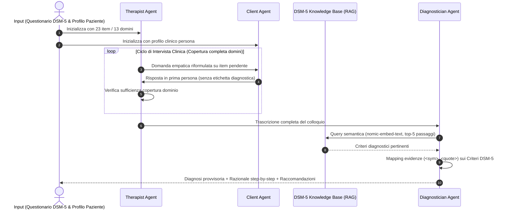

# DSM5AgentFlow

**Summary**: Framework multi-agente basato su Large Language Models per la simulazione e somministrazione interattiva del questionario diagnostico DSM-5 Livello 1, articolato in tre agenti specializzati (Therapist Agent, Client Agent, Diagnostician Agent) per garantire colloqui empatici e diagnosi tracciabili e motivate.
**Sources**: `2508.11398v2.pdf` (Ozgun et al., CIKM 2025: *Trustworthy AI Psychotherapy: Multi-Agent LLM Workflow for Counseling and Explainable Mental Disorder Diagnosis*)
**Last updated**: 2026-08-27
---

## Definizione e Obiettivi

**DSM5AgentFlow** è la prima architettura multi-agente basata su [[large-language-models]] concepita per automatizzare sia la conduzione di un colloquio di screening clinico standardizzato (basato sul *DSM-5 Level-1 Cross-Cutting Symptom Measure*), sia la formulazione di una diagnosi psichiatrica provvisoria accompagnata da un razionale trasparente ed esplicabile.

Il framework risponde a tre sfide primarie dell'IA applicata alla salute mentale:
1. **Superamento della Scarsità dei Dati**: Consente di generare dataset sintetici su larga scala (es. 8.000 colloqui clinici) nel pieno rispetto della privacy e dei vincoli etici.
2. **Eliminazione dell'Effetto "Scatola Nera"**: Sostituisce i punteggi numerici opachi dei questionari di triage con catene logiche step-by-step che collegano le parole esatte del paziente ai criteri nosografici formali.
3. **Controllo Deontologico del Setting**: Separa i ruoli dell'intervistatore, del paziente e del valutatore clinico per prevenire allucinazioni diagnostiche precoci durante il colloquio.

---

## I Tre Agenti del Workflow

### 1. Therapist Agent (Agente Terapeuta)
- **Compito**: Guidare il colloquio clinico traducendo i 23 item del DSM-5 Livello 1 in domande empatiche, naturali e calde.
- **Algoritmo di Tracking**: Mantiene una lista dinamica degli item completati e pendenti (`SelectNextItem`, `IsItemAddressed`). Se una risposta è parziale o ambigua, l'agente riformula la domanda prima di procedere al dominio successivo.
- **Prompt Safety**: Vincolo tassativo a non esprimere giudizi diagnostici o consigli terapeutici prima che l'assessment completo sia concluso.

### 2. Client Agent (Agente Paziente Simulato)
- **Compito**: Simulare in prima persona un paziente affetto da una psicopatologia specifica, arricchita da tratti demografici, comorbilità e stili di coping.
- **Fideltà di Ruolo**:
  - Risponde sempre in prima persona singolare (*I-perspective*).
  - Non rivela mai esplicitamente il nome della propria diagnosi né cita di essere un'IA.
  - Manifesta emozioni realistiche coerenti con la ricerca attiva di supporto.

### 3. Diagnostician Agent (Agente Diagnosta)
- **Modulo RAG Integrato**: Recupera i passaggi nosografici pertinenti dal testo del DSM-5 (chunk da 512/1024 token tramite `nomic-embed-text`).
- **Formulazione in Quattro Parti**:
  1. *Compassionate Summary*: Paragrafo di sintesi clinica empatica.
  2. *Diagnosis*: Diagnosi principale e provvisoria con tag nosografici (`<med>`).
  3. *Reasoning*: Razionale esplicito a punti con tag sintomatici (`<sym>`) e citazioni testuali del paziente (`<quote>`), ancorato alle clausole diagnostiche (es. Criteri A–E).
  4. *Recommended Next Steps / Treatment*: Opzioni terapeutiche evidence-based (es. CBT, IPT, invio a valutazione psichiatrica approfondita).

---

## Caratteristiche Tecniche e Modularità

- **Backend Abstraction Layer**: Supporta sia l'inferenza locale via **Ollama** (GGUF / HuggingFace, zero data-egress) sia via cloud (Groq, OpenAI).
- **Strumenti Personalizzabili**: Caricamento a runtime di nuovi questionari e strumenti di screening in formato PDF/TXT/Markdown.
- **File Persona Esterni**: Profili clinici definiti in semplici file di testo modificabili per simulare rapidamente sottopopolazioni, comorbilità o casi limite (*edge-case personas*).

---

## Pagine Correlate
- [[ozgun-et-al-2025]]: Sintesi completa dello studio empirico su CIKM 2025.
- [[explainable-mental-disorder-diagnosis]]: Principi di trasparenza, tagging clinico e razionali diagnostici step-by-step.
- [[trade-off-conversazione-ragionamento-llm]]: Il divario tra modelli di dialogo e modelli di ragionamento deduttivo.
- [[synthetic-clinical-dialogues]]: Generazione controllata di dialoghi terapeutici sintetici.
- [[simulazione-pazienti-ai]]: Metodi generali di simulazione clinica tramite LLM.
- [[rag-in-psicoterapia]]: Impiego del Retrieval-Augmented Generation nei sistemi di salute mentale.
- [[human-in-the-reasoning]]: Supervisione e audit clinico dei processi decisionali automatizzati.
