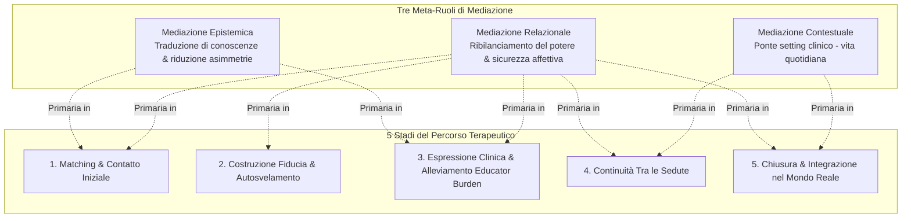
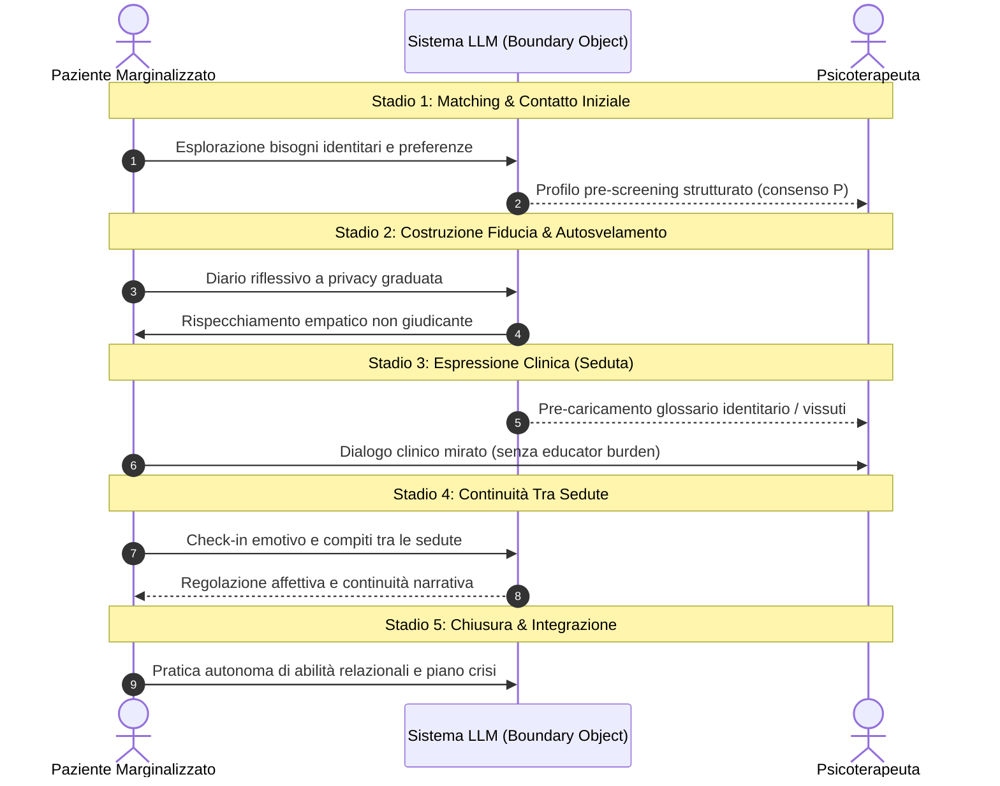

# Dynamic Boundary Mediation Framework

**Summary**: Framework concettuale e socio-tecnico formulato da Quan et al. (2025) che definisce il ruolo dei sistemi LLM come mediatori relazionali adattivi in psicoterapia, articolando tre meta-ruoli di mediazione (Epistemica, Relazionale, Contestuale) distribuiti lungo 5 stadi del percorso terapeutico per supportare popolazioni vulnerabili e marginalizzate.
**Sources**: Quan et al. (2025) - `2512.22462v1.pdf`
**Last updated**: 2026-08-27
---

## Definizione e Razionale

Il **Dynamic Boundary Mediation Framework** (Quan et al., 2025) ridefinisce l'integrazione dei Large Language Models (LLM) nella salute mentale. Superando sia la visione dell'IA come mero strumento documentale per il clinico sia quella dell'agente autonomo di auto-aiuto disconnesso dalla relazione, il framework concettualizza l'IA come un **mediatore relazionale dinamico** (*relational mediator*) capace di rimodulare le proprie funzioni in base alla fase terapeutica e ai bisogni di soggetti vulnerabili (es. comunità LGBTQ+, fasce a basso reddito, pazienti cronici).

---

## I Tre Meta-Ruoli di Mediazione

### 1. Mediazione Epistemica (*Epistemic Mediation*)
- **Obiettivo**: Ridurre le asimmetrie informative e colmare il divario epistemico tra la conoscenza clinico-istituzionale del terapeuta e la conoscenza situata/vissuta del paziente.
- **Funzioni chiave**:
  - *Traduzione dell'esperienza soggettiva*: Formalizzazione del disagio psicologico in costrutti clinici interpretabili senza snaturare l'autenticità del vissuto.
  - *Abbattimento dell'[[educator-burden-marginalized-clients|Educator Burden]]*: Fornitura proattiva al terapeuta di nozioni identitarie e contesti subculturali, evitando che il paziente debba impiegare tempo ed energie a "istruire" il professionista.

### 2. Mediazione Relazionale (*Relational Mediation*)
- **Obiettivo**: Ribilanciare le asimmetrie di potere, promuovere la sicurezza psicologica e offrire uno spazio intermedio a basso rischio per regolare il ritmo dell'autosvelamento.
- **Funzioni chiave**:
  - *Gestione Negoziabile dei Confini*: [[negotiable-data-visibility-privacy|Architettura di privacy multilivello]] (condivisione istantanea, parziale o totale riserbo).
  - *Buffer Relazionale Non-Giudicante*: Spazio dialogico che riduce la paura del rifiuto e permette di testare la propria vulnerabilità prima della seduta formale.

### 3. Mediazione Contestuale (*Contextual Mediation*)
- **Obiettivo**: Risolvere la discontinuità tra il setting protetto della terapia e la complessità spesso ostile o non supportiva della vita quotidiana (*lack of contextual portability*).
- **Funzioni chiave**:
  - *[[between-session-continuity-ai|Continuità Asincrona]]*: Presenza di supporto 24/7 tra le sedute, consolidamento degli esercizi e diario emotivo.
  - *Supporto alla Chiusura e Crisi*: Strumenti di riflessione longitudinale e canali di emergenza attivi dopo il termine del trattamento.

---

## Dinamica Evolutiva attraverso i 5 Stadi

---

## Rilevanza Clinica e per l'HCI

1. **Superamento del Modello Strumento-Puro**: Il sistema non è un mero esecutore algoritmico, ma un attore sociotecnico che modula le relazioni umane senza sostituirsi all'etica del curante.
2. **Accountability Relazionale**: L'efficacia dell'IA viene valutata non solo su metriche computazionali (accuratezza, engagement), ma sulla sua capacità di proteggere l'alleanza terapeutica e redistribuire il carico emotivo.

---
## Concetti Correlati
- [[boundary-objects-in-psychotherapy]]
- [[educator-burden-marginalized-clients]]
- [[negotiable-data-visibility-privacy]]
- [[contextualized-relational-memory]]
- [[between-session-continuity-ai]]
- [[interazione-triadica-terapeuta-paziente-ia]]
- [[ai-mental-health-vulnerable-populations]]
