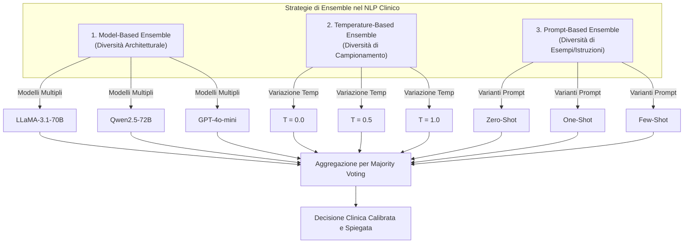

# Ensemble Prompting in Clinical NLP (Prompting ad Ensemble nel NLP Clinico)

## Definizione Concettuale
L'**Ensemble Prompting nel NLP Clinico** è una metodologia di inferenza che combina le risposte generate da molteplici configurazioni di prompt, parametri di decodifica o modelli linguistici indipendenti, aggregandone gli output mediante meccanismi di voto a maggioranza (*majority voting*) o regole decisionali strutturate (Trad & Chehab, 2025; Ong et al., 2025).

Nei compiti clinici caratterizzati da **elevata soggettività, complessità interpretativa o inferenza causale** (come l'individuazione di relazioni funzionali tra temi psicologici), i singoli modelli linguistici possono manifestare allucinazioni, instabilità o bias stilistici. L'ensemble prompting riduce l'incertezza epistemica del modello e aumenta la robustezza, la trasparenza e la calibrazione clinica delle decisioni.

---

## Tipologie di Ensemble Prompting

Ong et al. (2025) hanno confrontato tre diverse strategie di ensemble applicate alla generazione di connessioni dirette tra costrutti psicologici:

### 1. Model-Based Ensemble (Ensemble Basato su Modelli Eterogenei)
- **Funzionamento:** Mantiene fisso il prompt e interroga modelli linguistici sviluppati con architetture, pre-training e allineamenti differenti (es. *LLaMA-3.1-70B-Instruct*, *Qwen2.5-72B-Instruct* e *GPT-4o-mini*).
- **Vantaggi Clinici:** Massimizza la diversità delle prospettive cognitive; i modelli proprietari più avanzati compensano i limiti di ragionamento contestuale dei modelli aperti, mentre questi ultimi garantiscono la stabilità logica.
- **Esito Empirico:** È risultata la strategia **nettamente preferita dagli psicologi clinici** (preferenza del 77.0% per chiarezza espositiva, 52.7% per qualità delle connessioni e 45.9% per insight terapeutico).

### 2. Temperature-Based Ensemble (Ensemble Basato sulla Temperatura)
- **Funzionamento:** Utilizza il medesimo modello e prompt, variando il parametro di temperatura di campionamento ($T \in \{0.0, 0.5, 1.0\}$).
- **Vantaggi e Limiti:** Esplora uno spettro che va da risposte puramente deterministiche ($T=0$) a formulazioni più creative e associative ($T=1.0$), ma presenta un minor accordo interno sui tipi e intensità delle connessioni (68% di accordo sul tipo di connessione contro l'85% del prompt-based).

### 3. Prompt-Based Ensemble (Ensemble Basato su Variazioni di Prompt)
- **Funzionamento:** Mantiene fisso il modello (LLaMA-3.1 a $T=0$) e varia il livello di esemplificazione fornito (*zero-shot*, *one-shot*, *few-shot*).
- **Vantaggi e Limiti:** Ottiene un'elevata coerenza interna (100% di accordo sull'esistenza dell'arco, 85% sul tipo), ma tende a produrre risposte meno diversificate, adattive e sfumate rispetto all'ensemble multi-modello.

---

## Meccanismo Decisionale di Majority Voting

Nel protocollo di Ong et al. (2025), la convergenza dell'ensemble avviene attraverso una procedura deterministica a 3 fasi:

1. **Rilevamento della Connessione ($0$ o $1$):** L'arco orientato tra il tema $A$ e il tema $B$ viene tracciato solo se almeno 2 modelli su 3 concordano sull'esistenza della relazione e sul medesimo tipo (*eccitatorio* vs *inibitorio*). In caso di disaccordo sul tipo o assenza di maggioranza, la connessione non viene creata.
2. **Determinazione della Forza:** Viene selezionata l'intensità (*Strong*, *Moderate*, *Weak*) più marcata tra quelle indicate dalla maggioranza concordante.
3. **Selezione della Spiegazione:** Viene estratta automaticamente e in modo trasparente la spiegazione clinica generata dal modello appartenente alla maggioranza che ha espresso la motivazione qualitativamente più coerente.

---

## Vantaggi di Efficienza e Privacy nel Workflow Clinico

- **Isolamento dei Dati Sensibili:** Poiché lo stadio di collegamento tra temi opera su etichette concettuali astratte e de-identificate (es. *"Paura del fallimento"* $\rightarrow$ *"Evitamento relazionale"*), è possibile impiegare API esterne e modelli proprietari avanzati in totale sicurezza, senza trasmettere dettagli biografici o dialoghi grezzi della seduta.
- **Efficienza Computazionale:** Il numero di nodi tematici estratti da una seduta terapeutica è compatto (tipicamente da 4 a 10 nodi), rendendo il calcolo combinatorio delle coppie orientate estremamente rapido ed economico.

---

## Riferimenti Bibliografici
- Trad, F., & Chehab, A. (2025). To ensemble or not: Assessing majority voting strategies for phishing detection with large language models. In A. Bennour et al. (Eds.), *Intelligent Systems and Pattern Recognition* (pp. 158–173). Springer Nature Switzerland.
- Ong, C. W., Arnaout, H., Sheehan, K., Fox, E., Owtscharow, E., & Gurevych, I. (2025). Using Large Language Models to Create Personalized Networks From Therapy Sessions. *arXiv preprint arXiv:2512.05836v1*. https://doi.org/10.48550/arXiv.2512.05836

---

## Pagine Correlate
- [[ong-et-al-2025]]
- [[llm-case-conceptualization-pipeline]]
- [[personalized-networks-in-psychotherapy]]
- [[ai-clinical-decision-support]]
- [[hybrid-ai-research-workflows]]
