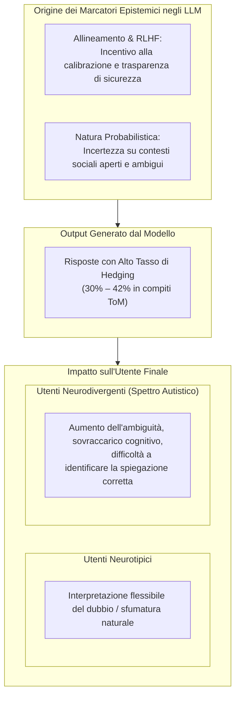

# Marcatori Epistemici e Hedging nei Sistemi di IA

**Summary**: Studio delle modalità epistemiche (*epistemic modalities*) e delle strategie di cautela stilistica (*hedging*) generate dai Large Language Models. Analizza il trade-off clinico tra la trasparenza probabilistica dell'IA e l'esigenza di chiarezza non ambigua per utenti neurodivergenti o vulnerabili.
**Sources**: `2601.06032v1.pdf`
**Last updated**: 2026-08-27
---

## Definizione e Inquadramento Linguistico

In linguistica e pragmatica, le **modalità epistemiche** (*epistemic markers* o *epistemic modalities*) rappresentano l'espressione verbale del grado di certezza, probabilità o prevedibilità attribuito dal parlante a un determinato stato di cose o affermazione (Halliday, 1970). 

Negli output dei Large Language Models ([[large-language-models]]), i marcatori epistemici assumono la forma di:
- **Avverbi di dubbio o probabilità**: *"maybe"*, *"probably"*, *"possibly"*, *"vielleicht"*, *"wahrscheinlich"*.
- **Costruzioni ipotetiche e congiuntive**: *"could be interpreted as"*, *"might suggest"*, *"it is possible that"*.
- **Clausole di riserva e opzioni multiple**: offrire spiegazioni alternative senza convergere su un'interpretazione univoca.

---

## Evidenze Empiriche e Quantificazione (Holl-Etten et al., 2026)

Mentre nelle valutazioni tradizionali dei modelli linguistici l'attenzione è posta quasi unicamente sull'accuratezza delle risposte (corretto/errato), la recente ricerca clinico-linguistica ha quantificato l'incidenza di tali marcatori:

1. **Frequenza Anomala rispetto ai Campioni Umani**:
   - **GPT-4**: Utilizza marcatori di incertezza tra il **27.1% e il 41.7%** delle risposte in compiti di Theory of Mind complessi (Faux Pas Test e Story Comprehension Test).
   - **GPT-3.5**: Presenta tassi variabili tra il **14.2% e il 50.0%** (con picchi marcati in lingue a minore volume di training come il tedesco).
   - **Umani Neurotipici**: Nei medesimi test, adulti e adolescenti impiegano marcatori di incertezza solo nel **5.7% – 5.9%** delle formulazioni verbali.
2. **Effetto della Lingua di Prompting**: Le risposte in tedesco mostrano una frequenza significativamente più elevata di modalità epistemiche rispetto all'inglese, suggerendo che una minore esposizione nel corpus di addestramento spinge il modello verso formulazioni più prudenti o cautelative.

---

## Il Trade-Off Assistivo: Trasparenza Algoritmica vs Chiarezza Clinica

L'uso massiccio di hedging negli LLM pone una sfida di design cruciale per le applicazioni di salute mentale e supporto alla neurodiversità:

### 1. Il Beneficio dal Punto di Vista Tecnico-Etico
- Riduce il rischio di *overconfidence* e allucinazioni assertive su questioni soggettive.
- Segnala onestamente i limiti della conoscenza del modello in domini psicologici ad alta variabilità.

### 2. Il Limite dal Punto di Vista Clinico-Assistivo
- Le persone nello spettro autistico beneficiano prioritariamente di comunicazioni **esplicite, dirette, univoche e strutturate**.
- Una risposta che fornisce spiegazioni multiple e ipotetiche richiede che l'utente effettui autonomamente la decodifica dell'intenzione sociale — proprio la competenza per cui ha richiesto l'ausilio del sistema assistivo.
- L'eccesso di modalità epistemiche rischia quindi di incrementare l'ansia sociale e il senso di disorientamento relazionale.

---

## Strategie di Mitigazione

1. **Prompt Tuning per Comunicazione Assistiva**: Istruire il modello a modulare il tono a seconda del target, privilegiando risposte assertive e focalizzate sulla spiegazione sociale più plausibile.
2. **Interfacce a Livelli di Spiegazione**: Offrire una risposta primaria diretta e chiara, relegando a una sezione secondaria facoltativa le ipotesi probabilistiche alternative.
3. **Calibrazione Personalizzata**: Permettere all'utente di selezionare il livello di certezza e di dettaglio della spiegazione sociale richiesta.

---

## Related pages
- [[holl-etten-et-al-2026]]
- [[applied-theory-of-mind-llm]]
- [[ai-assistive-autism-communication]]
- [[social-vignettes-benchmarking]]
- [[ai-mental-health-vulnerable-populations]]
- [[conversational-agents-mental-health]]
