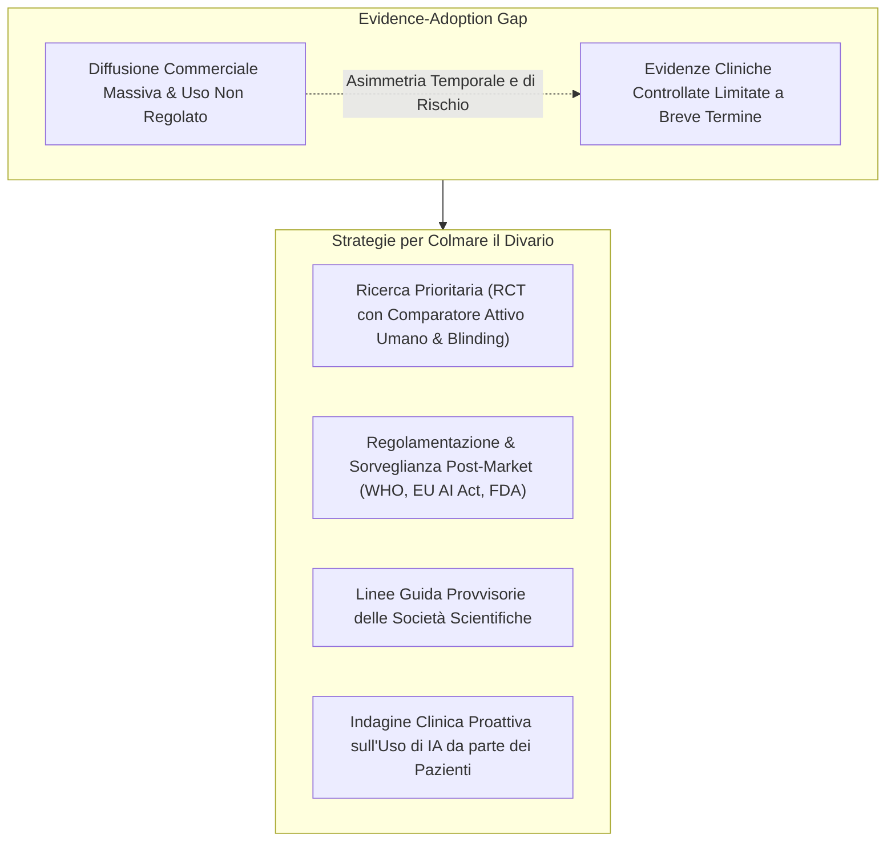

# Evidence–Adoption Gap e Salvaguardie Cliniche nell'IA in Salute Mentale

**Summary**: Analisi del divario critico tra la rapida adozione su larga scala di chatbot generalisti da parte del pubblico e la carenza di studi clinici controllati a lungo termine (RCT con comparatori attivi umani), e quadro delle raccomandazioni e salvaguardie provvisorie per clinici, enti regolatori e organizzazioni sanitarie.
**Sources**: Cavalera et al. (2026) - `11920_2026_Article_1690.pdf`; WHO (2024); Consulta Scuole CBT (2026).
**Last updated**: 2026-08-27
---

## Il Fenomeno dell'Evidence–Adoption Gap

L'**Evidence–Adoption Gap** (Divario tra Evidenze e Adozione) descrive una grave asimmetria nell'ecosistema della salute mentale digitale:

- **Velocità di Adozione di Massa**: Milioni di persone utilizzano quotidianamente LLM generalisti (es. ChatGPT, Claude) e chatbot non regolamentati come succedanei o surrogati di supporto psicologico e consulenza esistenziale.
- **Ritardo della Validazione Scientifica**: La maggior parte delle evidenze cliniche disponibili proviene da studi pilota o RCT a breve termine con controlli non attivi (liste d'attesa o contenuti web statici), mentre scarseggiano studi longitudinali (>8-12 settimane) con comparatori attivi umani e valutazione sistematica degli effetti iatrogeni o di dipendenza.

---

## Priorità di Ricerca Scientifica

Cavalera et al. (2026) identificano 7 direttrici prioritarie per la ricerca clinica:
1. **RCT con Comparatori Attivi Umani**: Condurre trial controllati in cui il gruppo di controllo riceva psicoterapia erogata da professionisti abilitati e con valutatori in cieco (*assessor blinding*).
2. **Follow-up a Lungo Termine (>8–12 Settimane)**: Valutare la tenuta dei risultati sintomatici, l'insorgenza di dipendenza comportamentale ed effetti iatrogeni a distanza.
3. **Endpoint Focalizzati sul Danno (*Harm-Focused Endpoints*)**: Misurare sistematicamente il rinforzo di deliri, stati maniacali, mancata gestione del rischio suicidario ed erosione della ricerca di aiuto umano.
4. **Analisi di Eterogeneità degli Effetti (*Heterogeneity-of-Treatment-Effect*)**: Identificare con precisione quali profili clinici beneficiano dell'IA (sintomi lievi-moderati, psicoeducazione) e quali rischiano un danno (spettro psicotico, solitudine estrema, minori).
5. **Studi di Processo**: Misurare l'evoluzione dell'alleanza terapeutica, dell'autonomia e l'impatto dell'assenza di [[calibrated-mismatches|calibrated mismatches]].
6. **Validazione Esterna Indipendente**: Verificare i modelli prognostici e diagnostici su diverse culture, lingue e contesti clinici reali.
7. **Sorveglianza Post-Market**: Raccogliere dati di utilizzo nel mondo reale (*real-world evidence*) oltre i contesti sperimentali ideali.

---

## 7 Salvaguardie Cliniche e Organizzative Immediate

In attesa di evidenze consolidate, clinici e organizzazioni sanitarie devono adottare un approccio conservativo:

1. **Informed Consent Esplicito**: Chiarire sempre all'utente che sta interagendo con un software privo di intenzionalità morale o coscienza.
2. **Stratificazione del Rischio all'Intake**: Escludere tassativamente dall'uso autonomo soggetti con psicosi, rischio suicidario o dissociazione.
3. **Uso Time-Limited e Goal-Bounded**: Limitare l'impiego a obiettivi specifici tra le sedute concordati col terapeuta.
4. **Procedure di Escalation Umana d'Emergenza**: Canali diretti di contatto con clinici umani in caso di crisi.
5. **Formazione dei Clinici Anti-Automation Bias**: Sviluppare competenze per valutare criticamente gli output dell'IA ed evitare la delega decisionale (*cognitive offloading*).
6. **Data Governance e Privacy Sanitaria**: Conformità a GDPR/HIPAA e divieto di cedere dati clinici a terzi.
7. **Responsabilità Organizzativa Nominale**: Designazione di un supervisore clinico umano responsabile per ogni percorso assistito da IA.

---

## Pagine Correlate
- [[cavalera-et-al-2026]]
- [[three-layer-governance-framework]]
- [[calibrated-mismatches]]
- [[sycophantic-mirroring]]
- [[fast-food-psychotherapy]]
- [[criminal-disclosures-and-reporting-in-ai]]
- [[stepped-care-ai-integration]]
- [[ai-assisted-psychotherapy]]
