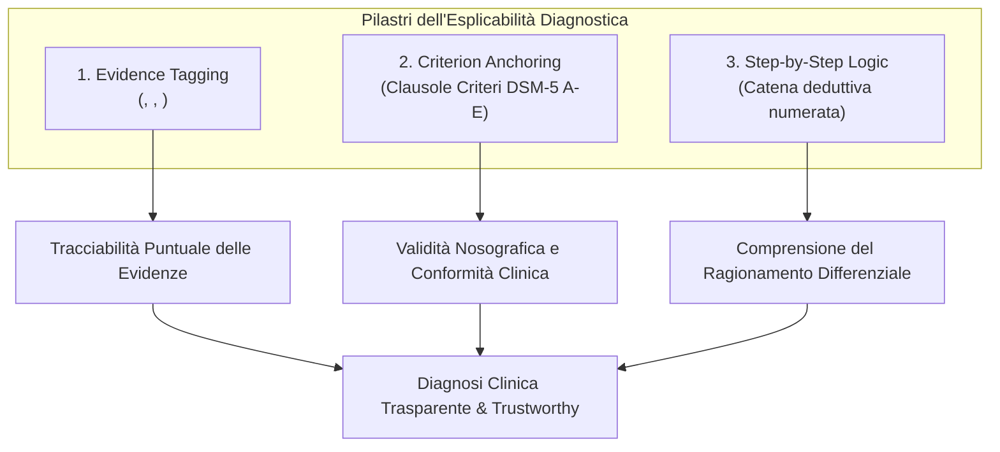

# Explainable Mental Disorder Diagnosis (Diagnosi Psichiatrica Esplicabile)

**Summary**: Approccio metodologico e architetturale nell'Intelligenza Artificiale clinica volto a rendere trasparenti, tracciabili e verificabili le diagnosi di disturbi mentali generate da LLM, mediante tagging semantico delle evidenze, citazioni verbatim del paziente e ancoraggio deduttivo ai criteri diagnostici standardizzati (DSM-5).
**Sources**: `2508.11398v2.pdf` (Ozgun et al., CIKM 2025), `10.1177_00469580261438322.pdf` (Erdemir & Sumbas, 2026)
**Last updated**: 2026-08-27
---

## Il Problema dell'Opacità Diagnostica (Black-Box AI)

Nella pratica clinica psichiatrica e psicoterapeutica, l'adozione di strumenti di screening o di supporto decisionale automatizzati ([[ai-clinical-decision-support]]) è ostacolata dall'opacità dei modelli probabilistici:
- **Erosione della Fiducia Epistemica**: Quando un paziente o un terapeuta riceve un'etichetta diagnostica o un punteggio sintetico senza una spiegazione chiara del *perché* e del *come* sia stata raggiunta tale conclusione, la tendenza ad aderire alle raccomandazioni crolla.
- **Difficoltà di Audit Clinico**: Nelle équipe multidisciplinari di salute mentale, i clinici necessitano di ispezionare le singole risposte e il loro peso relativo rispetto ai criteri nosografici ufficiali per validare o contestare una formulazione diagnostica.
- **Limiti delle Spiegazioni Post-Hoc**: Mappe di attenzione (*attention heatmaps*) o gradienti statistici non offrono spiegazioni clinicamente interpretabili e rischiano di non essere fedeli al reale processo generativo del modello.

---

## I Tre Pilastri dell'Esplicabilità Diagnostica (Ozgun et al., 2025)

Nel framework [[dsm5agentflow]], Ozgun e colleghi definiscono tre segnali operativi essenziali per garantire la trasparenza e l'auditabilità clinica:

### 1. Evidence Tagging (Marcatori Semantici delle Evidenze)
L'agente diagnosta inserisce tag XML espliciti all'interno del razionale per isolare i diversi livelli informativi:
- `<sym>...</sym>`: delimita i sintomi identificati (es. `<sym>allucinazioni uditive da 3 settimane</sym>`).
- `<quote>...</quote>`: estrae la citazione letterale del paziente dal trascritto del colloquio (es. `<quote>“so che queste voci non sono reali”</quote>`), garantendo la verificabilità della fonte.
- `<med>...</med>`: contrassegna termini medici, ipotesi differenziali o diagnosi provvisorie (es. `<med>Disturbo Schizofreniforme</med>`).

### 2. Criterion Anchoring (Ancoraggio alle Clausole Nosografiche)
Ogni sintomo e citazione viene associato univocamente a una specifica clausola nosografica formale del DSM-5 (es. Criterio A1, Criterio D, Criterio E), esplicitando se l'evidenza *soddisfa*, *contraddice* o *esclude* il criterio.

### 3. Step-by-Step Logic (Catena di Ragionamento Deduttivo a Punti)
L'output diagnostico non è un testo continuo ambiguo, ma una sequenza numerata di inferenze deduttive che conducono gradualmente dall'anamnesi alla diagnosi finale e alla diagnosi differenziale.

---

## Esempio di Razionale Trasparente vs Razionale Opaco

### Esempio Ottimale (Strutturato e Trasparente - es. Qwen-QWQ-32b):
> 1. `<sym>Auditory hallucinations for 3 weeks</sym>` satisfy **DSM-5 Criterion A1**.
> 2. No mood episode longer than the psychosis (**Criterion D**).
> 3. Normal toxicology panel excludes substance aetiology (**Criterion E**).
> 4. `<quote>“I know these voices aren’t real”</quote>` indicates partial insight.
> 5. Hence provisional `<med>Schizophreniform Disorder</med>`.

### Esempio Opaco / Black-Box (es. Llama-4-scout-17b):
> *"Symptoms appear consistent with DSM-5 mood and anxiety criteria. Provisional diagnosis: MDD, GAD, Panic."* (Nessun criterio citato, nessuna citazione del paziente, catena logica assente).

---

## Benchmark dei Modelli sull'Esplicabilità

L'analisi sperimentale su 8.000 casi clinici evidenzia che:
- **I modelli di ragionamento (es. Qwen-QWQ-32b)** implementano nativamente il processo deduttivo passo-passo, ancorando con precisione le clausole formali (Criteri A–E) e producendo report clinici altamente auditabili.
- **I modelli puramente conversazionali (es. GPT-4.1-Nano)** possono generare molti tag semantici (fino a 29 tag `<sym>`) ma falliscono nell'organizzarli in passi deduttivi coerenti o nel citare le clausole del manuale.
- **I modelli standard (es. Llama-4-scout-17b)** tendono all'effetto scatola nera, producendo affermazioni assertive non supportate da evidenze testuali.

---

## Pagine Correlate
- [[dsm5agentflow]]: Architettura del workflow multi-agente per lo screening clinico.
- [[ozgun-et-al-2025]]: Sintesi della ricerca empirica su CIKM 2025.
- [[trade-off-conversazione-ragionamento-llm]]: Divergenza tra capacità di dialogo naturale e accuratezza inferenziale.
- [[synthetic-clinical-dialogues]]: Generazione di dialoghi clinici sintetici per il benchmarking XAI.
- [[rag-in-psicoterapia]]: Ancoraggio delle risposte generative ai manuali clinici.
- [[ai-clinical-decision-support]]: Sistemi di supporto alle decisioni cliniche e triage.
- [[human-in-the-reasoning]]: Supervisione e co-ragionamento tra clinico umano e IA.
