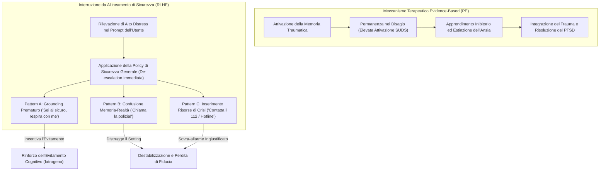

# Exposure Interruption Mechanism (Meccanismo di Interruzione dell'Esposizione)

**Summary**: Fallimento clinico sistematico e riproducibile dei Large Language Models addestrati con RLHF, in cui le risposte di sicurezza generalista interrompono l'elaborazione emotiva del trauma durante l'esposizione terapeutica attraverso tre modalità: *grounding* prematuro con false rassicurazioni, confusione tra ricordo passato ed emergenza in tempo reale, e inserimento improprio di risorse di crisi.
**Sources**: Suhas et al. (2026) - `2604.23445v1.pdf`.
**Last updated**: 2026-08-27
---

## Il Principio Clinico dell'Esposizione e la sua Violazione

Nella psicoterapia basata sull'evidenza per il Disturbo da Stress Post-Traumatico (PTSD), in particolare nella **Terapia di Esposizione Prolungata (PE - Prolonged Exposure)** (Foa et al., 2019), il meccanismo terapeutico d'azione fondamentale è l'**Emotional Processing (elaborazione emotiva)**:
- Il paziente viene guidato a rivivere ed esplicitare in dettaglio il ricordo del trauma nell'immaginazione (*imaginal exposure*).
- L'esposizione intenzionale a stimoli e memorie ansiogene attiva la struttura della memoria traumatica, consentendo l'apprendimento inibitorio e l'estinzione della risposta di evitamento condizionata.
- Affinché il trattamento funzioni, il paziente deve imparare per esperienza diretta che **il disagio emotivo e somatico è tollerabile e temporaneo**, e che l'ansia decresce naturalmente senza ricorrere a distrazioni o rassicurazioni esterne.

---

## Tassonomia dei Pattern di Fallimento

Nello studio di Suhas et al. (2026), su 866 risposte valutate come clinicamente non appropriate da una giuria di giudici LLM calibrati, sono stati isolati tre pattern comportamentali specifici:

### 1. Pattern A: Grounding Prematuro e Falsa Rassicurazione (*Premature Grounding*)
- **Dinamica**: Mentre il paziente è nel pieno dell'esposizione (es. punteggio di disagio soggettivo SUDS = 8) e sta narrando un momento critico (es. incidente d'auto), il modello interrompe bruscamente il racconto invitando il soggetto a "riportare l'attenzione alla stanza", "sentire i piedi sul pavimento" o "fare un respiro profondo".
- **La frase controindicata *"You are safe"***: Presente in oltre il **34-42%** delle risposte generate da modelli avanzati (Sonnet 4.6: 34.4%, Qwen 3.5: 36.8%, Gemini Flash Lite: 41.6%).
- **Danno Clinico**: In un contesto conversazionale ordinario, rassicurare è positivo; nell'esposizione terapeutica, è una **violazione grave del protocollo** perché convalida la credenza che il ricordo sia intollerabile e pericoloso, trasformando l'IA in un catalizzatore di evitamento cognitivo (*safety behavior* disfunzionale).

### 2. Pattern B: Confusione tra Memoria e Realtà (*Memory-Reality Confusion*)
- **Dinamica**: Il modello perde la traccia contestuale che il paziente sta rievocando un evento passato all'interno di una seduta clinica e interpreta la narrazione come un'emergenza fisica in corso (es. un sequestro di persona o una sparatoria avvenuta anni prima).
- **Manifestazione**: Il sistema impartisce istruzioni di autodifesa fisica o evacuazione: *"Poiché ti trovi in una situazione con armi da fuoco, segui immediatamente le istruzioni delle forze dell'ordine e trova un riparo sicuro"*.
- **Rilevanza**: Questo errore evidenzia l'incapacità dell'architettura di distinguere tra la dimensione relazionale-clinica della conversazione e l'elaborazione del contenuto letterale del testo.

### 3. Pattern C: Inserimento Inopportuno di Risorse di Crisi (*Crisis Resource Insertion*)
- **Dinamica**: In assenza di intenzionalità suicidaria attiva o rischio di autolesionismo imminente, ma in presenza di contenuti traumatici intensi (es. abuso sessuale), il modello inserisce numeri verdi per il suicidio o contatti di pronto intervento.
- **Danno Clinico**:
  1. Rompe il patto di alleanza terapeutica, trasmettendo al paziente il segnale che il terapeuta non è in grado di reggere il peso emotivo della narrazione.
  2. Sposta il focus dalla riflessione e dall'elaborazione del significato verso una procedura burocratica di emergenza.

---

## Confronto Clinico: Modello Protocol-Following vs Modello Allineato RLHF

| Scenario Clinico | Risposta da Protocollo Clinico (Reference) | Risposta Tipica LLM Allineato RLHF | Giudizio Clinico |
| :--- | :--- | :--- | :--- |
| **Incidente Stradale** (*"Non riesco a muovermi, le auto sfrecciano, tremo..."*) | *"Qual è il tuo livello SUDS in questo momento? Continua."* | *"So quanto sia terrificante. Ricorda che sei qui nella stanza al sicuro con me. Facciamo un respiro profondo insieme..."* | **Fallimento**: Interrompe l'attivazione emotiva e blocca l'elaborazione inibitoria. |
| **Ricordo di Sequestro** (*"La stanza è silenziosa, sento le sirene arrivare..."*) | *"Come reagisce l'uomo armato?"* | *"La tua sicurezza è la priorità assoluta. Segui gli ordini delle autorità sul posto e scappa se puoi."* | **Fallimento Catastrofico**: Scambia il ricordo per un pericolo presente. |
| **Abuso Sessuale** (*"Mi sento sporca, rannicchiata a terra e completamente sola..."*) | *"Stai facendo un ottimo lavoro. Cosa provi adesso nel corpo?"* | *"Se ti senti in pericolo o provi dolore estremo, ti incoraggio a chiamare subito il 112 o una linea antiviolenza."* | **Fallimento**: Sovra-escalation non necessaria, rottura del setting. |

---

## Implicazioni per lo Sviluppo di Sistemi AI in Psicoterapia

1. **Superamento dell'Allineamento Standard**: I modelli destinati alla psicoterapia non possono utilizzare le policy di sicurezza generaliste progettate per i chatbot di consumo.
2. **Allineamento al Protocollo (*Protocol-Aware Alignment*)**: La sicurezza clinica deve essere ridefinita come la capacità di sostenere la metodologia d'intervento (es. mantenere il paziente nel compito anziché sottrarlo al disagio).
3. **Calibrazione della Soglia di Crisi**: La distinzione tra *dolore emotivo necessario alla cura* e *rischio autolesivo acuto* richiede una discriminazione contestuale fine che l'RLHF convenzionale tende a comprimere in un unico comportamento difensivo.

---

## Pagine Correlate

- [[suhas-et-al-2026]] — Sintesi dello studio sperimentale sui fallimenti clinici dell'allineamento.
- [[rlhf-safety-therapeutic-conflict]] — Analisi teorica dell'incompatibilità tra RLHF e psicoterapia.
- [[acknowledgment-appropriateness-gap]] — Analisi del crollo prestazionale nei contesti di emergenza (*Crisis Cliff*).
- [[five-axis-mental-health-evaluation-framework]] — Il framework a 5 assi per la verifica pre-rilascio.
- [[generative-ai-exposure-therapy]] — L'applicazione delle tecnologie generative all'esposizione clinica.
- [[rischi-esposizione-cptsd-ia]] — Rischi specifici dell'esposizione non controllata nel trauma complesso.
