# Extended Evolutionary Meta-Model (EEMM)

## Definizione Concettuale
L'**Extended Evolutionary Meta-Model (EEMM)** è un meta-modello teorico ed euristico sviluppato nell'ambito della *Process-Based Therapy* (PBT; Hayes, Hofmann, & Ciarrochi, 2020; Ciarrochi et al., 2024). L'EEMM fornisce una tassonomia coerente e trans-teorica per concettualizzare l'adattamento psicologico e il cambiamento comportamentale umano attraverso i principi dell'evoluzione (variazione, selezione e ritenzione nel contesto), superando i silos diagnostici delle classificazioni categoriali sindromiche (DSM/ICD).

All'interno dell'elaborazione del linguaggio naturale (NLP) clinico e della modellazione automatizzata con LLM (Ong et al., 2025), l'EEMM funge da **schema ontologico fondamentale** per l'etichettatura multi-label degli enunciati dei pazienti e la categorizzazione dimensionale dei processi terapeutici.

---

## Le Dimensioni dell'EEMM

Il modello organizza il funzionamento psicologico umano in **6 dimensioni primarie** integrate a **livelli contestuali e biologici**:

```mermaid
graph TD
    subgraph EEMM_Framework ["Extended Evolutionary Meta-Model (EEMM)"]
        subgraph CoreDimensions ["Dimensioni Psicologiche Principali"]
            Aff["1. Affetto (Affect)<br>Esperienza emotiva e reattività affettiva"]
            Cog["2. Cognizione (Cognition)<br>Pensieri, schemi di credenze e attribuzione di significato"]
            Att["3. Attenzione (Attention)<br>Focalizzazione, shift e flessibilità attentiva"]
            Mot["4. Motivazione (Motivation)<br>Valori, bisogni e scopi dell'azione"]
            Self["5. Senso del Sé (Sense of Self)<br>Concetto di sé, auto-percezione e auto-valutazione"]
            Beh["6. Comportamento Manifesto (Overt Behavior)<br>Azioni osservabili, abitudini e inazione"]
        end

        subgraph ContextualLevels ["Livelli Contestuali e Biologici"]
            Bio["7. Biofisiologico (Biophysiological)<br>Sonno, nutrizione, dolore, tono vagale, comorbidità fisiche"]
            Soc["8. Relazioni / Cultura (Sociocultural)<br>Attaccamento, relazioni interpersonali, contesto socio-culturale"]
            Ctx["9. Contesto / Moderatori (Context/Moderators)<br>Fattori situazionali e ambientali stabili o difficilmente modificabili"]
        end
    end

    CoreDimensions <--> ContextualLevels
```

### Definizioni Operative ed Esempi Clinici (Ong et al., 2025)

1. **Affetto (*Affect*):** Come il paziente sperimenta o risponde alle proprie emozioni (es. *"Non riuscire a fare ciò che volevo è stato estremamente frustrante"*).
2. **Cognizione (*Cognition*):** Come il paziente elabora i pensieri, attribuisce significato agli eventi o valuta le proprie esperienze (es. *"Se non sono perfetto, le persone si stuferanno di me"*).
3. **Attenzione (*Attention*):** Modalità con cui il paziente orienta, focalizza o distoglie l'attenzione rispetto agli stimoli interni ed esterni (es. iper-monitoraggio delle minacce o ruminazione).
4. **Motivazione (*Motivation*):** Le ragioni sottostanti, i valori perseguiti o i desideri di orientamento dell'azione (es. *"Vorrei davvero riuscire a gestire più impegni contemporaneamente"*).
5. **Senso del Sé (*Sense of Self*):** Come l'individuo percepisce e concettualizza se stesso o reagisce al proprio concetto di sé (es. identificazione rigida nel ruolo di *"caregiver responsabile"*).
6. **Comportamento Manifesto (*Overt Behavior*):** Azioni comportamentali osservabili, ripetitive o schemi di inazione ed evitamento (es. procrastinazione, isolamento sociale, condotte compulsive).
7. **Biofisiologico (*Biophysiological / Biology*):** Aspetti somatici e neurobiologici, tra cui sonno, esercizio fisico, dieta, condizioni di dolore cronico e sensibilità enterocettiva.
8. **Relazionale e Socioculturale (*Sociocultural / Relationships-Culture*):** Dinamiche interpersonali, influenza dei pari, ruoli familiari e appartenenze culturali.
9. **Contesto / Moderatori (*Context/Moderators*):** Variabili ambientali statiche o vincoli situazionali che moderano il funzionamento dell'individuo.

---

## Applicazione nella Classificazione NLP con LLM

Nel framework di annotazione e prompting proposto da Ong et al. (2025):
- **Classificazione Multi-Label:** Gli enunciati clinici naturali sono raramente unidimensionali; l'EEMM supporta la co-occorrenza di etichette multiple (es. un'espressione di vergogna per un fallimento lavorativo attiva simultaneamente *Affect*, *Cognition* e *Sense of Self*).
- **Accordo Inter-Annotatore Esperto:** Nella validazione empirica tra psicologi clinici, le dimensioni che presentano la massima concordanza sono *Sense of Self* ($\kappa = 0.85$), *Context/Moderators* ($\kappa = 0.78$) e *Affect* ($\kappa = 0.62$), mentre dimensioni complesse come *Cognition* ($\kappa = 0.39$) e *Sociocultural* ($\kappa = 0.30$) beneficiano in modo decisivo della standardizzazione tramite *few-shot prompting* di LLM.

---

## Riferimenti Bibliografici
- Hayes, S. C., Hofmann, S. G., & Ciarrochi, J. (2020). A process-based approach to psychological diagnosis and treatment: The conceptual and treatment utility of an extended evolutionary meta model. *Clinical Psychology Review*, 82, Article 101908. https://doi.org/10.1016/j.cpr.2020.101908
- Ciarrochi, J., Hernández, C., Hill, D., Ong, C., Gloster, A. T., Levin, M. E., Yap, K., Fraser, M. I., Sahdra, B. K., Hofmann, S. G., & Hayes, S. C. (2024). Process-based therapy: A common ground for understanding and utilizing therapeutic practices. *Journal of Psychotherapy Integration*, 34(3), 265–290. https://doi.org/10.1037/int0000348
- Ong, C. W., Arnaout, H., Sheehan, K., Fox, E., Owtscharow, E., & Gurevych, I. (2025). Using Large Language Models to Create Personalized Networks From Therapy Sessions. *arXiv preprint arXiv:2512.05836v1*. https://doi.org/10.48550/arXiv.2512.05836

---

## Pagine Correlate
- [[ong-et-al-2025]]
- [[personalized-networks-in-psychotherapy]]
- [[process-based-therapy]]
- [[process-of-change]]
- [[llm-case-conceptualization-pipeline]]
