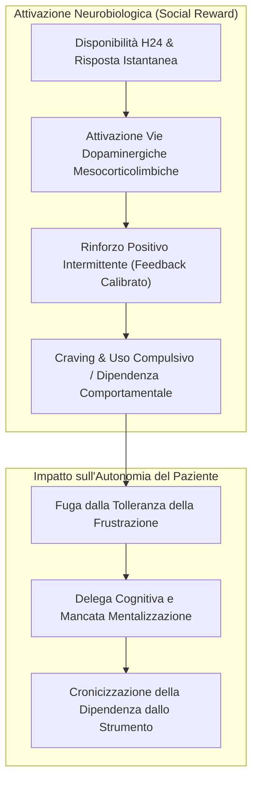

# Fast-Food Psychotherapy e Circuiti della Ricompensa Dopaminergica

**Summary**: Concettualizzazione clinica e neurobiologica del rischio di dipendenza comportamentale generato dall'interazione con chatbot di IA: l'immediatezza h24 e la disponibilità continua attivano le vie dopaminergiche mesocorticolimbiche, inducendo craving e uso compulsivo a scapito dell'autonomia e della profondità riflessiva.
**Sources**: Cavalera et al. (2026) - `11920_2026_Article_1690.pdf`; Zhang et al. (2025); Gilbert & Simos (2022); Armanino & Furlani (2023).
**Last updated**: 2026-08-27
---

## Inquadramento Concettuale

Il termine **"Fast-Food Psychotherapy"** definisce una modalità distorta di fruizione del supporto psicologico digitale caratterizzata da:
- **Immediatezza e Accessibilità Continua (24/7)**: Risposte istantanee che eliminano i tempi fisiologici di attesa, tolleranza della frustrazione ed elaborazione autonoma.
- **Soddisfazione Superficiale vs Profondità Riflessiva**: Erogazione di soluzioni preconfezionate e rassicurazioni sintomatiche veloci che danno una sensazione immediata di sollievo senza intaccare i nuclei di vulnerabilità e le dinamiche intrapsichiche.
- **Seduzione Algoritmica**: Tendenza dell'utente a cercare nell'IA un interlocutore sempre disponibile, docile e privo di attrito relazionale.

---

## Neurobiologia del Coinvolgimento Digitale

Studi di neuroimaging (Zhang et al., 2025; Cavalera et al., 2026) dimostrano che gli stimoli e i feedback ricevuti dalle interazioni con piattaforme conversazionali intelligenti attivano i medesimi circuiti della ricompensa sociale (*mesocorticolimbic reward circuitry*) implicati nelle dipendenze da social media e nel gaming disorder:

- Gran parte della soddisfazione e del sollievo percepiti dall'utente riflette **un'attivazione dopaminergica del circuito della ricompensa** piuttosto che un'autentica elaborazione terapeutica (*therapeutic processing*).
- I disclaimer o i messaggi di avviso automatici inclusi in alcune applicazioni non risultano efficaci nel prevenire l'instaurarsi di dinamiche di uso problematico e compulsivo.

---

## Psicoterapia Umana vs Fast-Food Therapy

| Dimensione Clinica | Psicoterapia Condotta da Umani | Fast-Food Psychotherapy (GenAI Autonoma) |
| :--- | :--- | :--- |
| **Obiettivo a Lungo Termine** | Sviluppo di autonomia, autoefficacia e progressiva indipendenza dal terapeuta. | Rischio di dipendenza cronica e consultazione compulsiva dell'agente. |
| **Gestione della Frustrazione** | Accompagnamento alla tolleranza dell'angoscia, del dubbio e dell'incertezza. | Anestetizzazione rapida dell'ansia tramite risposte immediate e rassicuranti. |
| **Profondità del Cambiamento** | Ristrutturazione di schemi cognitivo-affettivi e significato esistenziale. | Soluzioni pratiche sintomatiche a breve termine senza insight trasformativo. |
| **Presenza Relazionale** | Intersoggettività incarnata, alleanza di lavoro e reciprocità morale. | Pseudo-empatia algoritmica priva di responsabilità clinica ed etica. |

---

## Raccomandazioni per la Pratica Clinica

1. **Uso Time-Limited e Goal-Bounded**: L'interazione con strumenti di IA deve essere rigorosamente delimitata nel tempo e vincolata a micro-obiettivi definiti dal terapeuta umano (es. journaling guidato tra le sedute).
2. **Psicoeducazione sui Circuiti di Ricompensa**: Informare i pazienti sul rischio di confondere il sollievo dopaminergico temporaneo con il progresso terapeutico reale.
3. **Integrazione nel Modello Blended**: Utilizzare l'IA solo come estensione supervisionata del percorso di cura principale.

---

## Pagine Correlate
- [[cavalera-et-al-2026]]
- [[calibrated-mismatches]]
- [[sycophantic-mirroring]]
- [[uso-problematico-chatbot-ai]]
- [[stepped-care-ai-integration]]
- [[digital-therapeutic-alliance]]
