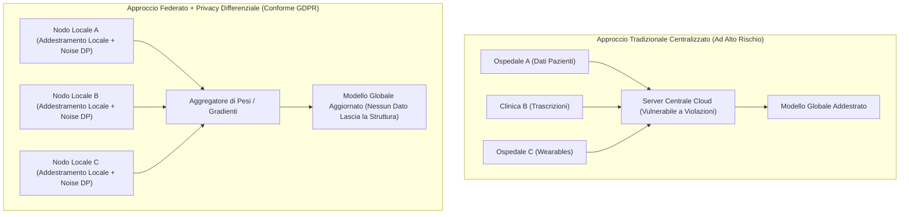

# Federated Learning e Differential Privacy nella Salute Mentale

**Summary**: Architetture tecnologiche e crittografiche per la salvaguardia della privacy (Privacy-Enhancing Technologies) applicate all'addestramento e alla validazione di modelli di intelligenza artificiale clinica, risolvendo il conflitto tra la necessità di grandi moli di dati e la tutela assoluta del segreto professionale e del GDPR.
**Sources**: Kandeel et al. (2026) - `ai-v5-e84305.pdf`, Sheller et al. (2020), Dwork & Roth (2014)
**Last updated**: 2026-08-27
---

## Definizione e Contesto Problematico

L'addestramento di modelli di deep learning e machine learning per la psicoterapia e la psichiatria computazionale (diagnosi precoce della depressione, predizione di ricadute, analisi del rischio suicidario) richiede dataset massivi, eterogenei e longitudinali. Tuttavia, l'accentramento di cartelle cliniche elettroniche (EHR), registrazioni audio-video di sedute o dati di monitoraggio passivo su un unico server centrale espone a gravissimi rischi di:
- **Data breach** e furto di informazioni ipersensibili;
- **Violazione del GDPR (Artt. 5, 9, 32)** e degli standard di riservatezza medica;
- **Rischio di re-identificazione** tramite collegamenti con banche dati esterne (Rocher et al., 2019).

Le tecnologie di potenziamento della privacy (**Privacy-Enhancing Technologies - PETs**), in particolare l'**Apprendimento Federato (*Federated Learning*)** e la **Privacy Differenziale (*Differential Privacy*)**, offrono una risposta architetturale a questo dilemma.

---

## 1. Federated Learning (Apprendimento Federato)

L'apprendimento federato (McMahan et al., Sheller et al., 2020) è un paradigma di machine learning decentralizzato:
- **Principio Operativo**: I dati clinici grezzi (note di terapia, farmaci prescritti, serie temporali di HRV) **non lasciano mai l'infrastruttura locale** (ospedale, clinica, o singolo smartphone dell'utente).
- **Flusso Computazionale**:
  1. Il server centrale invia una copia del modello base ai singoli nodi istituzionali.
  2. Ciascun nodo calcola i gradienti di ottimizzazione e aggiorna i pesi del modello addestrandolo sui propri dati locali.
  3. Solo i pesi statistici aggiornati (e non i dati grezzi) vengono inviati all'aggregatore centrale.
  4. L'aggregatore esegue una media pesata (*Federated Averaging - FedAvg*) e ridistribuisce il nuovo modello globale.
- **Vantaggi Clinico-Regolatori**:
  - Piena rispondenza al principio di **minimizzazione dei dati (GDPR Art. 5.1.c)**.
  - Possibilità di condurre studi multicentrici internazionali superando le barriere al trasferimento transfrontaliero dei dati post-Schrems II.
  - Abilitazione di **audit di bias multi-istituzionali** senza violare il segreto professionale.

---

## 2. Differential Privacy (Privacy Differenziale)

Proposta originariamente da Dwork & Roth (2014), la Privacy Differenziale fornisce una garanzia matematica formale contro il rischio di re-identificazione e attacchi di inferenza di appartenenza (*membership inference attacks*):
- **Meccanismo**: Consiste nell'aggiunta controllata di **rumore statistico calibrato** (es. tramite meccanismo di Laplace o Gaussiano) ai gradienti calcolati durante l'addestramento del modello o alle interrogazioni analitiche.
- **Parametro $\epsilon$ (Epsilon)**: Rappresenta il "budget di privacy"; valori inferiori di $\epsilon$ garantiscono una protezione crittografica maggiore, con un trade-off calibrato sulla precisione analitica del modello.
- **Risultato**: Un osservatore esterno che esamina i parametri del modello non è in grado di dedurre se i dati di uno specifico paziente abbiano partecipato o meno all'addestramento.

---

## Integrazione nelle Linee Guida dell'OMS e Privacy by Design

Come evidenziato nella rassegna di Kandeel et al. (2026), l'Organizzazione Mondiale della Sanità (OMS, 2021) raccomanda l'adozione di architetture *Privacy by Design* nello sviluppo dell'IA per la salute:
1. **Crittografia End-to-End** e registri di controllo immutabili (*audit trails*).
2. **Architetture Ibride Federate**: Combinare il Federated Learning sui nodi ospedalieri con la Differential Privacy sui gradienti per blindare sia i dati a riposo che i modelli in fase di inferenza.
3. **Minimizzazione dei Log Utente**: Politiche di cancellazione automatica dei dati di trascrizione e conversione immediata del testo in rappresentazioni vettoriali anonime non invertibili.

---

## Related pages
- [[kandeel-et-al-2026]]
- [[gdpr-governance-mental-health-ai]]
- [[open-weight-privacy-compliant-synthesis]]
- [[negotiable-data-visibility-privacy]]
- [[software-as-a-medical-device-salute-mentale]]
- [[etica-privacy-bias-ia-clinica]]
- [[multimodal-diagnostic-ai-mental-health]]
