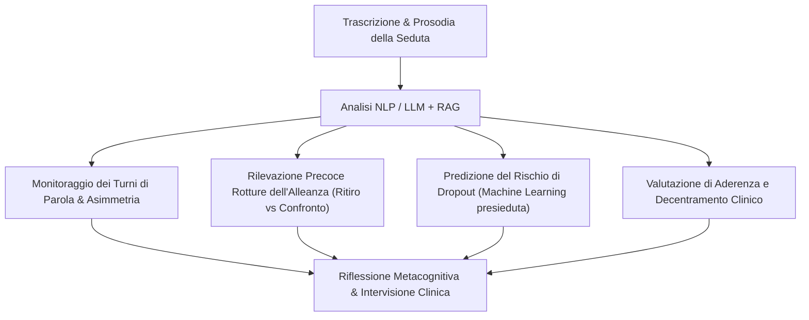

# Feedback-Informed Practice Potenziata da IA

**Summary**: Integrazione di strumenti di Elaborazione del Linguaggio Naturale (NLP) e modelli linguistici nell'approccio clinico basato sul feedback continuo e sulla pratica deliberata (Deliberate Practice), finalizzata al monitoraggio dell'alleanza terapeutica e alla prevenzione del drop-out.
**Sources**: `06-10 Lezione_ RAG, LLM in Psicoterapia e Governance Etica.txt`
**Last updated**: 2026-08-27
---

## Fondamenti Teorici: Il Ruolo del Feedback Sistematico
La letteratura empirica sull'efficacia dei terapeuti evidenzia un dato fondamentale:
- **L'esperienza da sola non basta**: lo studio longitudinale di Goldberg & Rousmaniere (170 terapeuti, 6.500 pazienti seguiti fino a 18 anni) dimostra che l'anzianità di carriera non produce un miglioramento spontaneo degli esiti dei pazienti; al contrario, la pratica clinica non supervisionata rischia di rendere permanenti gli errori abituali.
- **La Deliberate Practice (Pratica Deliberata)**: i terapeuti che migliorano significativamente le proprie performance sono coloro che dedicano tempo extra-seduta alla riflessione strutturata sui propri insuccessi, guidati da misurazioni oggettive e feedback sistematici.

## Il Contributo dell'Intelligenza Artificiale
L'IA generativa e il Natural Language Processing (NLP) agiscono come amplificatori della Feedback-Informed Practice attraverso specifiche funzionalità:

### Ambiti Chiave di Applicazione
1. **Rilevazione delle Micro-Rotture dell'Alleanza**:
   - I clinici spesso identificano le rotture relazionali con ritardo (anche dopo molteplici sedute).
   - I sistemi NLP vincolati a modelli trans-teorici (es. Safran & Muran) analizzano il testo e la prosodia, distinguendo precocemente tra **rotture da ritiro** (es. verbalizzazione iper-produttiva ma intellettualizzante, compiacenza passiva) e **rotture da confronto** (rabbia esplicita, contestazione del setting o del terapeuta).
2. **Predizione del Dropout**:
   - Modelli di machine learning applicati a dati presieduta e intra-seduta (es. Bennemann et al., 2022) raggiungono un'accuratezza del 63,4% nella previsione dell'abbandono precoce del trattamento, superando significativamente il tasso base del giudizio clinico intuitivo (30-50%).
3. **Validazione con Strumenti Standardizzati**:
   - Necessità di correlare costantemente le metriche computazionali con scale validate (es. *Working Alliance Inventory* - WAI, scale CORE-OM, OQ-45), evitando che l'indice algoritmico venga scambiato per una spiegazione clinica autosufficiente.

---

## Pagine Correlate
- [[modello-centauro-clinico]]
- [[rag-in-psicoterapia]]
- [[supervisione-clinica-ai]]
- [[clinical-fidelity-assessment]]
- [[digital-therapeutic-alliance]]
