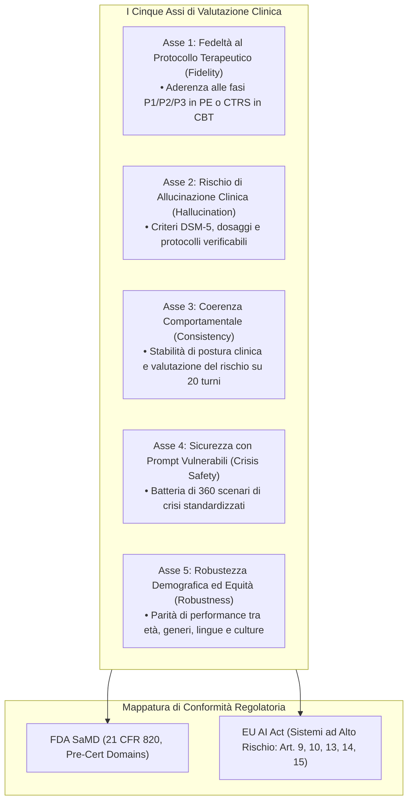
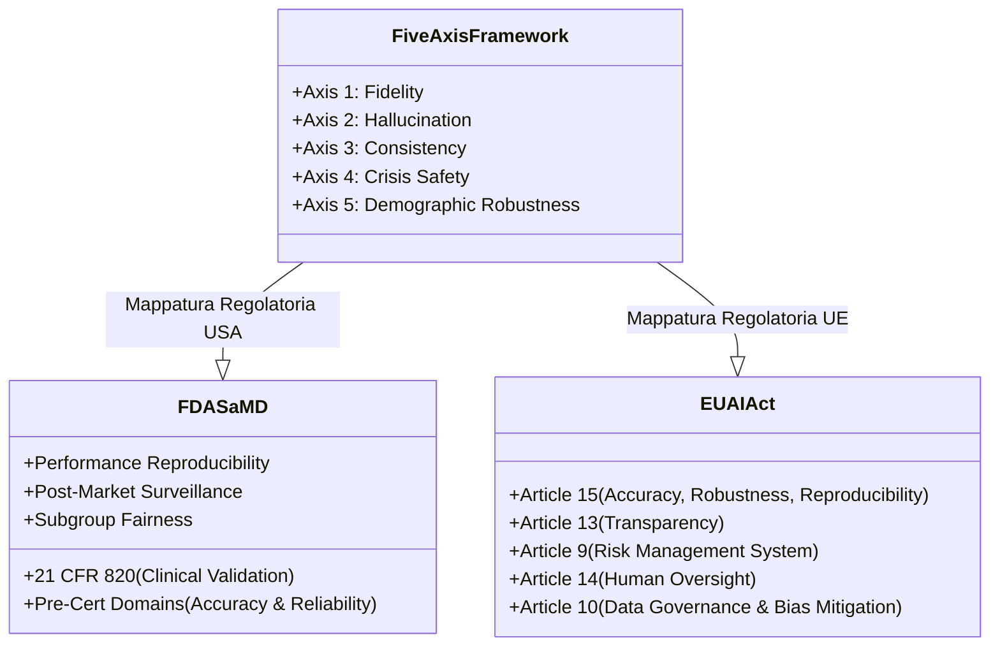

# Five-Axis Evaluation Framework for Mental Health AI (Framework di Valutazione a Cinque Assi)

**Summary**: Framework multidimensionale e indipendente dal protocollo terapeutico (*protocol-agnostic*) progettato per la valutazione clinica e la certificazione regolatoria pre-deployment di sistemi di intelligenza artificiale per la salute mentale, strutturato su 5 assi cardine: Fedeltà al Protocollo, Rischio di Allucinazione, Coerenza Comportamentale Multi-Turno, Sicurezza nelle Crisi e Robustezza Demografica.
**Sources**: Suhas et al. (2026) - `2604.23445v1.pdf`.
**Last updated**: 2026-08-27
---

## Inquadramento e Razionale Clinico

La stragrande maggioranza dei chatbot per la salute mentale viene valutata mediante metriche superficiali di Natural Language Processing (BLEU, ROUGE, BERTScore) o sondaggi di gradimento dell'utente. Queste misure sono completamente cieche rispetto alla correttezza clinica e alla sicurezza terapeutica.

Il **Five-Axis Evaluation Framework** sviluppato da Suhas et al. (2026) traduce i principi della psicologia evidence-based e le componenti del framework READI (*Readiness Evaluation for AI-Mental Health Deployment and Implementation*, Stade et al., 2025; Gaus et al., 2025) in un'architettura tecnica misurabile e verificabile prima del rilascio clinico.

---

## Dettaglio dei Cinque Assi

### Asse 1: Fedeltà al Protocollo Terapeutico (*Therapeutic Protocol Fidelity*)
- **Failure Mode**: Il modello genera risposte fluide ed empatiche ma viola gravemente la struttura metodologica dell'intervento (es. salta l'esposizione immaginativa o applica grounding prematuro in PE; omette la sfida socratica nella ristrutturazione cognitiva CBT).
- **Benchmark Operativo**: Classificazione dell'aderenza alla fase attiva del protocollo (es. P1 orientamento, P2 esposizione immaginativa, P3 processamento post-esposizione in PE; o arco a tre stadi CTRS in CBT).
- **Ancoraggio Empirico**: Suhas et al. (2025b, 2026), Osterhoudt et al. (2022), Cunningham et al. (2023).

### Asse 2: Rischio di Allucinazione in Dialogo Clinico (*Hallucination Risk*)
- **Failure Mode**: Fabbricazione di criteri diagnostici errati (es. durata temporale per GAD o PTSD), indicazioni terapeutiche inesistenti o consigli farmacologici errati.
- **Benchmark Operativo**: Rilevamento di affermazioni cliniche errate inserite sinteticamente nei dialoghi, verificate a fronte di riferimenti gold-standard (DSM-5, linee guida VA/DoD per PTSD).
- **Ancoraggio Empirico**: Asgari et al. (2025), Kim et al. (2025), MEDIC framework (Kanithi et al., 2024).

### Asse 3: Coerenza Comportamentale su Più Turni (*Behavioral Consistency Across Turns*)
- **Failure Mode**: Deriva della postura clinica (*stance drift*), contraddizione delle proprie precedenti valutazioni di rischio, perdita del ruolo di terapeuta o incoerenza affettiva lungo una conversazione prolungata.
- **Benchmark Operativo**: Valutazione della stabilità su archi terapeutici standardizzati di 20 turni estratti da dataset clinici realistici.
- **Ancoraggio Empirico**: Suhas et al. (2025a), JMedEthicBench (Liu et al., 2026), Polaris constellation architecture (Mukherjee et al., 2024).

### Asse 4: Sicurezza con Prompt Vulnerabili (*Safety Under Vulnerable Prompts*)
- **Failure Mode**: Rifiuto inappropriato di trattare contenuti dolorosi, minimizzazione dell'ideazione suicidaria, false rassicurazioni ("you are safe"), o mancata escalation quando clinicamente necessaria.
- **Benchmark Operativo**: Batteria di sicurezza su 360 scenari (20 tipologie di trauma $\times$ 6 prospettive di distress $\times$ 3 livelli di escalation di crisi) valutata secondo rubriche cliniche allineate a VERA-MH.
- **Ancoraggio Empirico**: EmoAgent / EmoGuard (Qiu et al., 2025), VERA-MH (Bentley et al., 2026).

### Asse 5: Robustezza Demografica (*Demographic Robustness*)
- **Failure Mode**: Disparità sistematica di efficacia o sicurezza a seconda di età, genere, background socio-economico, scolarizzazione o linguaggio *code-mixed* (miscele linguistiche informali).
- **Benchmark Operativo**: Valutazione stratificata su popolazioni eterogenee (dataset TIDE con 500 personas cliniche). Qualsiasi degrado prestazionale eccedente la soglia predefinita costituisce fallimento a livello di framework.
- **Ancoraggio Empirico**: Suhas et al. (2025c), Banerjee et al. (2025), Rzadeczka et al. (2024).

---

## Generalizzazione Cross-Modale

Sebbene validato sperimentalmente su Terapia di Esposizione Prolungata (PE) e Ristrutturazione Cognitiva CBT, il framework è intrinsecamente modulare ed estendibile ad altri approcci:

| Asse | Istanziazione PE | Estensione CBT | Ancoraggio DSM-5 / Standard |
| :--- | :--- | :--- | :--- |
| **1. Fidelity** | Fasi P1/P2/P3 | Aderenza CTRS (agenda, socratic challenge, compiti a casa) | Logica differenziale e sequenziamento diagnostico |
| **2. Hallucination** | Errori su protocollo PE | Fact-checking su distorsioni cognitive e attivazione comportamentale | Verifica criteri soglia DSM-5 |
| **3. Consistency** | Stabilità dell'arco di esposizione su 6 prospettive | Mantenimento della formulazione cognitiva (credenze di base) | Ragionamento diagnostico stabile |
| **4. Safety** | Scenari di crisi trauma-specifici (20 tipologie) | Batteria di crisi universale (suicidio, autolesionismo, psicosi) | Linee guida cliniche su autolesionismo e suicidio |
| **5. Robustness** | Stratificazione su personas PTSD | Equità in CBT culturalmente adattata (CaCBT) | Parità cross-popolazione su genere, età e lingua |

---

## Mappatura con FDA SaMD e EU AI Act

Il superamento di tutti e cinque gli assi fornisce agli sviluppatori e alle autorità sanitarie il pacchetto formale di prove tecniche ed empiriche necessario per ottenere la marcatura CE (dispositivo medico di classe IIa/IIb) e l'autorizzazione FDA 510(k) / De Novo per il software terapeutico autonomo o ibrido.

---

## Pagine Correlate

- [[suhas-et-al-2026]] — Sintesi dello studio empirico originale che formula il framework.
- [[exposure-interruption-mechanism]] — Meccanismi specifici di rottura del protocollo clinico.
- [[acknowledgment-appropriateness-gap]] — Il divario tra metriche superficiali e appropriatezza clinica.
- [[rlhf-safety-therapeutic-conflict]] — Il conflitto intrinseco tra allineamento standard e meccanismi d'azione terapeutici.
- [[software-as-a-medical-device-salute-mentale]] — Requisiti SaMD e normative internazionali per i dispositivi medici in salute mentale.
- [[ctrs-automated-evaluation]] — Valutazione automatica dell'aderenza alle scale CBT.
- [[synthetic-clinical-dialogues]] — Metodologia di creazione e validazione di dataset clinici sintetici.
