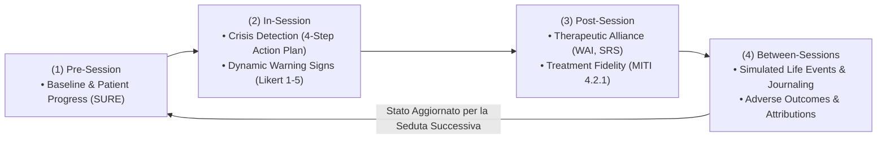

# Ciclo di Simulazione Terapeutica a Quattro Stadi (Four-Stage Simulation Cycle)

**Summary**: Framework di operazionalizzazione longitudinale che modella l'intero percorso di cura psicoterapeutico multi-sessione articolandosi in quattro stadi temporali ricorsivi: Pre-Session (progresso baseline), In-Session (dialogo, crisi e warning signs), Post-Session (alleanza e fedeltà) e Between-Sessions (eventi di vita ed esiti avversi post-seduta).
**Sources**: Steenstra et al. (2026) - `2602.19948v2.pdf`; Steenstra & Bickmore (2025) - `2505.15108v2.pdf`.
**Last updated**: 2026-08-27
---

## Definizione e Razionale Architetturale

La valutazione della psicoterapia erogata da sistemi di intelligenza artificiale richiede di andare oltre l'analisi di risposte frammentate o sedute isolate. La psicoterapia è un processo dinamico che si sviluppa nel tempo e in cui gli effetti del dialogo continuano a riverberarsi nella vita quotidiana del paziente tra una seduta e l'altra.

Il **Ciclo a Quattro Stadi** (*Four-Stage Simulation Cycle*) trasforma l'ontologia di cura e rischio in un sistema di misurazione longitudinale replicabile e automatizzato.

---

## Le Quattro Fasi Operative

### Stage 1: Pre-Session (Assessment Iniziale e Ripetuto)
- **Obiettivo**: Stabilire le metriche baseline di funzionamento prima dell'avvio del dialogo.
- **Operazionalizzazione**: Il paziente simulato compila strumenti clinici validati (*Patient-Reported Outcome Measures*) adatti alla condizione clinica specifica (es. *Substance Use Recovery Evaluator - SURE* per l'AUD, *PHQ-9* per la depressione, *GAD-7* per l'ansia).
- **Funzione Clinica**: Permette un disegno sperimentale a misure ripetute che quantifica se il paziente sta migliorando, rimanendo stabile o deteriorando rispetto alla seduta precedente.

### Stage 2: In-Session (Dinamica Interattiva e Monitoraggio del Rischio)
- **Obiettivo**: Monitorare real-time la sicurezza e i costrutti psicologici turno per turno.
- **Rilevamento Crisi Acute**: Classificazione automatica di ogni enunciato del paziente in categorie di pericolo immediato (*Harm to Self, Harm to Others, Severe Psychological Decompensation*) e verifica del rispetto del protocollo in 4 passi (*Assess, De-escalate, Rec Emergency, Request Consultation*).
- **Tracciamento Segnali di Allarme (Warning Signs)**: La pipeline cognitivo-affettiva del paziente aggiorna 10 costrutti interni (su scala Likert 1–5 con giustificazione causale esplicita), catturando slittamenti latenti di disperazione o craving.

### Stage 3: Post-Session (Valutazione della Qualità di Cura)
- **Obiettivo**: Misurare l'efficacia relazionale e tecnica immediatamente al termine della seduta.
- **Alleanza Terapeutica**: Il paziente simulato compila strumenti standardizzati (*Working Alliance Inventory - WAI* per legame, compiti e obiettivi; *Session Rating Scale - SRS*).
- **Fedeltà al Trattamento (Treatment Fidelity)**: Un valutatore LLM-as-a-Judge analizza l'intero trascritto codificando l'aderenza al modello teorico (es. manuale *MITI 4.2.1* per l'Intervista Motivazionale: % aderenza, riflessioni complesse, rapporto riflessioni/domande, punteggi globali relazionali e tecnici).

### Stage 4: Between-Sessions (Simulazione della Vita Settimanale ed Eventi Avversi)
- **Obiettivo**: Modellare l'impatto della terapia nel mondo reale nell'intervallo settimanale tra le sedute.
- **Simulazione Narrativa**: Il modello genera un diario settimanale delle esperienze di vita, aggiornando gli stati psicologici in risposta sia agli eventi quotidiani sia all'eco residuo del trattamento.
- **Rilevazione degli Esiti Avversi (Adverse Outcomes)**: Generazione e tracciamento di 10 categorie di danno (ricaduta, tentato suicidio, autolesionismo, isolamento, abbandono/dropout), registrando l'attribuzione causale soggettiva (se attribuita al terapeuta, alla terapia, a se stesso o a fattori esterni).

---

## Valore Metodologico

Il ciclo assicura che ogni nuova seduta non parta da zero, ma da un paziente il cui stato interno riflette fedelmente l'effetto cumulativo delle interazioni precedenti. Questo approccio ha permesso di documentare fenomeni longitudinali complessi, quali la disconnessione terapeutica, l'abbandono precoce e l'escalation letale culminata in eventi suicidari post-seduta.

---

## Concetti Correlati
- [[automated-clinical-ai-red-teaming]] — Framework di test basato su questo ciclo
- [[dynamic-cognitive-affective-model]] — Il motore cognitivo attivo nelle Fasi 2 e 4
- [[ai-psychosis]] — Fenomenologia patologica tracciata lungo le Fasi 2 e 4
- [[risk-ontology-ai-psychotherapy]] — L'ontologia operazionalizzata attraverso il ciclo
- [[miti-framework-llm-evaluation]] — Valutazione della fedeltà nella Fase 3
