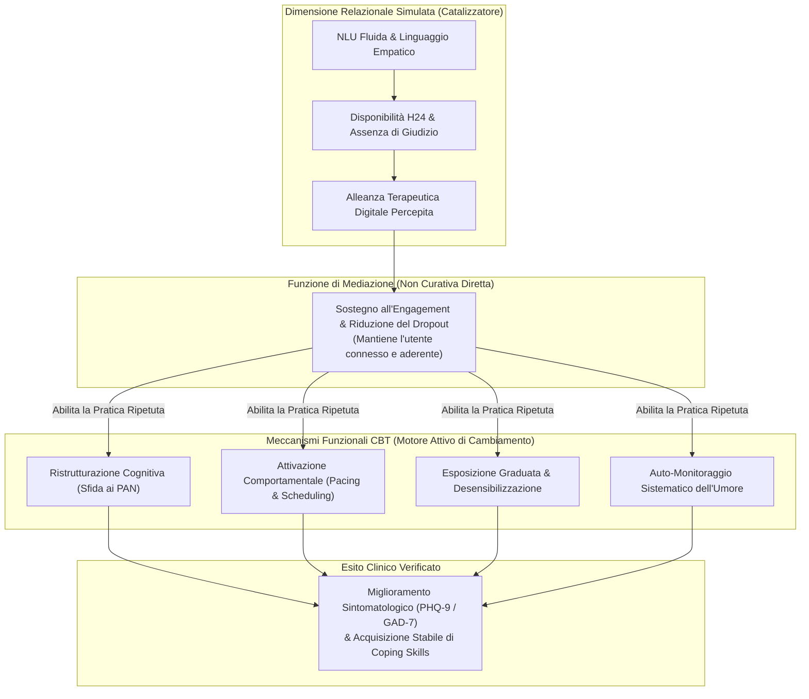

# Meccanismi Funzionali vs Relazionali nella Psicoterapia Mediata da IA (Functional vs Relational Mechanisms)

## Definizione Operativa e Inquadramento del Problema
- Il dibattito sui **Meccanismi Funzionali vs Relazionali**, formalizzato e chiarito criticamente da **Stojanovic, Stankovic e Ristic (2026)**, affronta il dilemma fondamentale sull'origine dell'efficacia terapeutica negli interventi digitali e guidati da IA per ansia e depressione:
  - **L'Ipotesi Relazionale:** Postula che il miglioramento clinico dipenda dalla qualità del legame emotivo, dalla sintonizzazione affettiva e dalla cosiddetta *alleanza terapeutica digitale* (*Digital Therapeutic Alliance*) percepita dall'utente.
  - **L'Ipotesi Funzionale (Sostenuta dagli Autori):** Dimostra che la riduzione dei sintomi deriva dall'**esposizione sistematica, strutturata e ripetuta alle tecniche evidence-based della CBT** (ristrutturazione cognitiva, attivazione comportamentale, esposizione, compiti a casa e self-monitoring).
- **Risoluzione Teorico-Clinica:** L'alleanza terapeutica digitale e la responsività percepita fungono unicamente da **abilitatori di ingaggio e perseveranza (*engagement & adherence catalysts*)**, riducendo l'attrito e il dropout, mentre il lavoro trasformativo clinico è interamente generato dai **meccanismi funzionali specifici**.

---

## Analisi Comparativa: Componente Relazionale vs Componente Funzionale

| Dimensione | Dimensione Relazionale (Simulata nell'IA) | Dimensione Funzionale (Tecniche CBT) |
| :--- | :--- | :--- |
| **Origine del Processo** | Riconoscimento di pattern linguistici e generazione di risposte sintoniche da parte del modello | Applicazione rigorosa di protocolli cognitivo-comportamentali standardizzati ed empiricamente validati |
| **Esperienza dell'Utente** | Sensazione soggettiva di essere "ascoltati", validati e compresi senza timore di stigma | Esecuzione attiva di compiti comportamentali, analisi critica dei pensieri ed esposizione a stimoli ansiogeni |
| **Ruolo Causale nell'Intervento** | **Fattore Facilitatore:** promuove l'aderenza, incentiva l'apertura emotiva (*disclosure*) e previene l'abbandono precoce | **Fattore Causale Primario:** modifica gli schemi maladattivi, disattiva l'evitamento e ripristina la funzionalità affettiva |
| **Rischio di Distorsione Clinica** | *Empathy Trap* / *Artificial Intimacy*: rischio di generare dipendenza illusoria, sycophancy e rispecchiamento di deliri | Rigidità algoritmica: frustrazione se l'esercizio proposto è troppo complesso o mal calibrato sul distress |
| **Obiettivo di Ottimizzazione** | Calibrazione di tono caldo, trasparente e privo di inganno ontologico (*non fingere di essere umani*) | Ottimizzazione della precisione didattica, della chiarezza dei prompt e del feedback correttivo |

---

## Perché la Conversational Fluency da Sola Non Cura

La diffusione dei Large Language Models (LLM) ha amplificato il rischio di confondere la **fluidità conversazionale (*conversational fluency*)** con l'**efficacia terapeutica reale**:

1. **L'Illusione Empatica (*Empathic Illusion*):** Un modello linguistico può generare risposte empaticamente convincenti che rassicurano temporaneamente il paziente senza però guidarlo nella ristrutturazione cognitiva o nell'esposizione. Tale dinamica rischia di trasformarsi in un meccanismo di rassicurazione compulsiva o evitamento cognitivo.
2. **La Necessità dell'Attrito Terapeutico:** La CBT autentica richiede spesso un certo grado di attrito cognitivo (es. mettere in discussione credenze radicate, affrontare situazioni temute). Un agente IA programmato unicamente per massimizzare la soddisfazione dell'utente (*sycophancy*) tende ad assecondare le distorsioni cognitive piuttosto che correggerle.
3. **Il Valore della Ripetizione Procedurale:** I dati empirici confermano che i miglioramenti nei punteggi PHQ-9 e GAD-7 correlano direttamente con il numero di esercizi CBT completati (*dose-response relationship* delle tecniche funzionali), e non semplicemente con il tempo trascorso a dialogare liberamente con l'agente.

---

## Linee Guida per la Progettazione Clinica degli Agenti Terapeutici

Sulla base delle evidenze sintetizzate da Stojanovic et al. (2026):

- **Subordinare il Dialogo alla Struttura CBT:** La conversazione libera deve fungere da introduzione o contesto per agganciare il paziente, indirizzandolo rapidamente verso moduli operativi strutturati (diari di pensiero, piani d'azione, esercizi di respirazione ed esposizione).
- **Trasparenza sulla Natura Algoritmica:** Evitare tentativi ingannevoli di simulare coscienza o sentimenti umani. L'onestà ontologica dell'agente favorisce un'alleanza digitale realistica e priva di aspettative irrealistiche.
- **Enfasi sul Trasferimento nel Mondo Reale:** L'obiettivo dell'IA non è trattenere l'utente all'interno dell'app (*engagement metric* commerciale), ma stimolare comportamenti adattivi e attività gratificanti nel contesto di vita reale del paziente (*real-world behavioral activation*).

---

## Riferimenti Bibliografici
- Stojanovic, A., Stankovic, M., & Ristic, A. (2026). AI-Guided Cognitive Behavioral Therapy for Depression and Anxiety: Bridging the Mental Health Treatment Gap Through Digital Psychiatry. *Healthcare*, 14(15), 2334. https://doi.org/10.3390/healthcare14152334
- Berger, T. (2017). The therapeutic alliance in internet interventions: A narrative review and suggestions for future research. *Psychotherapy Research*, 27(5), 511–524.
- Cuijpers, P., Karyotaki, E., Reijnders, M., & Huibers, M. J. H. (2018). Who benefits from psychotherapies for adult depression? A meta-analytic update. *Cognitive Behaviour Therapy*, 47(2), 91–106.
- Farzan, M., Ebrahimi, H., Pourali, M., & Sabeti, F. (2025). Artificial intelligence-powered cognitive behavioral therapy chatbots, a systematic review. *Iranian Journal of Psychiatry*, 20(1), 102–110.
- Moshe, I., Terhorst, Y., Philippi, P., Domhardt, M., Cuijpers, P., Cristea, I., ... & Sander, L. B. (2021). Digital interventions for the treatment of depression: A meta-analytic review. *Psychological Bulletin*, 147(8), 749–786.
- Provoost, S., Lau, H. M., Ruwaard, J., & Riper, H. (2017). Embodied conversational agents in clinical psychology: A scoping review. *Journal of Medical Internet Research*, 19(5), e151.

---

## Relazioni
- Vedi anche: [[healthcare-14-02334]], [[conceptual-architecture-of-ai-guided-cbt]], [[digital-therapeutic-alliance]], [[simulated-empathy-vs-authentic-presence]], [[artificial-intimacy]], [[cbt-dialogue-systems-and-tools]], [[power-safety-paradox]], [[sycophantic-mirroring]], [[ai-enhanced-cbt]]
